Configure how agents discover and load reusable skills from directories and paths.

```mermaid
graph LR
    subgraph "Skills System"
        A[📁 Paths] --> B[🔍 Discover]
        B --> C[📦 Load]
        C --> D[🤖 Agent]
    end
    
    classDef paths fill:#6366F1,stroke:#7C90A0,color:#fff
    classDef discover fill:#F59E0B,stroke:#7C90A0,color:#fff
    classDef load fill:#189AB4,stroke:#7C90A0,color:#fff
    classDef agent fill:#10B981,stroke:#7C90A0,color:#fff
    
    class A paths
    class B discover
    class C load
    class D agent
```



## Quick Start

<Steps>
<Step title="Simple List">

Pass skill paths directly:

```python
from praisonaiagents import Agent

agent = Agent(
    name="Skilled Agent",
    instructions="Use these skills",
    skills=["./my-skill", "code-review"]
)
```

</Step>

<Step title="With Configuration">

Configure skill discovery:

```python
from praisonaiagents import Agent
from praisonaiagents.config import SkillsConfig

agent = Agent(
    name="Skilled Agent",
    instructions="Use these skills",
    skills=SkillsConfig(
        paths=["./my-skill"],
        dirs=["~/.praison/skills/"],
        auto_discover=True
    )
)
```

</Step>
</Steps>

---

## Configuration Options

```python
from praisonaiagents.config import SkillsConfig

config = SkillsConfig(
    # Direct skill paths
    paths=[],
    
    # Directories to scan
    dirs=[],
    
    # Auto-discover from defaults
    auto_discover=False
)
```

| Parameter | Type | Default | Description |
|-----------|------|---------|-------------|
| `paths` | `List[str]` | `[]` | Direct paths to skill folders |
| `dirs` | `List[str]` | `[]` | Directories to scan for skills |
| `auto_discover` | `bool` | `False` | Auto-discover from default locations |

---

## Common Patterns

### Pattern 1: Project Skills

```python
from praisonaiagents import Agent
from praisonaiagents.config import SkillsConfig

agent = Agent(
    name="Project Agent",
    instructions="Use project skills",
    skills=SkillsConfig(
        paths=["./skills/code-review", "./skills/testing"]
    )
)
```

### Pattern 2: Global Skills Directory

```python
from praisonaiagents import Agent
from praisonaiagents.config import SkillsConfig

agent = Agent(
    name="Global Agent",
    instructions="Use global skills",
    skills=SkillsConfig(
        dirs=["~/.praison/skills/"],
        auto_discover=True
    )
)
```

### Pattern 3: Mixed Sources

```python
from praisonaiagents import Agent
from praisonaiagents.config import SkillsConfig

agent = Agent(
    name="Mixed Agent",
    instructions="Use all available skills",
    skills=SkillsConfig(
        paths=["./local-skill"],
        dirs=["~/.praison/skills/", "/shared/skills/"],
        auto_discover=True
    )
)
```

---

## Best Practices

<AccordionGroup>
<Accordion title="Use Paths for Specific Skills">
Use `paths` when you know exactly which skills to load.
</Accordion>

<Accordion title="Use Dirs for Skill Libraries">
Use `dirs` to manage collections of related skills.
</Accordion>

<Accordion title="Enable Auto-Discover for Development">
Enable `auto_discover` during development to find available skills.
</Accordion>
</AccordionGroup>

---

## Related

<CardGroup cols={2}>
<Card title="Skills" icon="puzzle-piece" href="/docs/concepts/skills">
  Learn about the skills system
</Card>
<Card title="Tool Config" icon="wrench" href="/docs/configuration/tool-config">
  Configure agent tools
</Card>
</CardGroup>
