Customize prompt templates to control how agents receive instructions and format responses.

```mermaid
graph LR
    subgraph "Template Flow"
        A[📋 System] --> B[💬 Prompt]
        B --> C[🤖 Agent]
        C --> D[📝 Response]
    end
    
    classDef system fill:#6366F1,stroke:#7C90A0,color:#fff
    classDef prompt fill:#F59E0B,stroke:#7C90A0,color:#fff
    classDef agent fill:#189AB4,stroke:#7C90A0,color:#fff
    classDef response fill:#10B981,stroke:#7C90A0,color:#fff
    
    class A system
    class B prompt
    class C agent
    class D response
```



## Quick Start

<Steps>
<Step title="Basic Templates">

Set custom templates:

```python
from praisonaiagents import Agent
from praisonaiagents.config import TemplateConfig

agent = Agent(
    name="Custom Agent",
    instructions="You are a helpful assistant",
    templates=TemplateConfig(
        system="You are an expert in {domain}.",
        prompt="User query: {input}",
        response="Provide a detailed response."
    )
)
```

</Step>
</Steps>

---

## Configuration Options

```python
from praisonaiagents.config import TemplateConfig

config = TemplateConfig(
    # System template
    system=None,
    
    # Prompt template
    prompt=None,
    
    # Response template
    response=None,
    
    # Use system prompt
    use_system_prompt=True
)
```

| Parameter | Type | Default | Description |
|-----------|------|---------|-------------|
| `system` | `str \| None` | `None` | System message template |
| `prompt` | `str \| None` | `None` | User prompt template |
| `response` | `str \| None` | `None` | Response format template |
| `use_system_prompt` | `bool` | `True` | Include system prompt in messages |

---

## Common Patterns

### Pattern 1: Domain Expert Template

```python
from praisonaiagents import Agent
from praisonaiagents.config import TemplateConfig

agent = Agent(
    name="Legal Expert",
    instructions="Legal analysis",
    templates=TemplateConfig(
        system="""You are an expert legal analyst.
        Always cite relevant laws and precedents.
        Be precise and thorough in your analysis."""
    )
)
```

### Pattern 2: Structured Response Template

```python
from praisonaiagents import Agent
from praisonaiagents.config import TemplateConfig

agent = Agent(
    name="Report Agent",
    instructions="Generate reports",
    templates=TemplateConfig(
        response="""Format your response as:
        
## Summary
[Brief overview]

## Details
[Detailed analysis]

## Recommendations
[Action items]"""
    )
)
```

### Pattern 3: No System Prompt

```python
from praisonaiagents import Agent
from praisonaiagents.config import TemplateConfig

agent = Agent(
    name="Raw Agent",
    instructions="Direct interaction",
    templates=TemplateConfig(
        use_system_prompt=False
    )
)
```

---

## Best Practices

<AccordionGroup>
<Accordion title="Use System Templates for Persona">
Define agent persona and behavior in the system template.
</Accordion>

<Accordion title="Use Response Templates for Formatting">
Ensure consistent output format with response templates.
</Accordion>

<Accordion title="Keep Templates Focused">
Each template should have a single, clear purpose.
</Accordion>
</AccordionGroup>

---

## Related

<CardGroup cols={2}>
<Card title="Prompt Templates" icon="file-code" href="/docs/concepts/prompt-templates">
  Learn about prompt templates
</Card>
<Card title="Structured Output" icon="table" href="/docs/features/structured">
  Structured output generation
</Card>
</CardGroup>
