Enable agents to search the web and fetch page content for real-time information retrieval.

```mermaid
graph LR
    subgraph "Web Capabilities"
        A[❓ Query] --> B[🔍 Search]
        B --> C[📄 Fetch]
        C --> D[📊 Process]
    end
    
    classDef query fill:#6366F1,stroke:#7C90A0,color:#fff
    classDef search fill:#F59E0B,stroke:#7C90A0,color:#fff
    classDef fetch fill:#189AB4,stroke:#7C90A0,color:#fff
    classDef process fill:#10B981,stroke:#7C90A0,color:#fff
    
    class A query
    class B search
    class C fetch
    class D process
```



## Quick Start

<Steps>
<Step title="Simple Enable">

Enable web capabilities with defaults:

```python
from praisonaiagents import Agent

agent = Agent(
    name="Web Agent",
    instructions="Search the web for information",
    web=True
)
```

</Step>

<Step title="With Configuration">

Configure search provider and settings:

```python
from praisonaiagents import Agent
from praisonaiagents.config import WebConfig

agent = Agent(
    name="Web Agent",
    instructions="Search the web for information",
    web=WebConfig(
        search=True,
        fetch=True,
        search_provider="duckduckgo",
        max_results=5
    )
)
```

</Step>
</Steps>

---

## Configuration Options

```python
from praisonaiagents.config import WebConfig, WebSearchProvider

config = WebConfig(
    # Enable web search
    search=True,
    
    # Enable web fetch (retrieve full page content)
    fetch=True,
    
    # Search provider
    search_provider=WebSearchProvider.DUCKDUCKGO,
    
    # Search settings
    max_results=5,
    
    # Provider-specific settings
    search_config=None,
    
    # Fetch config
    fetch_config=None
)
```

| Parameter | Type | Default | Description |
|-----------|------|---------|-------------|
| `search` | `bool` | `True` | Enable web search capability |
| `fetch` | `bool` | `True` | Enable page content fetching |
| `search_provider` | `str \| WebSearchProvider` | `"duckduckgo"` | Search provider (`duckduckgo`, `google`, `bing`, `tavily`, `serper`) |
| `max_results` | `int` | `5` | Maximum search results to return |
| `search_config` | `Dict \| None` | `None` | Provider-specific search settings |
| `fetch_config` | `Dict \| None` | `None` | Page fetching configuration |

---

## Search Providers

| Provider | API Key Required | Best For |
|----------|-----------------|----------|
| `duckduckgo` | No | Free, privacy-focused |
| `google` | Yes | Comprehensive results |
| `bing` | Yes | Microsoft ecosystem |
| `tavily` | Yes | AI-optimized search |
| `serper` | Yes | Google results via API |

---

## Common Patterns

### Pattern 1: Tavily for AI Search

```python
from praisonaiagents import Agent
from praisonaiagents.config import WebConfig

agent = Agent(
    name="AI Search Agent",
    instructions="Find accurate information",
    web=WebConfig(
        search_provider="tavily",
        max_results=10,
        search_config={"api_key": "your-tavily-key"}
    )
)
```

### Pattern 2: Search Only (No Fetching)

```python
from praisonaiagents import Agent
from praisonaiagents.config import WebConfig

agent = Agent(
    name="Search Agent",
    instructions="List search results",
    web=WebConfig(
        search=True,
        fetch=False,  # Don't fetch page content
        max_results=10
    )
)
```

---

## Best Practices

<AccordionGroup>
<Accordion title="Use DuckDuckGo for Free Searches">
DuckDuckGo requires no API key and is suitable for most use cases.
</Accordion>

<Accordion title="Use Tavily for AI-Optimized Results">
Tavily is designed for AI agents and returns more relevant, concise results.
</Accordion>

<Accordion title="Limit Results for Speed">
Fewer results means faster responses. Start with 5 and increase if needed.
</Accordion>
</AccordionGroup>

---

## Related

<CardGroup cols={2}>
<Card title="Web Search" icon="magnifying-glass" href="/docs/agents/websearch">
  Learn about web search agents
</Card>
<Card title="Deep Research" icon="microscope" href="/docs/agents/deep-research">
  Multi-step research agents
</Card>
</CardGroup>
