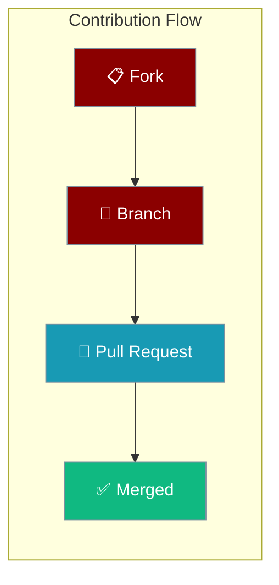
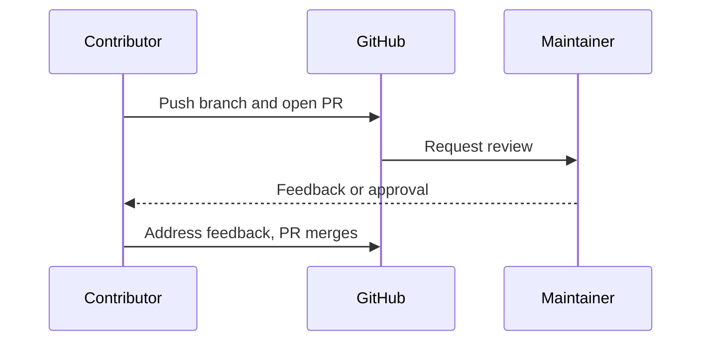

Fork the repo, make your change on a branch, and open a pull request for review.

```bash
git clone https://github.com/yourusername/praisonAI.git
git checkout -b new-feature
git commit -am "Add some feature"
git push origin new-feature
```



<Note>
Before writing or editing any documentation page, read the [Documentation Style Guide](/docs/guides/documentation-style-guide) — it defines the page structure, components, Mermaid colour scheme, and writing rules every page must follow.
</Note>

- Fork on GitHub: Use the "Fork" button on the repository page.
- Clone your fork: `git clone https://github.com/yourusername/praisonAI.git`
- Create a branch: `git checkout -b new-feature`
- Make changes and commit: `git commit -am "Add some feature"`
- Push to your fork: `git push origin new-feature`
- Submit a pull request via GitHub's web interface.
- Await feedback from project maintainers.

## Running Platform Tests

<Steps>
<Step title="Create a virtual environment">
```bash
python -m venv .venv && source .venv/bin/activate
# Windows: .venv\Scripts\activate
```
</Step>

<Step title="Install platform test extras">
```bash
pip install -e src/praisonai-platform[test]
```
This installs every dependency needed for pytest collection and execution — including `email-validator` for Pydantic `EmailStr` fields. No manual follow-up installs.
</Step>

<Step title="Run tests">
```bash
pytest src/praisonai-platform/tests -q
```
</Step>
</Steps>

## How It Works

You open a pull request, maintainers review it, and once approved it merges into the main branch.



## Best Practices

<AccordionGroup>
<Accordion title="Branch per change">
Create a focused branch (`git checkout -b new-feature`) for each contribution so reviews stay small and clear.
</Accordion>

<Accordion title="Read the style guide first">
For docs changes, follow the [Documentation Style Guide](/docs/guides/documentation-style-guide) before editing any page.
</Accordion>

<Accordion title="Run tests locally">
Install the test extras and run `pytest` before opening a PR to catch failures early.
</Accordion>
</AccordionGroup>

## Related

<CardGroup cols={2}>
  <Card title="Documentation Style Guide" icon="book" href="/docs/guides/documentation-style-guide">
    Structure and rules for docs pages.
  </Card>
  <Card title="Installation" icon="download" href="/docs/installation">
    Set up a local development environment.
  </Card>
</CardGroup>

