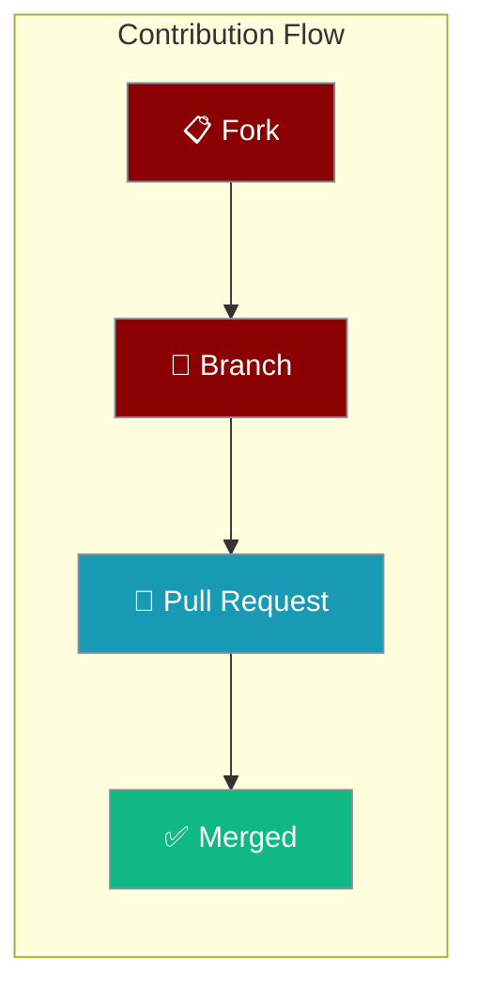
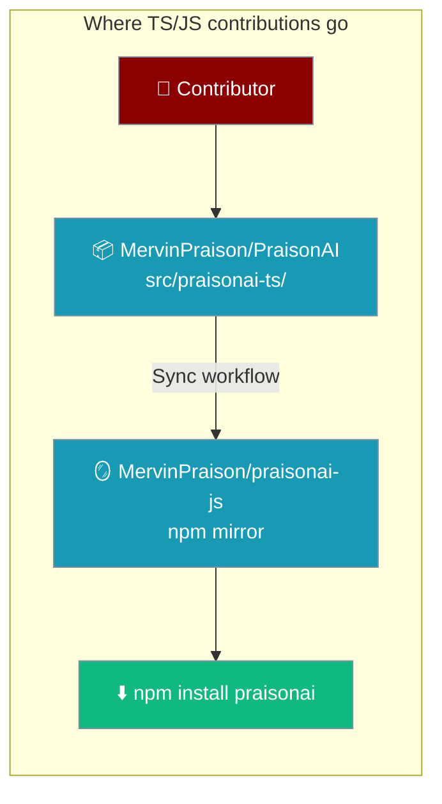
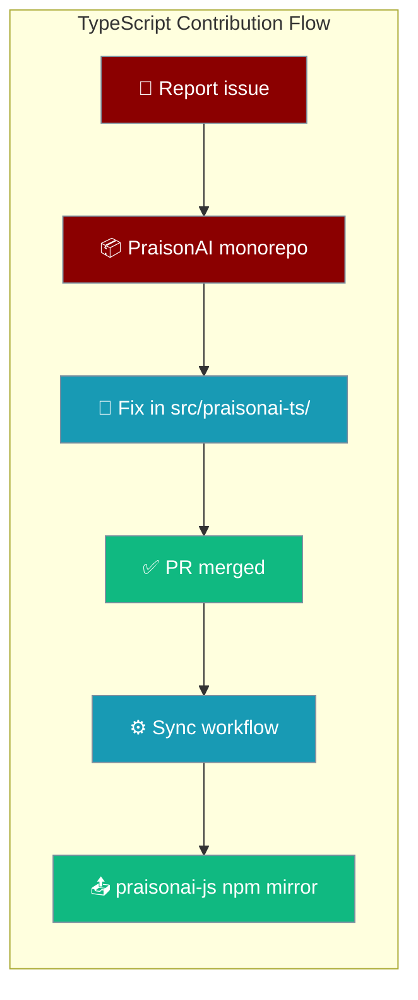
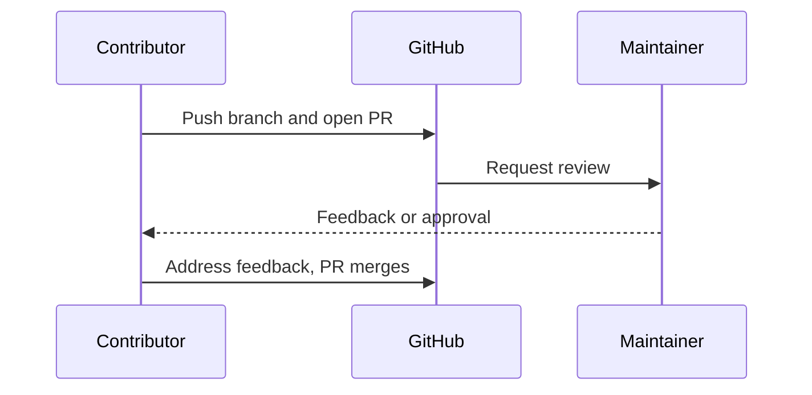
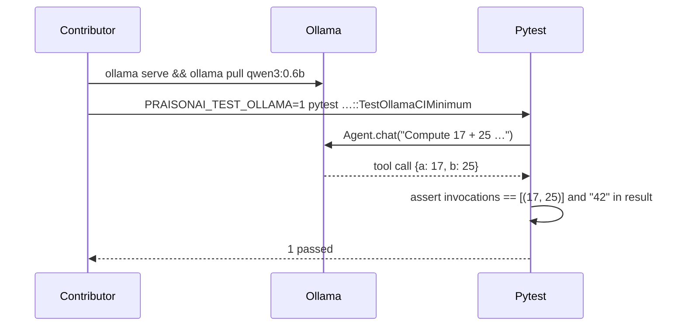

Fork the repo, make your change on a branch, and open a pull request for review.

```bash
git clone https://github.com/yourusername/praisonAI.git
git checkout -b new-feature
git commit -am "Add some feature"
git push origin new-feature
```


```mermaid
graph LR
    subgraph "Contribution Flow"
        Fork[📋 Fork] --> Branch[🤖 Branch]
        Branch --> PR[🧠 Pull Request]
        PR --> Merge[✅ Merged]
    end

    classDef input fill:#8B0000,stroke:#7C90A0,color:#fff
    classDef process fill:#189AB4,stroke:#7C90A0,color:#fff
    classDef output fill:#10B981,stroke:#7C90A0,color:#fff

    class Fork,Branch input
    class PR process
    class Merge output
```

<Note>
Before writing or editing any documentation page, read the [Documentation Style Guide](/guides/documentation-style-guide) — it defines the page structure, components, Mermaid colour scheme, and writing rules every page must follow.
</Note>

- Fork on GitHub: Use the "Fork" button on the repository page.
- Clone your fork: `git clone https://github.com/yourusername/praisonAI.git`
- Create a branch: `git checkout -b new-feature`
- Make changes and commit: `git commit -am "Add some feature"`
- Push to your fork: `git push origin new-feature`
- Submit a pull request via GitHub's web interface.
- Await feedback from project maintainers.
- **TypeScript / JavaScript changes:** develop in `src/praisonai-ts/` inside the monorepo. Do **not** open PRs against `MervinPraison/praisonai-js` — that repo is an npm mirror updated from the monorepo. See the [JS Development Setup](/js/development) page.

## TypeScript / JavaScript SDK

TypeScript and JavaScript SDK code lives inside the main **[MervinPraison/PraisonAI](https://github.com/MervinPraison/PraisonAI)** monorepo at `src/praisonai-ts/` — file issues and open pull requests there.

The [`MervinPraison/praisonai-js`](https://github.com/MervinPraison/praisonai-js) repo is only the **npm mirror**, auto-written from `src/praisonai-ts/` by the `Sync to praisonai-js` workflow. Do not open issues or PRs against `praisonai-js`; they will not be merged.


```mermaid
graph LR
    subgraph "Where TS/JS contributions go"
        Dev[👤 Contributor] --> Mono[📦 MervinPraison/PraisonAI<br/>src/praisonai-ts/]
        Mono -->|Sync workflow| Mirror[🪞 MervinPraison/praisonai-js<br/>npm mirror]
        Mirror --> NPM[⬇️ npm install praisonai]
    end

    classDef input fill:#8B0000,stroke:#7C90A0,color:#fff
    classDef process fill:#189AB4,stroke:#7C90A0,color:#fff
    classDef output fill:#10B981,stroke:#7C90A0,color:#fff

    class Dev input
    class Mono,Mirror process
    class NPM output
```

<Note>
Python contributions target the same `MervinPraison/PraisonAI` monorepo under one of the nine Python packages (`praisonaiagents/`, `praisonai-code/`, `praisonai-bot/`, `praisonai-train/`, `praisonai-browser/`, `praisonai-mcp/`, `praisonai-sandbox/`, `praisonai-deploy/`, `praisonai/`).
</Note>

## Running Platform Tests

<Note>
Platform contributions happen in the separate [PraisonAI-Platform](https://github.com/MervinPraison/PraisonAI-Platform) repo — see its CONTRIBUTING for setup and test commands.
</Note>

## TypeScript SDK Contributions

File TypeScript SDK issues on the monorepo, fix them under `src/praisonai-ts/`, and let maintainers sync the npm mirror.


```mermaid
graph LR
    subgraph "TypeScript Contribution Flow"
        Issue[🐛 Report issue] --> Repo[📦 PraisonAI monorepo]
        Repo --> Fix[🔧 Fix in src/praisonai-ts/]
        Fix --> Merge[✅ PR merged]
        Merge --> Sync[⚙️ Sync workflow]
        Sync --> Mirror[📤 praisonai-js npm mirror]
    end

    classDef input fill:#8B0000,stroke:#7C90A0,color:#fff
    classDef process fill:#189AB4,stroke:#7C90A0,color:#fff
    classDef result fill:#10B981,stroke:#7C90A0,color:#fff

    class Issue,Repo input
    class Fix,Sync process
    class Merge,Mirror result
```

**Where to file TypeScript issues**

File every TypeScript SDK bug or feature request on [MervinPraison/PraisonAI](https://github.com/MervinPraison/PraisonAI) using the bug or feature template. Do not open TypeScript issues on `praisonai-js`.

**Where to fix TypeScript code**

All TypeScript source lives in `src/praisonai-ts/` inside the [PraisonAI monorepo](https://github.com/MervinPraison/PraisonAI). Fork the monorepo, branch off `main`, and open your PR there.

**What is `praisonai-js` on GitHub?**

[`MervinPraison/praisonai-js`](https://github.com/MervinPraison/praisonai-js) is a one-way, downstream mirror. It exists so the `praisonai` npm package can be published from a standalone repo. It is **not** a fix target — do not open code PRs against it.

After a TypeScript PR merges on the monorepo, a maintainer syncs the mirror:

```bash
gh workflow run "Sync to praisonai-js" --repo MervinPraison/PraisonAI
```

Direction is **monorepo → `praisonai-js`** only.

## How It Works

You open a pull request, maintainers review it, and once approved it merges into the main branch.


```mermaid
sequenceDiagram
    participant Contributor
    participant GitHub
    participant Maintainer

    Contributor->>GitHub: Push branch and open PR
    GitHub->>Maintainer: Request review
    Maintainer-->>Contributor: Feedback or approval
    Contributor->>GitHub: Address feedback, PR merges
```

## Live model tests

Since [PR #4803](https://github.com/MervinPraison/PraisonAI/pull/4803), a nightly `extended-ollama` CI job runs `tests/integration/test_ollama_tool_calling_live.py` against a real local Ollama. Run the same suite before opening a PR that touches Ollama, LiteLLM adapters, or tool-call handling.


```mermaid
sequenceDiagram
    participant Contributor
    participant Ollama
    participant Pytest

    Contributor->>Ollama: ollama serve && ollama pull qwen3:0.6b
    Contributor->>Pytest: PRAISONAI_TEST_OLLAMA=1 pytest …::TestOllamaCIMinimum
    Pytest->>Ollama: Agent.chat("Compute 17 + 25 …")
    Ollama-->>Pytest: tool call {a: 17, b: 25}
    Pytest->>Pytest: assert invocations == [(17, 25)] and "42" in result
    Pytest-->>Contributor: 1 passed
```

### Prerequisites

Install Ollama, start it, and pull the same tool-capable model CI uses.

```bash
# Install Ollama and start it
curl -fsSL https://ollama.com/install.sh | sh
ollama serve &

# Pull the same model CI uses (522 MB, tool-capable)
ollama pull qwen3:0.6b
```

### Run the required contract test only

The `TestOllamaCIMinimum` class is the one CI treats as required — a tool round-trip must succeed.

```bash
cd src/praisonai
PRAISONAI_TEST_OLLAMA=1 \
PRAISONAI_OLLAMA_TEST_MODEL=qwen3:0.6b \
python -m pytest tests/integration/test_ollama_tool_calling_live.py::TestOllamaCIMinimum -v
```

### Run the full suite

Some tests are informational rather than required.

```bash
cd src/praisonai
PRAISONAI_TEST_OLLAMA=1 \
PRAISONAI_OLLAMA_TEST_MODEL=qwen3:0.6b \
python -m pytest tests/integration/test_ollama_tool_calling_live.py -v
```

Expected on `qwen3:0.6b`: **7 passed, 1 failed** — the failure is `test_multi_step_arithmetic`, which small local models handle unreliably. The nightly CI job places this in an informational step for exactly that reason.

<Note>
The env-var gate matters. When `PRAISONAI_TEST_OLLAMA` is **unset**, the suite skips gracefully (safe on any machine). When it is **set**, an unreachable Ollama server is a hard failure — a skip would let CI report green without exercising the tool-call contract.
</Note>

### Bring your own model

`PRAISONAI_OLLAMA_TEST_MODEL` defaults to `olmo-3` for the local developer workflow. Any tools-capable Ollama model works; `qwen3:0.6b` is what CI verifies.

## Best Practices

<AccordionGroup>
<Accordion title="Branch per change">
Create a focused branch (`git checkout -b new-feature`) for each contribution so reviews stay small and clear.
</Accordion>

<Accordion title="Read the style guide first">
For docs changes, follow the [Documentation Style Guide](/guides/documentation-style-guide) before editing any page.
</Accordion>

<Accordion title="Run tests locally">
Install the test extras and run `pytest` before opening a PR to catch failures early.
</Accordion>

<Accordion title="Run live model tests locally">
Live-model suites (`tests/integration/test_ollama_tool_calling_live.py` etc.) are env-gated and skip by default. To run them, install and start Ollama, pull the model, then export the gate. See the [Live model tests](/contributing#live-model-tests) section above for the full recipe.
</Accordion>
</AccordionGroup>

## Related

<CardGroup cols={2}>
  <Card title="TypeScript Development" icon="code" href="/docs/js/development">
    Set up the TypeScript SDK and its issue routing.
  </Card>
  <Card title="Documentation Style Guide" icon="book" href="/guides/documentation-style-guide">
    Structure and rules for docs pages.
  </Card>
  <Card title="Installation" icon="download" href="/installation">
    Set up a local development environment.
  </Card>
</CardGroup>

