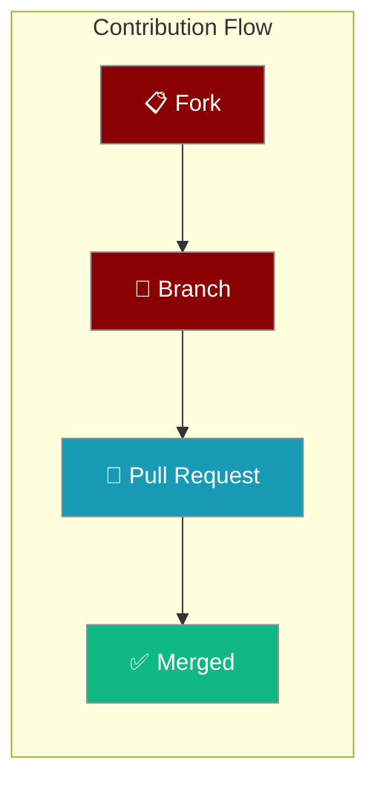
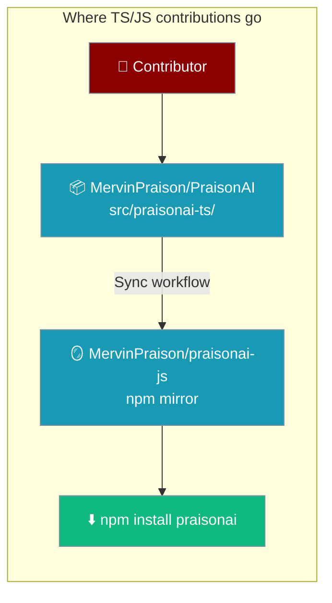
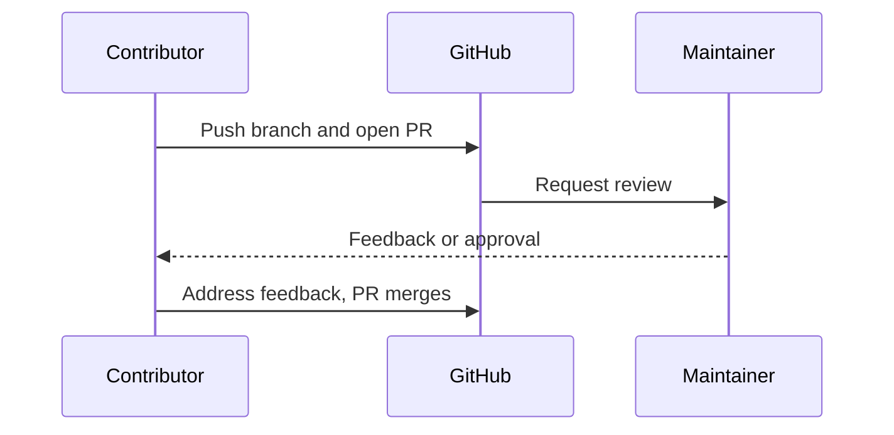

Fork the repo, make your change on a branch, and open a pull request for review.

```bash
git clone https://github.com/yourusername/praisonAI.git
git checkout -b new-feature
git commit -am "Add some feature"
git push origin new-feature
```


```mermaid
graph LR
    subgraph "Contribution Flow"
        Fork[📋 Fork] --> Branch[🤖 Branch]
        Branch --> PR[🧠 Pull Request]
        PR --> Merge[✅ Merged]
    end

    classDef input fill:#8B0000,stroke:#7C90A0,color:#fff
    classDef process fill:#189AB4,stroke:#7C90A0,color:#fff
    classDef output fill:#10B981,stroke:#7C90A0,color:#fff

    class Fork,Branch input
    class PR process
    class Merge output
```

<Note>
Before writing or editing any documentation page, read the [Documentation Style Guide](/guides/documentation-style-guide) — it defines the page structure, components, Mermaid colour scheme, and writing rules every page must follow.
</Note>

- Fork on GitHub: Use the "Fork" button on the repository page.
- Clone your fork: `git clone https://github.com/yourusername/praisonAI.git`
- Create a branch: `git checkout -b new-feature`
- Make changes and commit: `git commit -am "Add some feature"`
- Push to your fork: `git push origin new-feature`
- Submit a pull request via GitHub's web interface.
- Await feedback from project maintainers.

## TypeScript / JavaScript SDK

TypeScript and JavaScript SDK code lives inside the main **[MervinPraison/PraisonAI](https://github.com/MervinPraison/PraisonAI)** monorepo at `src/praisonai-ts/` — file issues and open pull requests there.

The [`MervinPraison/praisonai-js`](https://github.com/MervinPraison/praisonai-js) repo is only the **npm mirror**, auto-written from `src/praisonai-ts/` by the `Sync to praisonai-js` workflow. Do not open issues or PRs against `praisonai-js`; they will not be merged.


```mermaid
graph LR
    subgraph "Where TS/JS contributions go"
        Dev[👤 Contributor] --> Mono[📦 MervinPraison/PraisonAI<br/>src/praisonai-ts/]
        Mono -->|Sync workflow| Mirror[🪞 MervinPraison/praisonai-js<br/>npm mirror]
        Mirror --> NPM[⬇️ npm install praisonai]
    end

    classDef input fill:#8B0000,stroke:#7C90A0,color:#fff
    classDef process fill:#189AB4,stroke:#7C90A0,color:#fff
    classDef output fill:#10B981,stroke:#7C90A0,color:#fff

    class Dev input
    class Mono,Mirror process
    class NPM output
```

<Note>
Python contributions target the same `MervinPraison/PraisonAI` monorepo under one of the nine Python packages (`praisonaiagents/`, `praisonai-code/`, `praisonai-bot/`, `praisonai-train/`, `praisonai-browser/`, `praisonai-mcp/`, `praisonai-sandbox/`, `praisonai-deploy/`, `praisonai/`).
</Note>

## Running Platform Tests

<Note>
Platform contributions happen in the separate [PraisonAI-Platform](https://github.com/MervinPraison/PraisonAI-Platform) repo — see its CONTRIBUTING for setup and test commands.
</Note>

## How It Works

You open a pull request, maintainers review it, and once approved it merges into the main branch.


```mermaid
sequenceDiagram
    participant Contributor
    participant GitHub
    participant Maintainer

    Contributor->>GitHub: Push branch and open PR
    GitHub->>Maintainer: Request review
    Maintainer-->>Contributor: Feedback or approval
    Contributor->>GitHub: Address feedback, PR merges
```

## Best Practices

<AccordionGroup>
<Accordion title="Branch per change">
Create a focused branch (`git checkout -b new-feature`) for each contribution so reviews stay small and clear.
</Accordion>

<Accordion title="Read the style guide first">
For docs changes, follow the [Documentation Style Guide](/guides/documentation-style-guide) before editing any page.
</Accordion>

<Accordion title="Run tests locally">
Install the test extras and run `pytest` before opening a PR to catch failures early.
</Accordion>
</AccordionGroup>

## Related

<CardGroup cols={2}>
  <Card title="Documentation Style Guide" icon="book" href="/guides/documentation-style-guide">
    Structure and rules for docs pages.
  </Card>
  <Card title="Installation" icon="download" href="/installation">
    Set up a local development environment.
  </Card>
</CardGroup>

