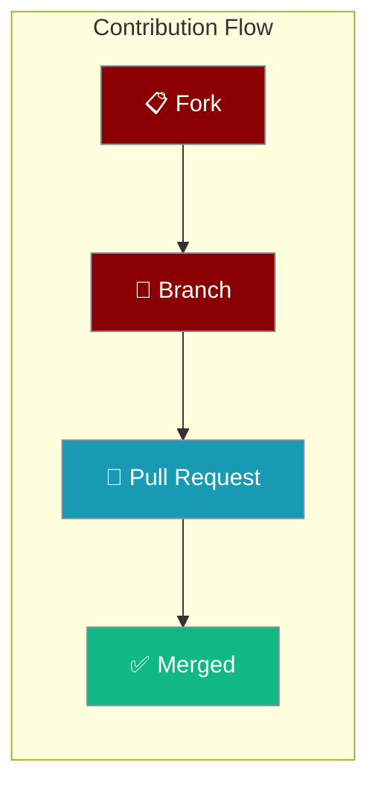
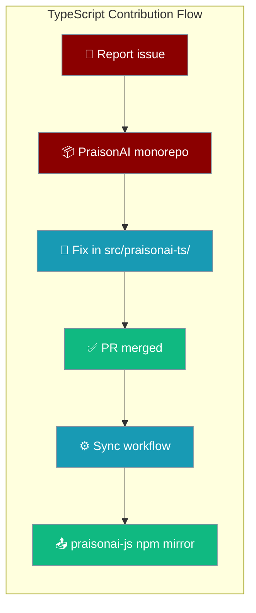
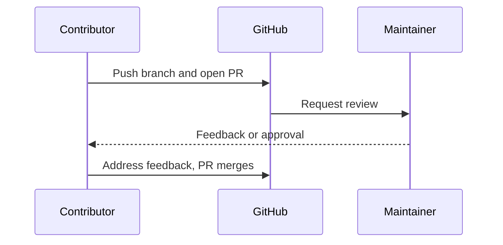

Fork the repo, make your change on a branch, and open a pull request for review.

```bash
git clone https://github.com/yourusername/praisonAI.git
git checkout -b new-feature
git commit -am "Add some feature"
git push origin new-feature
```


```mermaid
graph LR
    subgraph "Contribution Flow"
        Fork[📋 Fork] --> Branch[🤖 Branch]
        Branch --> PR[🧠 Pull Request]
        PR --> Merge[✅ Merged]
    end

    classDef input fill:#8B0000,stroke:#7C90A0,color:#fff
    classDef process fill:#189AB4,stroke:#7C90A0,color:#fff
    classDef output fill:#10B981,stroke:#7C90A0,color:#fff

    class Fork,Branch input
    class PR process
    class Merge output
```

<Note>
Before writing or editing any documentation page, read the [Documentation Style Guide](/guides/documentation-style-guide) — it defines the page structure, components, Mermaid colour scheme, and writing rules every page must follow.
</Note>

- Fork on GitHub: Use the "Fork" button on the repository page.
- Clone your fork: `git clone https://github.com/yourusername/praisonAI.git`
- Create a branch: `git checkout -b new-feature`
- Make changes and commit: `git commit -am "Add some feature"`
- Push to your fork: `git push origin new-feature`
- Submit a pull request via GitHub's web interface.
- Await feedback from project maintainers.

## Running Platform Tests

<Note>
Platform contributions happen in the separate [PraisonAI-Platform](https://github.com/MervinPraison/PraisonAI-Platform) repo — see its CONTRIBUTING for setup and test commands.
</Note>

## TypeScript SDK Contributions

File TypeScript SDK issues on the monorepo, fix them under `src/praisonai-ts/`, and let maintainers sync the npm mirror.


```mermaid
graph LR
    subgraph "TypeScript Contribution Flow"
        Issue[🐛 Report issue] --> Repo[📦 PraisonAI monorepo]
        Repo --> Fix[🔧 Fix in src/praisonai-ts/]
        Fix --> Merge[✅ PR merged]
        Merge --> Sync[⚙️ Sync workflow]
        Sync --> Mirror[📤 praisonai-js npm mirror]
    end

    classDef input fill:#8B0000,stroke:#7C90A0,color:#fff
    classDef process fill:#189AB4,stroke:#7C90A0,color:#fff
    classDef result fill:#10B981,stroke:#7C90A0,color:#fff

    class Issue,Repo input
    class Fix,Sync process
    class Merge,Mirror result
```

**Where to file TypeScript issues**

File every TypeScript SDK bug or feature request on [MervinPraison/PraisonAI](https://github.com/MervinPraison/PraisonAI) using the bug or feature template. Do not open TypeScript issues on `praisonai-js`.

**Where to fix TypeScript code**

All TypeScript source lives in `src/praisonai-ts/` inside the [PraisonAI monorepo](https://github.com/MervinPraison/PraisonAI). Fork the monorepo, branch off `main`, and open your PR there.

**What is `praisonai-js` on GitHub?**

[`MervinPraison/praisonai-js`](https://github.com/MervinPraison/praisonai-js) is a one-way, downstream mirror. It exists so the `praisonai` npm package can be published from a standalone repo. It is **not** a fix target — do not open code PRs against it.

After a TypeScript PR merges on the monorepo, a maintainer syncs the mirror:

```bash
gh workflow run "Sync to praisonai-js" --repo MervinPraison/PraisonAI
```

Direction is **monorepo → `praisonai-js`** only.

## How It Works

You open a pull request, maintainers review it, and once approved it merges into the main branch.


```mermaid
sequenceDiagram
    participant Contributor
    participant GitHub
    participant Maintainer

    Contributor->>GitHub: Push branch and open PR
    GitHub->>Maintainer: Request review
    Maintainer-->>Contributor: Feedback or approval
    Contributor->>GitHub: Address feedback, PR merges
```

## Best Practices

<AccordionGroup>
<Accordion title="Branch per change">
Create a focused branch (`git checkout -b new-feature`) for each contribution so reviews stay small and clear.
</Accordion>

<Accordion title="Read the style guide first">
For docs changes, follow the [Documentation Style Guide](/guides/documentation-style-guide) before editing any page.
</Accordion>

<Accordion title="Run tests locally">
Install the test extras and run `pytest` before opening a PR to catch failures early.
</Accordion>
</AccordionGroup>

## Related

<CardGroup cols={2}>
  <Card title="TypeScript Development" icon="code" href="/docs/js/development">
    Set up the TypeScript SDK and its issue routing.
  </Card>
  <Card title="Documentation Style Guide" icon="book" href="/guides/documentation-style-guide">
    Structure and rules for docs pages.
  </Card>
  <Card title="Installation" icon="download" href="/installation">
    Set up a local development environment.
  </Card>
</CardGroup>

