Welcome to AI Agents! This course helps you build your own AI agents - even with no programming experience.

```mermaid
graph LR
    subgraph "What is an AI Agent?"
        You[👤 You] --> Agent[🤖 AI Agent]
        Agent --> Task[✅ Task Done]
    end
    
    classDef user fill:#8B0000,stroke:#7C90A0,color:#fff
    classDef agent fill:#189AB4,stroke:#7C90A0,color:#fff
    classDef task fill:#2E8B57,stroke:#7C90A0,color:#fff
    
    class You user
    class Agent agent
    class Task task
```



## Quick Start

<Steps>

<Step title="Install PraisonAI">
```bash
pip install praisonaiagents
```
</Step>

<Step title="Set Your API Key">
```bash
export OPENAI_API_KEY=your_key_here
```
</Step>

<Step title="Create Your First Agent">
```python
from praisonaiagents import Agent

agent = Agent(instructions="You are a helpful assistant")
agent.start("Hello! What can you help me with?")
```
</Step>

</Steps>

<Note>
That's it! Just 3 lines of code to create an AI agent.
</Note>

---

## What is an AI Agent?

An AI agent is like a smart assistant that can:

```mermaid
graph TB
    subgraph "AI Agent Capabilities"
        Understand[👁️ Understand<br/>your request]
        Think[🧠 Think<br/>about solutions]
        Act[🎯 Act<br/>to complete tasks]
    end
    
    Understand --> Think --> Act
    
    classDef capability fill:#189AB4,stroke:#7C90A0,color:#fff
    class Understand,Think,Act capability
```



<CardGroup cols={3}>
  <Card title="Understand" icon="eye">
    Read and understand what you need
  </Card>
  <Card title="Think" icon="brain">
    Figure out the best approach
  </Card>
  <Card title="Act" icon="bolt">
    Complete the task for you
  </Card>
</CardGroup>

---

## Real Examples

You already use AI agents every day:

<CardGroup cols={2}>
  <Card title="Virtual Assistants" icon="microphone">
    Siri, Alexa, Google Assistant
  </Card>
  <Card title="Recommendations" icon="thumbs-up">
    Netflix, YouTube, Spotify suggestions
  </Card>
  <Card title="Smart Home" icon="house">
    Automatic temperature, lighting
  </Card>
  <Card title="Customer Support" icon="headset">
    Chatbots that help you 24/7
  </Card>
</CardGroup>

---

## What You'll Learn

<Steps>
  <Step title="Basics">
    Understand how AI agents work
  </Step>
  <Step title="Build">
    Create your own agents with PraisonAI
  </Step>
  <Step title="Customize">
    Add tools, memory, and knowledge
  </Step>
  <Step title="Deploy">
    Put your agents to work
  </Step>
</Steps>

---

## Who Is This For?

<AccordionGroup>
  <Accordion title="Complete Beginners">
    No coding experience needed - we start from zero
  </Accordion>
  <Accordion title="Business Professionals">
    Learn how AI agents can automate your work
  </Accordion>
  <Accordion title="Students">
    Understand AI through hands-on projects
  </Accordion>
  <Accordion title="Curious Minds">
    Anyone who wants to build with AI
  </Accordion>
</AccordionGroup>

---

<Card title="Next: Types of AI Agents" icon="arrow-right" href="/course/agents/02-types-of-agents">
  Learn about the different types of AI agents and when to use each one.
</Card>
