```mermaid
graph TB
    subgraph "Tool-Using Agent"
        Agent[🤖 Agent] --> Decide{Need Tool?}
        Decide -->|Yes| Tool[🔧 Use Tool]
        Tool --> Process[📊 Process Result]
        Decide -->|No| Respond[💬 Respond]
        Process --> Respond
    end
    
    classDef agent fill:#189AB4,stroke:#7C90A0,color:#fff
    classDef tool fill:#2E8B57,stroke:#7C90A0,color:#fff
    classDef decision fill:#8B0000,stroke:#7C90A0,color:#fff
    
    class Agent agent
    class Tool,Process tool
    class Decide decision
    class Respond agent
```

```mermaid
graph LR
    subgraph "Multi-Agent Team"
        Task[📋 Task] --> A1[🤖 Agent 1]
        A1 --> A2[🤖 Agent 2]
        A2 --> Result[✅ Result]
    end
    
    classDef task fill:#8B0000,stroke:#7C90A0,color:#fff
    classDef agent fill:#189AB4,stroke:#7C90A0,color:#fff
    classDef result fill:#2E8B57,stroke:#7C90A0,color:#fff
    
    class Task task
    class A1,A2 agent
    class Result result
```

Different agents for different tasks. Let's explore the types you can build with PraisonAI.

```mermaid
graph LR
    subgraph "Agent Types"
        Simple[🔄 Simple<br/>React to input]
        Goal[🎯 Goal-Based<br/>Achieve objectives]
        Learning[🧠 Learning<br/>Improve over time]
    end
    
    Simple --> Goal --> Learning
    
    classDef simple fill:#8B0000,stroke:#7C90A0,color:#fff
    classDef goal fill:#189AB4,stroke:#7C90A0,color:#fff
    classDef learning fill:#2E8B57,stroke:#7C90A0,color:#fff
    
    class Simple simple
    class Goal goal
    class Learning learning
```



---

## 1. Simple Agents

React directly to what you ask - no memory, just immediate response.

```python
from praisonaiagents import Agent

# Simple Q&A agent
agent = Agent(instructions="Answer questions directly and concisely")
agent.start("What is the capital of France?")
```

<CardGroup cols={2}>
  <Card title="Best For" icon="check">
    Quick answers, simple tasks, FAQ bots
  </Card>
  <Card title="Example" icon="lightbulb">
    Thermostat: cold → turn on heat
  </Card>
</CardGroup>

---

## 2. Goal-Based Agents

Work toward specific objectives, planning steps to achieve them.

```python
from praisonaiagents import Agent

# Goal-oriented research agent
agent = Agent(
    instructions="Research and summarize topics thoroughly",
    planning=True  # Enable planning for complex goals
)
agent.start("Research the benefits of solar energy")
```



<CardGroup cols={2}>
  <Card title="Best For" icon="check">

```mermaid
graph LR
    subgraph "Goal-Based Agent"
        Goal[🎯 Goal] --> Plan[📋 Plan Steps]
        Plan --> Execute[⚡ Execute]
        Execute --> Check{Done?}
        Check -->|No| Plan
        Check -->|Yes| Done[✅ Complete]
    end
    
    classDef goal fill:#8B0000,stroke:#7C90A0,color:#fff
    classDef process fill:#189AB4,stroke:#7C90A0,color:#fff
    classDef done fill:#2E8B57,stroke:#7C90A0,color:#fff
    
    class Goal goal
    class Plan,Execute,Check process
    class Done done
```

    Research, analysis, multi-step tasks
  </Card>
  <Card title="Example" icon="lightbulb">
    Chess AI: plans moves to win
  </Card>
</CardGroup>

---

## 3. Learning Agents

Improve over time by remembering past interactions.

```python
from praisonaiagents import Agent

# Agent with memory that learns preferences
agent = Agent(
    instructions="Remember user preferences and improve responses",
    memory=True  # Enable memory
)
agent.start("I prefer short, bullet-point answers")
```

<CardGroup cols={2}>
  <Card title="Best For" icon="check">
    Personal assistants, recommendations
  </Card>
  <Card title="Example" icon="lightbulb">
    Netflix: learns what you like
  </Card>
</CardGroup>

---

## 4. Tool-Using Agents

Extend capabilities with external tools.

```python
from praisonaiagents import Agent

def search_web(query: str) -> str:
    """Search the web for information"""
    return f"Results for: {query}"

# Agent with tools
agent = Agent(
    instructions="Search and analyze information",
    tools=[search_web]
)
agent.start("Find the latest news about AI")
```



---

## 5. Multi-Agent Teams

Multiple agents working together on complex tasks.

```python
from praisonaiagents import Agent, Agents

researcher = Agent(instructions="Research topics thoroughly")
writer = Agent(instructions="Write clear summaries")

team = AgentManager(agents=[researcher, writer])
team.start()
```



---

## Which Type Should You Use?

| Need | Agent Type | PraisonAI Feature |
|------|------------|-------------------|
| Quick answers | Simple | Default agent |
| Complex tasks | Goal-Based | `planning=True` |
| Personalization | Learning | `memory=True` |
| External data | Tool-Using | `tools=[...]` |
| Big projects | Multi-Agent | `AgentManager([...])` |

<Tip>
Start simple! You can always add features like memory, tools, and planning later.
</Tip>

---

<Card title="Next: Agent Architecture" icon="arrow-right" href="/course/agents/03-agent-architecture">
  Learn how agents are structured internally.
</Card>
