Every PraisonAI agent has the same core structure. Understanding it helps you build better agents.

```mermaid
graph TB
    subgraph "Agent Architecture"
        Input[📥 Input<br/>Your request] --> Brain[🧠 Brain<br/>LLM processing]
        Brain --> Tools[🔧 Tools<br/>External actions]
        Brain --> Memory[💾 Memory<br/>Context storage]
        Tools --> Output[📤 Output<br/>Response]
        Memory --> Brain
    end
    
    classDef input fill:#8B0000,stroke:#7C90A0,color:#fff
    classDef brain fill:#189AB4,stroke:#7C90A0,color:#fff
    classDef tools fill:#2E8B57,stroke:#7C90A0,color:#fff
    
    class Input,Output input
    class Brain brain
    class Tools,Memory tools
```



---

## The 4 Core Components

<CardGroup cols={2}>
  <Card title="1. Instructions" icon="scroll">
    What the agent does and how it behaves
  </Card>
  <Card title="2. LLM (Brain)" icon="brain">
    The AI model that powers thinking
  </Card>
  <Card title="3. Tools" icon="wrench">
    Functions the agent can call
  </Card>
  <Card title="4. Memory" icon="database">
    Remembers past conversations
  </Card>
</CardGroup>

---

## Building an Agent

<Steps>

<Step title="Instructions - Define Purpose">
```python
from praisonaiagents import Agent

agent = Agent(
    instructions="You are a helpful coding assistant"
)
```
</Step>

<Step title="LLM - Choose the Brain">
```python
agent = Agent(
    instructions="You are a helpful assistant",
    llm="gpt-4o"  # Or "claude-3", "gemini-pro", etc.
)
```
</Step>

<Step title="Tools - Add Capabilities">
```python
def calculate(expression: str) -> str:
    """Calculate a math expression"""
    return str(eval(expression))

agent = Agent(
    instructions="You help with math",
    tools=[calculate]
)
```
</Step>

<Step title="Memory - Remember Context">
```python
agent = Agent(
    instructions="You are a personal assistant",
    memory=True  # Remember conversations
)
```
</Step>

</Steps>

---

## Complete Example

```python
from praisonaiagents import Agent

def search_web(query: str) -> str:
    """Search the web"""
    return f"Results for: {query}"

# Full agent with all components
agent = Agent(
    name="ResearchAssistant",
    instructions="You research topics and provide summaries",
    llm="gpt-4o",
    tools=[search_web],
    memory=True
)

agent.start("Research the latest AI trends")
```

---

## The Agent Loop

Every agent follows this cycle:

```mermaid
graph LR
    subgraph "Agent Loop"
        Receive[📥 Receive] --> Think[🧠 Think]
        Think --> Act[⚡ Act]
        Act --> Respond[💬 Respond]
        Respond -.-> Receive
    end
    
    classDef receive fill:#8B0000,stroke:#7C90A0,color:#fff
    classDef think fill:#189AB4,stroke:#7C90A0,color:#fff
    classDef act fill:#2E8B57,stroke:#7C90A0,color:#fff
    
    class Receive receive
    class Think think
    class Act,Respond act
```



| Step | What Happens |
|------|--------------|
| **Receive** | Agent gets your message |
| **Think** | LLM processes and plans |
| **Act** | Uses tools if needed |
| **Respond** | Returns the answer |

---

## Multi-Agent Architecture

Multiple agents can work together:

```mermaid
graph LR
    subgraph "Team Architecture"
        Task[📋 Task] --> A1[🤖 Researcher]
        A1 --> A2[🤖 Writer]
        A2 --> A3[🤖 Editor]
        A3 --> Result[✅ Result]
    end
    
    classDef task fill:#8B0000,stroke:#7C90A0,color:#fff
    classDef agent fill:#189AB4,stroke:#7C90A0,color:#fff
    classDef result fill:#2E8B57,stroke:#7C90A0,color:#fff
    
    class Task task
    class A1,A2,A3 agent
    class Result result
```



```python
from praisonaiagents import Agent, AgentTeam

researcher = Agent(instructions="Research topics")
writer = Agent(instructions="Write content")
editor = Agent(instructions="Edit and polish")

team = AgentTeam(agents=[researcher, writer, editor])
team.start()
```

---

## Key Takeaways

<AccordionGroup>
  <Accordion title="Start Simple">
    Begin with just instructions - add tools and memory later
  </Accordion>
  <Accordion title="Choose the Right LLM">
    GPT-4o for complex tasks, GPT-4o-mini for simple ones
  </Accordion>
  <Accordion title="Tools Extend Capabilities">
    Any Python function can become a tool
  </Accordion>
  <Accordion title="Memory Enables Context">
    Enable memory for multi-turn conversations
  </Accordion>
</AccordionGroup>

---

<Card title="Next: Agent Instructions" icon="arrow-right" href="/course/agents/04-agent-instructions">
  Learn how to write effective instructions for your agents.
</Card>
