Instructions are the most important part of your agent. Good instructions = great results.

```mermaid
graph LR
    subgraph "Instructions Impact"
        Bad[❌ Vague<br/>"Help me"] --> BadResult[😕 Unpredictable]
        Good[✅ Clear<br/>"Research AI trends"] --> GoodResult[🎯 Focused]
    end
    
    classDef bad fill:#8B0000,stroke:#7C90A0,color:#fff
    classDef good fill:#2E8B57,stroke:#7C90A0,color:#fff
    classDef result fill:#189AB4,stroke:#7C90A0,color:#fff
    
    class Bad bad
    class Good good
    class BadResult,GoodResult result
```

---

## Quick Start

```python
from praisonaiagents import Agent

# Simple but effective instructions
agent = Agent(
    instructions="You are a helpful coding assistant. Explain concepts simply and provide working code examples."
)
agent.start("How do I read a file in Python?")
```

---

## The 4 Parts of Great Instructions

<Steps>

<Step title="1. Role - Who is the agent?">
```python
# ❌ Vague
instructions = "You are a helper"

# ✅ Clear
instructions = "You are a senior Python developer with 10 years of experience"
```
</Step>

<Step title="2. Goal - What should it achieve?">
```python
# ❌ Vague
instructions = "Help with code"

# ✅ Clear
instructions = "Help users write clean, efficient Python code with proper error handling"
```
</Step>

<Step title="3. Style - How should it respond?">
```python
# ❌ No guidance
instructions = "Answer questions"

# ✅ Clear style
instructions = "Answer in bullet points. Keep explanations under 3 sentences."
```
</Step>

<Step title="4. Constraints - What should it avoid?">
```python
# ✅ With boundaries
instructions = """You are a coding assistant.
- Only answer programming questions
- Never execute dangerous commands
- Ask for clarification if the question is unclear"""
```
</Step>

</Steps>

---

## Complete Example

```python
from praisonaiagents import Agent

agent = Agent(
    name="CodeHelper",
    instructions="""You are a senior Python developer.

Your goal: Help users write clean, working Python code.

When answering:
1. First understand what the user wants
2. Provide a working code example
3. Explain the key parts briefly

Style:
- Use simple language
- Include comments in code
- Show expected output

Constraints:
- Only answer Python questions
- Keep explanations short
- Ask if something is unclear"""
)

agent.start("How do I sort a list of dictionaries by a key?")
```

---

## Good vs Bad Instructions

| Aspect | ❌ Bad | ✅ Good |
|--------|--------|---------|
| **Role** | "You are a helper" | "You are a data analyst" |
| **Goal** | "Help with stuff" | "Analyze sales data and find trends" |
| **Style** | (none) | "Use bullet points and charts" |
| **Constraints** | (none) | "Focus only on the provided data" |

---

## Common Mistakes

<CardGroup cols={2}>
  <Card title="Too Vague" icon="cloud">
    "Help me" → Agent doesn't know what to do
  </Card>
  <Card title="Too Long" icon="scroll">
    1000+ words → Agent gets confused
  </Card>
  <Card title="Contradictory" icon="shuffle">
    "Be brief" + "Explain everything" → Conflict
  </Card>
  <Card title="No Examples" icon="question">
    No sample output → Inconsistent format
  </Card>
</CardGroup>

---

## Improve Your Instructions

```mermaid
graph LR
    subgraph "Improvement Cycle"
        Write[✍️ Write] --> Test[🧪 Test]
        Test --> Review[👀 Review]
        Review --> Improve[🔧 Improve]
        Improve --> Write
    end
    
    classDef write fill:#8B0000,stroke:#7C90A0,color:#fff
    classDef test fill:#189AB4,stroke:#7C90A0,color:#fff
    classDef improve fill:#2E8B57,stroke:#7C90A0,color:#fff
    
    class Write write
    class Test,Review test
    class Improve improve
```



<Tip>
Start simple, then add details based on what's missing in the responses.
</Tip>

---

## Template

Copy this template and fill in the blanks:

```python
from praisonaiagents import Agent

agent = Agent(
    instructions="""You are a [ROLE] with expertise in [AREA].

Your goal: [WHAT TO ACHIEVE]

When responding:
1. [FIRST STEP]
2. [SECOND STEP]
3. [THIRD STEP]

Style: [HOW TO FORMAT RESPONSES]

Constraints:
- [WHAT TO AVOID]
- [BOUNDARIES]"""
)
```

---

<Card title="Next: Agent Tools" icon="arrow-right" href="/course/agents/05-agent-tools">
  Learn how to give your agents superpowers with tools.
</Card>
