Tools give your agents superpowers. Without tools, agents can only chat. With tools, they can search, calculate, and interact with the world.

```mermaid
graph LR
    subgraph "Agent Without Tools"
        A1[🤖 Agent] --> A2[💬 Chat Only]
    end
    
    subgraph "Agent With Tools"
        B1[🤖 Agent] --> B2[🔍 Search]
        B1 --> B3[🔢 Calculate]
        B1 --> B4[📧 Send Email]
    end
    
    classDef agent fill:#189AB4,stroke:#7C90A0,color:#fff
    classDef limited fill:#8B0000,stroke:#7C90A0,color:#fff
    classDef tools fill:#2E8B57,stroke:#7C90A0,color:#fff
    
    class A1,B1 agent
    class A2 limited
    class B2,B3,B4 tools
```



---

## Quick Start

```python
from praisonaiagents import Agent

# Define a tool (any Python function)
def calculate(expression: str) -> str:
    """Calculate a math expression"""
    return str(eval(expression))

# Give the tool to your agent
agent = Agent(
    instructions="You help with math problems",
    tools=[calculate]
)

agent.start("What is 25 * 48?")
```

<Note>
Any Python function can be a tool. Just add it to the `tools` list.
</Note>

---

## How Tools Work

```mermaid
graph TB
    subgraph "Tool Flow"
        Question[❓ Question] --> Agent[🤖 Agent]
        Agent --> Decide{Need Tool?}
        Decide -->|Yes| Tool[🔧 Use Tool]
        Tool --> Result[📊 Get Result]
        Result --> Answer[✅ Answer]
        Decide -->|No| Answer
    end
    
    classDef question fill:#8B0000,stroke:#7C90A0,color:#fff
    classDef agent fill:#189AB4,stroke:#7C90A0,color:#fff
    classDef tool fill:#2E8B57,stroke:#7C90A0,color:#fff
    
    class Question question
    class Agent,Decide agent
    class Tool,Result,Answer tool
```



---

## Creating Tools

<Steps>

<Step title="Write a Python Function">
```python
def get_weather(city: str) -> str:
    """Get the weather for a city"""
    # Your logic here
    return f"Weather in {city}: Sunny, 72°F"
```
</Step>

<Step title="Add Type Hints">
```python
# Type hints help the agent understand inputs/outputs
def search_web(query: str, max_results: int = 5) -> str:
    """Search the web for information"""
    return f"Found {max_results} results for: {query}"
```
</Step>

<Step title="Add to Agent">
```python
agent = Agent(
    instructions="You help users find information",
    tools=[get_weather, search_web]
)
```
</Step>

</Steps>

---

## Built-in Tools

PraisonAI includes ready-to-use tools:

```python
from praisonaiagents import Agent

# Web search (requires API key)
agent = Agent(
    instructions="Search and summarize",
    tools=["tavily"]  # or "duckduckgo", "you", "exa"
)

# Enable web search simply
agent = Agent(
    instructions="Research topics",
    web=True  # Built-in web search
)
```

<CardGroup cols={2}>
  <Card title="Web Search" icon="magnifying-glass">
    `tools=["tavily"]` or `web=True`
  </Card>
  <Card title="File Operations" icon="file">
    Read, write, and manage files
  </Card>
  <Card title="Code Execution" icon="code">
    Run Python code safely
  </Card>
  <Card title="MCP Tools" icon="plug">
    Connect to external services
  </Card>
</CardGroup>

---

## Complete Example

```python
from praisonaiagents import Agent

# Tool 1: Calculator
def calculate(expression: str) -> str:
    """Calculate a math expression"""
    try:
        return str(eval(expression))
    except:
        return "Error: Invalid expression"

# Tool 2: Unit converter
def convert_units(value: float, from_unit: str, to_unit: str) -> str:
    """Convert between units"""
    conversions = {
        ("km", "miles"): 0.621371,
        ("miles", "km"): 1.60934,
        ("kg", "lbs"): 2.20462,
        ("lbs", "kg"): 0.453592,
    }
    factor = conversions.get((from_unit, to_unit), 1)
    result = value * factor
    return f"{value} {from_unit} = {result:.2f} {to_unit}"

# Agent with multiple tools
agent = Agent(
    instructions="You help with math and unit conversions",
    tools=[calculate, convert_units]
)

agent.start("Convert 100 km to miles, then calculate 62 * 3")
```

---

## Tool Best Practices

<CardGroup cols={2}>
  <Card title="Add Docstrings" icon="comment">
    Describe what the tool does so the agent knows when to use it
  </Card>
  <Card title="Use Type Hints" icon="code">
    `def tool(x: str) -> str:` helps the agent understand inputs
  </Card>
  <Card title="Handle Errors" icon="shield">
    Return helpful error messages instead of crashing
  </Card>
  <Card title="One Purpose" icon="bullseye">
    Each tool should do one thing well
  </Card>
</CardGroup>

---

## MCP Tools (Advanced)

Connect to external services using Model Context Protocol:

```python
from praisonaiagents import Agent, MCP

agent = Agent(
    instructions="Search the web",
    tools=MCP(
        command="npx",
        args=["-y", "@anthropic/mcp-server-brave-search"],
        env={"BRAVE_API_KEY": "your-key"}
    )
)
```

---

<Card title="Next: Agent Memory" icon="arrow-right" href="/course/agents/06-agent-memory">
  Learn how agents remember conversations.
</Card>
