Memory lets agents remember conversations and learn from past interactions. Without memory, every message is like starting fresh.

```mermaid
graph LR
    subgraph "Without Memory"
        A1[❓ Who am I?] --> A2[🤖 I don't know]
    end
    
    subgraph "With Memory"
        B1[👤 I'm Alex] --> B2[💾 Saved]
        B2 --> B3[❓ Who am I?]
        B3 --> B4[🤖 You're Alex!]
    end
    
    classDef question fill:#8B0000,stroke:#7C90A0,color:#fff
    classDef memory fill:#2E8B57,stroke:#7C90A0,color:#fff
    classDef agent fill:#189AB4,stroke:#7C90A0,color:#fff
    
    class A1,B1,B3 question
    class B2 memory
    class A2,B4 agent
```



---

## Quick Start

```python
from praisonaiagents import Agent

# Enable memory with one parameter
agent = Agent(
    instructions="You are a personal assistant",
    memory=True  # Remember conversations
)

agent.start("My name is Alex and I love Python")
# Later...
agent.start("What's my name?")  # Agent remembers: "Alex"
```

<Note>
Just add `memory=True` to enable conversation memory.
</Note>

---

## Types of Memory

```mermaid
graph TB
    subgraph "Memory Types"
        Short[💬 Short-Term<br/>Current conversation]
        Long[💾 Long-Term<br/>Across sessions]
        Knowledge[📚 Knowledge<br/>Documents & data]
    end
    
    Short --> Agent[🤖 Agent]
    Long --> Agent
    Knowledge --> Agent
    
    classDef short fill:#8B0000,stroke:#7C90A0,color:#fff
    classDef long fill:#189AB4,stroke:#7C90A0,color:#fff
    classDef knowledge fill:#2E8B57,stroke:#7C90A0,color:#fff
    
    class Short short
    class Long long
    class Knowledge knowledge
    class Agent long
```



<CardGroup cols={3}>
  <Card title="Short-Term" icon="comment">
    Remembers current chat
  </Card>
  <Card title="Long-Term" icon="database">
    Persists across sessions
  </Card>
  <Card title="Knowledge" icon="book">
    Access to documents
  </Card>
</CardGroup>

---

## Memory Options

<Steps>

<Step title="Basic Memory (Conversation)">
```python
agent = Agent(
    instructions="You are helpful",
    memory=True  # Remembers the conversation
)
```
</Step>

<Step title="Long-Term Memory (Persistent)">
```python
agent = Agent(
    instructions="You are a personal assistant",
    memory={
        "provider": "sqlite",  # Store in database
        "db_path": "memory.db"
    }
)
```
</Step>

<Step title="Knowledge Memory (Documents)">
```python
agent = Agent(
    instructions="Answer from documents",
    knowledge=["docs/"],  # Load documents
    memory=True
)
```
</Step>

</Steps>

---

## How Memory Works

```mermaid
graph LR
    subgraph "Memory Flow"
        Input[📥 Your Message] --> Process[🧠 Process]
        Memory[💾 Memory] --> Process
        Process --> Response[💬 Response]
        Process --> Save[💾 Save to Memory]
    end
    
    classDef input fill:#8B0000,stroke:#7C90A0,color:#fff
    classDef process fill:#189AB4,stroke:#7C90A0,color:#fff
    classDef memory fill:#2E8B57,stroke:#7C90A0,color:#fff
    
    class Input input
    class Process,Response process
    class Memory,Save memory
```



| Step | What Happens |
|------|--------------|
| **Input** | You send a message |
| **Retrieve** | Agent checks memory for context |
| **Process** | Combines memory + new input |
| **Respond** | Generates informed response |
| **Save** | Stores important info for later |

---

## Complete Example

```python
from praisonaiagents import Agent

# Personal assistant with memory
assistant = Agent(
    name="PersonalAssistant",
    instructions="""You are a personal assistant.
    Remember user preferences and past conversations.
    Be helpful and personalized.""",
    memory=True
)

# First conversation
assistant.start("I prefer short, bullet-point answers")
assistant.start("My favorite programming language is Python")

# Later conversation - agent remembers!
assistant.start("Explain how to read a file")
# Agent will give short, bullet-point answer about Python
```

---

## Multi-Agent Memory

Agents can share memory or have private memory:

```mermaid
graph TB
    subgraph "Shared Memory"
        A1[🤖 Agent 1] --> Shared[💾 Shared Memory]
        A2[🤖 Agent 2] --> Shared
    end
    
    classDef agent fill:#189AB4,stroke:#7C90A0,color:#fff
    classDef memory fill:#2E8B57,stroke:#7C90A0,color:#fff
    
    class A1,A2 agent
    class Shared memory
```



```python
from praisonaiagents import Agent, Agents

# Agents with shared memory
researcher = Agent(instructions="Research topics", memory=True)
writer = Agent(instructions="Write summaries", memory=True)

team = Agents(
    agents=[researcher, writer],
    memory=True  # Shared team memory
)
```

---

## Best Practices

<CardGroup cols={2}>
  <Card title="Start Simple" icon="play">
    Use `memory=True` first, add complexity later
  </Card>
  <Card title="Be Specific" icon="bullseye">
    Tell the agent what to remember in instructions
  </Card>
  <Card title="Use Knowledge" icon="book">
    For documents, use `knowledge=` not memory
  </Card>
  <Card title="Test Memory" icon="flask">
    Verify the agent remembers correctly
  </Card>
</CardGroup>

---

<Card title="Next: Multi-Agent Systems" icon="arrow-right" href="/course/agents/07-multi-agent-systems">
  Learn how multiple agents work together.
</Card>
