Multiple agents working together can solve complex problems that one agent can't handle alone.

```mermaid
graph LR
    subgraph "Multi-Agent Team"
        Task[📋 Task] --> A1[🔍 Researcher]
        A1 --> A2[📊 Analyst]
        A2 --> A3[✍️ Writer]
        A3 --> Result[✅ Result]
    end
    
    classDef task fill:#8B0000,stroke:#7C90A0,color:#fff
    classDef agent fill:#189AB4,stroke:#7C90A0,color:#fff
    classDef result fill:#2E8B57,stroke:#7C90A0,color:#fff
    
    class Task task
    class A1,A2,A3 agent
    class Result result
```



---

## Quick Start

```python
from praisonaiagents import Agent, Agents

# Create specialized agents
researcher = Agent(instructions="Research topics thoroughly")
writer = Agent(instructions="Write clear summaries")

# Combine into a team
team = Agents(agents=[researcher, writer])
team.start()
```

<Note>
Each agent focuses on what it does best. Together, they accomplish more.
</Note>

---

## Why Multiple Agents?

<CardGroup cols={2}>
  <Card title="Specialization" icon="star">
    Each agent is an expert at one thing
  </Card>
  <Card title="Complex Tasks" icon="puzzle-piece">
    Break big problems into smaller pieces
  </Card>
  <Card title="Better Results" icon="trophy">
    Specialists produce higher quality work
  </Card>
  <Card title="Scalability" icon="arrows-up-down">
    Add more agents as needed
  </Card>
</CardGroup>

---

## Workflow Patterns

### Sequential (Pipeline)

Agents work one after another:

```mermaid
graph LR
    subgraph "Sequential"
        A[🔍 Research] --> B[📊 Analyze] --> C[✍️ Write]
    end
    
    classDef step fill:#189AB4,stroke:#7C90A0,color:#fff
    class A,B,C step
```



```python
from praisonaiagents import Agent, Agents

researcher = Agent(instructions="Research the topic")
analyst = Agent(instructions="Analyze the research")
writer = Agent(instructions="Write the final report")

team = Agents(
    agents=[researcher, analyst, writer],
    process="sequential"  # One after another
)
team.start()
```

### Parallel

Agents work at the same time:


```python
team = Agents(
    agents=[agent1, agent2, agent3],
    process="parallel"  # All at once
)
```

### Hierarchical

A manager delegates to workers:

```mermaid
graph TB
    subgraph "Hierarchical"
        Manager[👔 Manager] --> W1[🤖 Worker 1]
        Manager --> W2[🤖 Worker 2]
        Manager --> W3[🤖 Worker 3]
    end
    
    classDef manager fill:#8B0000,stroke:#7C90A0,color:#fff
    classDef worker fill:#189AB4,stroke:#7C90A0,color:#fff
    
    class Manager manager
    class W1,W2,W3 worker
```



```python
team = Agents(
    agents=[manager, worker1, worker2],
    process="hierarchical"
)
```

---

## Complete Example

```python
from praisonaiagents import Agent, Agents

# Research agent with web search
researcher = Agent(
    name="Researcher",
    instructions="Find the latest information on the topic",
    web=True  # Can search the web
)

# Analyst agent
analyst = Agent(
    name="Analyst",
    instructions="Analyze findings and identify key insights"
)

# Writer agent
writer = Agent(
    name="Writer",
    instructions="Create a clear, engaging summary"
)

# Create the team
team = Agents(
    agents=[researcher, analyst, writer],
    process="sequential"
)

# Run the team
result = team.start("Research AI trends in 2025")
print(result)
```

---

## Agent Communication

Agents share information automatically:

```mermaid
graph LR
    subgraph "Communication"
        A1[🤖 Agent 1] -->|Output| A2[🤖 Agent 2]
        A2 -->|Output| A3[🤖 Agent 3]
    end
    
    classDef agent fill:#189AB4,stroke:#7C90A0,color:#fff
    class A1,A2,A3 agent
```



| Method | Description |
|--------|-------------|
| **Output Passing** | One agent's result → next agent's input |
| **Shared Memory** | All agents access common memory |
| **Context** | Agents see what others have done |

---

## Best Practices

<AccordionGroup>
  <Accordion title="Start with 2-3 Agents">
    Don't overcomplicate. Add more agents only when needed.
  </Accordion>
  <Accordion title="Clear Roles">
    Each agent should have one specific job.
  </Accordion>
  <Accordion title="Sequential First">
    Start with sequential, then try parallel if needed.
  </Accordion>
  <Accordion title="Test Each Agent">
    Make sure each agent works alone before combining.
  </Accordion>
</AccordionGroup>

---

<Card title="Next: Agent Process" icon="arrow-right" href="/course/agents/08-agent-process">
  Learn about different workflow processes.
</Card>
