Process defines how agents work together - the order, flow, and coordination of tasks.

```mermaid
graph LR
    subgraph "Process Types"
        Seq[📋 Sequential<br/>One by one]
        Par[⚡ Parallel<br/>All at once]
        Hier[👔 Hierarchical<br/>Manager + workers]
    end
    
    classDef seq fill:#8B0000,stroke:#7C90A0,color:#fff
    classDef par fill:#189AB4,stroke:#7C90A0,color:#fff
    classDef hier fill:#2E8B57,stroke:#7C90A0,color:#fff
    
    class Seq seq
    class Par par
    class Hier hier
```



---

## Quick Start

```python
from praisonaiagents import Agent, AgentTeam

researcher = Agent(instructions="Research the topic")
writer = Agent(instructions="Write the content")

team = AgentTeam(
    agents=[researcher, writer],
    process="sequential"  # Options: sequential, parallel, hierarchical
)
team.start()
```

---

## Process Types

### Sequential

Agents work one after another:

```mermaid
graph LR
    subgraph "Sequential Process"
        A[🔍 Research] --> B[📊 Analyze] --> C[✍️ Write] --> D[✅ Done]
    end
    
    classDef step fill:#189AB4,stroke:#7C90A0,color:#fff
    classDef done fill:#2E8B57,stroke:#7C90A0,color:#fff
    
    class A,B,C step
    class D done
```



```python
team = AgentTeam(
    agents=[researcher, analyst, writer],
    process="sequential"
)
```

<Tip>
Best for: Tasks with clear stages where each step depends on the previous one.
</Tip>

### Parallel

Agents work at the same time:

```mermaid
graph TB
    subgraph "Parallel Process"
        Task[📋 Task] --> A[🤖 Agent 1]
        Task --> B[🤖 Agent 2]
        Task --> C[🤖 Agent 3]
        A --> Result[✅ Combined]
        B --> Result
        C --> Result
    end
    
    classDef task fill:#8B0000,stroke:#7C90A0,color:#fff
    classDef agent fill:#189AB4,stroke:#7C90A0,color:#fff
    classDef result fill:#2E8B57,stroke:#7C90A0,color:#fff
    
    class Task task
    class A,B,C agent
    class Result result
```



```python
team = AgentTeam(
    agents=[agent1, agent2, agent3],
    process="parallel"
)
```

<Tip>
Best for: Independent tasks that can run simultaneously.
</Tip>

### Hierarchical

A manager coordinates workers:

```mermaid
graph TB
    subgraph "Hierarchical Process"
        Manager[👔 Manager] --> W1[🤖 Worker 1]
        Manager --> W2[🤖 Worker 2]
        W1 --> Manager
        W2 --> Manager
        Manager --> Result[✅ Result]
    end
    
    classDef manager fill:#8B0000,stroke:#7C90A0,color:#fff
    classDef worker fill:#189AB4,stroke:#7C90A0,color:#fff
    classDef result fill:#2E8B57,stroke:#7C90A0,color:#fff
    
    class Manager manager
    class W1,W2 worker
    class Result result
```



```python
manager = Agent(instructions="Coordinate the team")
worker1 = Agent(instructions="Handle research")
worker2 = Agent(instructions="Handle writing")

team = AgentTeam(
    agents=[manager, worker1, worker2],
    process="hierarchical"
)
```

<Tip>
Best for: Complex tasks requiring coordination and decision-making.
</Tip>

---

## Complete Example

```python
from praisonaiagents import Agent, AgentTeam

# Create specialized agents
researcher = Agent(
    name="Researcher",
    instructions="Research topics and gather facts",
    web=True
)

analyst = Agent(
    name="Analyst", 
    instructions="Analyze data and find insights"
)

writer = Agent(
    name="Writer",
    instructions="Write clear, engaging content"
)

# Sequential process - research → analyze → write
team = AgentTeam(
    agents=[researcher, analyst, writer],
    process="sequential",
    verbose=True  # See what's happening
)

result = team.start("Create a report on AI trends")
```

---

## Choosing a Process

| Process | When to Use | Example |
|---------|-------------|---------|
| **Sequential** | Steps depend on each other | Research → Write → Edit |
| **Parallel** | Independent tasks | Analyze 3 different topics |
| **Hierarchical** | Need coordination | Manager assigns tasks |

---

## Best Practices

<CardGroup cols={2}>
  <Card title="Start Sequential" icon="arrow-right">
    Easiest to understand and debug
  </Card>
  <Card title="Clear Roles" icon="user-tag">
    Each agent has one specific job
  </Card>
  <Card title="Enable Verbose" icon="terminal">
    Use `verbose=True` to see progress
  </Card>
  <Card title="Test Individually" icon="flask">
    Test each agent before combining
  </Card>
</CardGroup>

---

<Card title="Next: Knowledge Bases" icon="arrow-right" href="/course/agents/09-knowledge-bases">
  Learn how to give agents access to documents and data.
</Card>
