Knowledge gives agents access to your documents, PDFs, and data - so they can answer questions about YOUR content.

```mermaid
graph LR
    subgraph "Knowledge Flow"
        Docs[📄 Your Documents] --> KB[💾 Knowledge Base]
        KB --> Agent[🤖 Agent]
        Question[❓ Question] --> Agent
        Agent --> Answer[✅ Answer from docs]
    end
    
    classDef docs fill:#8B0000,stroke:#7C90A0,color:#fff
    classDef kb fill:#2E8B57,stroke:#7C90A0,color:#fff
    classDef agent fill:#189AB4,stroke:#7C90A0,color:#fff
    
    class Docs,Question docs
    class KB kb
    class Agent,Answer agent
```



---

## Quick Start

```python
from praisonaiagents import Agent

# Agent with knowledge from a PDF
agent = Agent(
    instructions="Answer questions from the document",
    knowledge=["company-handbook.pdf"]
)

agent.start("What is our vacation policy?")
```

<Note>
Just add `knowledge=["your-file.pdf"]` to give agents access to your documents.
</Note>

---

## Supported File Types

<CardGroup cols={4}>
  <Card title="PDF" icon="file-pdf">
    `.pdf`
  </Card>
  <Card title="Text" icon="file-lines">
    `.txt`, `.md`
  </Card>
  <Card title="Documents" icon="file-word">
    `.docx`
  </Card>
  <Card title="Folders" icon="folder">
    Entire directories
  </Card>
</CardGroup>

```python
# Multiple sources
agent = Agent(
    instructions="Answer from all documents",
    knowledge=[
        "handbook.pdf",
        "policies.txt",
        "docs/",  # Entire folder
    ]
)
```

---

## How It Works

```mermaid
graph TB
    subgraph "Knowledge Retrieval"
        Q[❓ Question] --> Search[🔍 Search]
        Search --> Find[📄 Find Relevant]
        Find --> Answer[✅ Generate Answer]
    end
    
    classDef question fill:#8B0000,stroke:#7C90A0,color:#fff
    classDef process fill:#189AB4,stroke:#7C90A0,color:#fff
    classDef answer fill:#2E8B57,stroke:#7C90A0,color:#fff
    
    class Q question
    class Search,Find process
    class Answer answer
```



| Step | What Happens |
|------|--------------|
| **Load** | Documents are processed and indexed |
| **Search** | Agent finds relevant sections |
| **Answer** | Response is generated from found content |

---

## Advanced Configuration

<Steps>

<Step title="Basic - Just Files">
```python
agent = Agent(
    instructions="Answer questions",
    knowledge=["file.pdf"]
)
```
</Step>

<Step title="Custom Vector Store">
```python
agent = Agent(
    instructions="Answer questions",
    knowledge={
        "sources": ["docs/"],
        "vector_store": {
            "provider": "chroma",
            "config": {
                "collection_name": "my_docs",
                "path": ".praison"
            }
        }
    }
)
```
</Step>

<Step title="With Memory">
```python
agent = Agent(
    instructions="Answer questions and remember context",
    knowledge=["docs/"],
    memory=True  # Remember conversation
)
```
</Step>

</Steps>

---

## Complete Example

```python
from praisonaiagents import Agent

# Customer support agent with company knowledge
support_agent = Agent(
    name="SupportBot",
    instructions="""You are a customer support agent.
    Answer questions using the company documentation.
    If you don't find the answer, say so.""",
    knowledge=[
        "faq.pdf",
        "product-manual.pdf",
        "policies/"
    ]
)

# Ask questions about your documents
support_agent.start("How do I return a product?")
support_agent.start("What's the warranty period?")
```

---

## Use Cases

<CardGroup cols={2}>
  <Card title="Customer Support" icon="headset">
    Answer questions from FAQs and manuals
  </Card>
  <Card title="HR Assistant" icon="users">
    Answer policy questions from handbooks
  </Card>
  <Card title="Research" icon="microscope">
    Query research papers and reports
  </Card>
  <Card title="Documentation" icon="book">
    Search technical documentation
  </Card>
</CardGroup>

---

## Best Practices

<AccordionGroup>
  <Accordion title="Start Small">
    Begin with a few key documents, then expand
  </Accordion>
  <Accordion title="Quality Over Quantity">
    Well-organized documents work better than many messy ones
  </Accordion>
  <Accordion title="Keep Updated">
    Refresh knowledge when documents change
  </Accordion>
  <Accordion title="Test Thoroughly">
    Verify the agent finds correct information
  </Accordion>
</AccordionGroup>

---

<Card title="Next: Agent Tasks" icon="arrow-right" href="/course/agents/10-agent-tasks">
  Learn how to define and manage agent tasks.
</Card>
