Tasks define what agents should do. In PraisonAI, you can give tasks directly to agents or use the Task class for complex workflows.

```mermaid
graph LR
    subgraph "Task Flow"
        Define[📋 Define Task] --> Assign[🤖 Assign Agent]
        Assign --> Execute[⚡ Execute]
        Execute --> Result[✅ Result]
    end
    
    classDef define fill:#8B0000,stroke:#7C90A0,color:#fff
    classDef agent fill:#189AB4,stroke:#7C90A0,color:#fff
    classDef result fill:#2E8B57,stroke:#7C90A0,color:#fff
    
    class Define define
    class Assign,Execute agent
    class Result result
```



---

## Quick Start

### Simple Way - Direct Task

```python
from praisonaiagents import Agent

agent = Agent(instructions="You are a research assistant")
agent.start("Research the latest AI trends")  # This is the task
```

### Advanced Way - Task Class

```python
from praisonaiagents import Agent, Task, Agents

researcher = Agent(instructions="Research topics")
writer = Agent(instructions="Write summaries")

task1 = Task(description="Research AI trends", agent=researcher)
task2 = Task(description="Write a summary", agent=writer)

team = AgentManager(agents=[researcher, writer], tasks=[task1, task2])
team.start()
```

---

## Task Options

| Option | Description | Example |
|--------|-------------|---------|
| `description` | What to do | `"Research AI trends"` |
| `agent` | Who does it | `researcher` |
| `expected_output` | What to produce | `"Summary report"` |
| `context` | Previous tasks to use | `[task1]` |
| `output_file` | Save result to file | `"report.md"` |

---

## Task Types


<CardGroup cols={2}>
  <Card title="Research" icon="magnifying-glass">
    Find, gather, and summarize information
  </Card>
  <Card title="Create" icon="pen">
    Write articles, reports, or content
  </Card>
  <Card title="Analyze" icon="chart-line">
    Process data and find insights
  </Card>
  <Card title="Interact" icon="comments">
    Answer questions and chat
  </Card>
</CardGroup>

---

## Task Dependencies

Tasks can use results from previous tasks:

```mermaid
graph LR
    subgraph "Task Chain"
        T1[📋 Task 1<br/>Research] --> T2[📋 Task 2<br/>Analyze]
        T2 --> T3[📋 Task 3<br/>Write]
    end
    
    classDef task fill:#189AB4,stroke:#7C90A0,color:#fff
    class T1,T2,T3 task
```



```python
from praisonaiagents import Agent, Task, Agents

researcher = Agent(instructions="Research topics")
analyst = Agent(instructions="Analyze data")
writer = Agent(instructions="Write reports")

# Task 1: Research
task1 = Task(
    description="Research renewable energy trends",
    agent=researcher
)

# Task 2: Uses Task 1's output
task2 = Task(
    description="Analyze the research findings",
    agent=analyst,
    context=[task1]  # Gets task1's result
)

# Task 3: Uses Task 2's output
task3 = Task(
    description="Write a summary report",
    agent=writer,
    context=[task2],
    output_file="report.md"  # Save to file
)

team = AgentManager(agents=[researcher, analyst, writer], tasks=[task1, task2, task3])
team.start()
```

---

## Complete Example

```python
from praisonaiagents import Agent, Task, Agents

# Create specialized agents
researcher = Agent(
    name="Researcher",
    instructions="Find accurate information on topics",
    web=True
)

writer = Agent(
    name="Writer",
    instructions="Write clear, engaging content"
)

# Define tasks
research_task = Task(
    description="Research the benefits of solar energy",
    expected_output="Key facts and statistics",
    agent=researcher
)

writing_task = Task(
    description="Write a blog post about solar energy benefits",
    expected_output="500-word blog post",
    agent=writer,
    context=[research_task],
    output_file="solar-blog.md"
)

# Run the workflow
team = AgentManager(
    agents=[researcher, writer],
    tasks=[research_task, writing_task],
    process="sequential"
)

result = team.start()
```

---

## Best Practices

<AccordionGroup>
  <Accordion title="Be Specific">
    "Research AI trends in healthcare" is better than "Research AI"
  </Accordion>
  <Accordion title="One Goal Per Task">
    Split complex work into multiple focused tasks
  </Accordion>
  <Accordion title="Use Context">
    Connect related tasks with `context=[previous_task]`
  </Accordion>
  <Accordion title="Define Expected Output">
    Tell the agent what format you want
  </Accordion>
</AccordionGroup>

---

<Card title="Next: Creating Your First Agent" icon="arrow-right" href="/course/agents/11-creating-your-first-agent">
  Build a complete agent application step by step.
</Card>
