Let's build your first AI agent in 5 minutes! Follow along step by step.

```mermaid
graph LR
    subgraph "What We'll Build"
        You[👤 You] --> Agent[🤖 Research Assistant]
        Agent --> Answer[✅ Helpful Answers]
    end
    
    classDef user fill:#8B0000,stroke:#7C90A0,color:#fff
    classDef agent fill:#189AB4,stroke:#7C90A0,color:#fff
    classDef result fill:#2E8B57,stroke:#7C90A0,color:#fff
    
    class You user
    class Agent agent
    class Answer result
```



---

## Step-by-Step Guide

<Steps>

<Step title="Install PraisonAI">
Open your terminal and run:

```bash
pip install praisonaiagents
```
</Step>

<Step title="Set Your API Key">
Set your OpenAI API key:

```bash
export OPENAI_API_KEY=your_key_here
```

<Note>
Get your API key from [platform.openai.com](https://platform.openai.com/api-keys)
</Note>
</Step>

<Step title="Create Your Agent File">
Create a new file called `my_agent.py`:

```python
from praisonaiagents import Agent

# Create your first agent
agent = Agent(
    name="ResearchAssistant",
    instructions="You are a helpful research assistant. Explain things simply and clearly."
)

# Ask it a question
agent.start("Explain how solar panels work in simple terms")
```
</Step>

<Step title="Run Your Agent">
```bash
python my_agent.py
```

You should see the agent's response explaining solar panels!
</Step>

</Steps>

---

## How It Works


| Step | What Happens |
|------|--------------|
| **Instructions** | Tell the agent who it is and how to behave |
| **Question** | Your message or task |
| **LLM** | AI model processes everything |
| **Response** | Agent returns the answer |

---

## Try Different Agents

### Coding Helper

```python
from praisonaiagents import Agent

coder = Agent(
    name="CodeHelper",
    instructions="You are a Python expert. Explain code simply and provide working examples."
)

coder.start("How do I read a CSV file in Python?")
```

### Creative Writer

```python
from praisonaiagents import Agent

writer = Agent(
    name="StoryWriter",
    instructions="You write short, engaging stories with vivid descriptions."
)

writer.start("Write a short story about a robot learning to paint")
```

### Math Tutor

```python
from praisonaiagents import Agent

tutor = Agent(
    name="MathTutor",
    instructions="You explain math concepts step by step. Use simple language."
)

tutor.start("Explain how percentages work")
```

---

## Complete Example

```python
from praisonaiagents import Agent

# Create a research assistant
assistant = Agent(
    name="ResearchAssistant",
    instructions="""You are a helpful research assistant.

When answering:
- Be concise and clear
- Use bullet points when helpful
- Explain complex topics simply
- Admit when you don't know something"""
)

# Ask multiple questions
assistant.start("What are the benefits of exercise?")
assistant.start("How does the internet work?")
assistant.start("Explain climate change in simple terms")
```

---

## Troubleshooting

<CardGroup cols={2}>
  <Card title="API Key Error" icon="key">
    Make sure `OPENAI_API_KEY` is set correctly
  </Card>
  <Card title="Module Not Found" icon="box">
    Run `pip install praisonaiagents` again
  </Card>
  <Card title="No Response" icon="wifi">
    Check your internet connection
  </Card>
  <Card title="Slow Response" icon="clock">
    First request may take a few seconds
  </Card>
</CardGroup>

---

## What's Next?

<AccordionGroup>
  <Accordion title="Add Tools">
    Give your agent superpowers like web search and calculations
  </Accordion>
  <Accordion title="Add Memory">
    Let your agent remember conversations
  </Accordion>
  <Accordion title="Add Knowledge">
    Give your agent access to your documents
  </Accordion>
  <Accordion title="Build Teams">
    Create multiple agents that work together
  </Accordion>
</AccordionGroup>

---

<Card title="Next: Adding Tools to Agents" icon="arrow-right" href="/course/agents/12-adding-tools-to-agents">
  Learn how to give your agents superpowers with tools.
</Card>
