Tools give agents superpowers - the ability to search the web, do calculations, access APIs, and more.

```mermaid
graph LR
    subgraph "Agent + Tools"
        Agent[🤖 Agent] --> Search[🔍 Search]
        Agent --> Calc[🔢 Calculate]
        Agent --> API[🌐 API Call]
        Agent --> Result[✅ Better Results]
    end
    
    classDef agent fill:#189AB4,stroke:#7C90A0,color:#fff
    classDef tool fill:#2E8B57,stroke:#7C90A0,color:#fff
    classDef result fill:#8B0000,stroke:#7C90A0,color:#fff
    
    class Agent agent
    class Search,Calc,API tool
    class Result result
```



---

## Quick Start

<Steps>

<Step title="Install Dependencies">
```bash
pip install praisonaiagents duckduckgo-search
```
</Step>

<Step title="Create a Tool">
Any Python function can be a tool:

```python
from duckduckgo_search import DDGS

def search_web(query: str) -> str:
    """Search the web for information"""
    results = DDGS().text(query, max_results=3)
    return str(results)
```
</Step>

<Step title="Add Tool to Agent">
```python
from praisonaiagents import Agent

agent = Agent(
    instructions="Search and summarize information",
    tools=[search_web]  # Add your tool here
)

agent.start("Search for AI trends in 2025")
```
</Step>

</Steps>

---

## How Tools Work

```mermaid
graph TB
    subgraph "Tool Flow"
        Question[❓ Question] --> Agent[🤖 Agent]
        Agent --> Decide{Need Tool?}
        Decide -->|Yes| Tool[🔧 Use Tool]
        Tool --> Process[📊 Process Result]
        Decide -->|No| Answer[💬 Answer]
        Process --> Answer
    end
    
    classDef question fill:#8B0000,stroke:#7C90A0,color:#fff
    classDef agent fill:#189AB4,stroke:#7C90A0,color:#fff
    classDef tool fill:#2E8B57,stroke:#7C90A0,color:#fff
    
    class Question question
    class Agent,Decide agent
    class Tool,Process,Answer tool
```



---

## Creating Tools

### Simple Tool

```python
def calculate(expression: str) -> str:
    """Calculate a math expression"""
    try:
        return str(eval(expression))
    except:
        return "Error: Invalid expression"
```

### Tool with Multiple Parameters

```python
def convert_temperature(value: float, from_unit: str, to_unit: str) -> str:
    """Convert temperature between Celsius and Fahrenheit"""
    if from_unit == "C" and to_unit == "F":
        return f"{value * 9/5 + 32}°F"
    elif from_unit == "F" and to_unit == "C":
        return f"{(value - 32) * 5/9}°C"
    return "Unknown conversion"
```

### Web Search Tool

```python
from duckduckgo_search import DDGS

def search_web(query: str) -> str:
    """Search the web for information"""
    results = []
    for r in DDGS().text(query, max_results=5):
        results.append(f"- {r['title']}: {r['body']}")
    return "\n".join(results)
```

---

## Complete Example

```python
from praisonaiagents import Agent
from duckduckgo_search import DDGS

# Tool 1: Web search
def search_web(query: str) -> str:
    """Search the web for information"""
    results = DDGS().text(query, max_results=3)
    return str(results)

# Tool 2: Calculator
def calculate(expression: str) -> str:
    """Calculate a math expression"""
    try:
        return str(eval(expression))
    except:
        return "Error"

# Agent with multiple tools
agent = Agent(
    name="ResearchAssistant",
    instructions="Search the web and do calculations to help users",
    tools=[search_web, calculate]
)

agent.start("What is the population of Tokyo? Calculate 10% of that number.")
```

---

## Built-in Tools

PraisonAI includes ready-to-use tools:

```python
from praisonaiagents import Agent

# Built-in web search
agent = Agent(
    instructions="Research topics",
    web=True  # Enable built-in web search
)

# Or use specific search providers
agent = Agent(
    instructions="Research topics",
    tools=["tavily", "duckduckgo"]  # Named tools
)
```

---

## Multi-Agent with Tools

```python
from praisonaiagents import Agent, Agents
from duckduckgo_search import DDGS

def search_web(query: str) -> str:
    """Search the web"""
    return str(DDGS().text(query, max_results=3))

# Researcher has the search tool
researcher = Agent(
    instructions="Search for information",
    tools=[search_web]
)

# Writer doesn't need tools
writer = Agent(
    instructions="Write summaries based on research"
)

team = AgentManager(agents=[researcher, writer])
team.start()
```

---

## Best Practices

<CardGroup cols={2}>
  <Card title="Add Docstrings" icon="comment">
    Describe what the tool does so the agent knows when to use it
  </Card>
  <Card title="Use Type Hints" icon="code">
    `def tool(x: str) -> str:` helps the agent understand inputs
  </Card>
  <Card title="Handle Errors" icon="shield">
    Return helpful error messages instead of crashing
  </Card>
  <Card title="One Purpose" icon="bullseye">
    Each tool should do one thing well
  </Card>
</CardGroup>

---

<Card title="Next: Building Multi-Agent Systems" icon="arrow-right" href="/course/agents/13-building-multi-agent-system">
  Learn how to create teams of agents that work together.
</Card>
