Build a team of agents that work together - each specializing in one task for better results.


---

## What We'll Build

A content creation team with 3 agents:

<CardGroup cols={3}>
  <Card title="Researcher" icon="magnifying-glass">
    Finds information
  </Card>
  <Card title="Writer" icon="pen">
    Creates content
  </Card>
  <Card title="Editor" icon="spell-check">
    Polishes the result
  </Card>
</CardGroup>

---

## Step-by-Step Guide

<Steps>

<Step title="Create the Agents">
```python
from praisonaiagents import Agent, AgentTeam

# Agent 1: Researcher
researcher = Agent(
    name="Researcher",
    instructions="Research topics thoroughly and provide key facts",
    web=True  # Can search the web
)

# Agent 2: Writer
writer = Agent(
    name="Writer",
    instructions="Write engaging content based on research"
)

# Agent 3: Editor
editor = Agent(
    name="Editor",
    instructions="Polish content for clarity and grammar"
)
```
</Step>

<Step title="Create the Team">
```python
# Combine agents into a team
team = AgentTeam(
    agents=[researcher, writer, editor],
    process="sequential"  # One after another
)
```
</Step>

<Step title="Run the Team">
```python
result = team.start("Create a blog post about the benefits of exercise")
print(result)
```
</Step>

</Steps>

---

## Complete Example

```python
from praisonaiagents import Agent, AgentTeam

# Create specialized agents
researcher = Agent(
    name="Researcher",
    instructions="""You research topics thoroughly.
    - Find key facts and statistics
    - Identify main points
    - Organize information clearly""",
    web=True
)

writer = Agent(
    name="Writer",
    instructions="""You write engaging content.
    - Use research provided
    - Write clear, readable text
    - Include introduction and conclusion"""
)

editor = Agent(
    name="Editor",
    instructions="""You polish and improve content.
    - Fix grammar and spelling
    - Improve clarity and flow
    - Ensure consistent tone"""
)

# Create the team
team = AgentTeam(
    agents=[researcher, writer, editor],
    process="sequential"
)

# Run the team
result = team.start("Create a blog post about renewable energy")
print(result)
```

---

## How It Works

```mermaid
graph TB
    subgraph "Sequential Flow"
        Input[📋 Topic] --> A1[🔍 Researcher]
        A1 -->|Research| A2[✍️ Writer]
        A2 -->|Draft| A3[📝 Editor]
        A3 --> Output[✅ Final Content]
    end
    
    classDef input fill:#8B0000,stroke:#7C90A0,color:#fff
    classDef agent fill:#189AB4,stroke:#7C90A0,color:#fff
    classDef output fill:#2E8B57,stroke:#7C90A0,color:#fff
    
    class Input input
    class A1,A2,A3 agent
    class Output output
```



| Step | Agent | What Happens |
|------|-------|--------------|
| 1 | Researcher | Gathers information on the topic |
| 2 | Writer | Creates content from research |
| 3 | Editor | Polishes the final result |

---

## Different Team Patterns

### Parallel Team

All agents work at the same time:

```python
team = AgentTeam(
    agents=[analyst1, analyst2, analyst3],
    process="parallel"
)
```

### Hierarchical Team

Manager coordinates workers:

```python
manager = Agent(instructions="Coordinate the team")
worker1 = Agent(instructions="Handle research")
worker2 = Agent(instructions="Handle writing")

team = AgentTeam(
    agents=[manager, worker1, worker2],
    process="hierarchical"
)
```

---

## Best Practices

<AccordionGroup>
  <Accordion title="Clear Roles">
    Each agent should have one specific job
  </Accordion>
  <Accordion title="Simple Instructions">
    Keep agent instructions focused and clear
  </Accordion>
  <Accordion title="Start with 2-3 Agents">
    Don't overcomplicate - add more only when needed
  </Accordion>
  <Accordion title="Test Each Agent First">
    Make sure each agent works alone before combining
  </Accordion>
</AccordionGroup>

---

<Card title="Next: Building Conversational Agents" icon="arrow-right" href="/course/agents/14-conversational-agents">
  Learn how to create agents that remember conversations.
</Card>
