Conversational agents remember what you've said and maintain context throughout the chat.

```mermaid
graph LR
    subgraph "Conversation Flow"
        M1[💬 Message 1] --> Agent[🤖 Agent]
        Agent --> R1[💬 Response 1]
        M2[💬 Message 2] --> Agent
        Agent --> R2[💬 Response 2<br/>with context]
    end
    
    classDef message fill:#8B0000,stroke:#7C90A0,color:#fff
    classDef agent fill:#189AB4,stroke:#7C90A0,color:#fff
    classDef response fill:#2E8B57,stroke:#7C90A0,color:#fff
    
    class M1,M2 message
    class Agent agent
    class R1,R2 response
```



---

## Quick Start

```python
from praisonaiagents import Agent

# Create a conversational agent with memory
agent = Agent(
    instructions="You are a friendly assistant. Remember what users tell you.",
    memory=True  # Enable conversation memory
)

# Have a conversation
agent.start("Hi! My name is Alex.")
agent.start("What's my name?")  # Agent remembers: "Alex"
```

<Note>
Enable `memory=True` to let agents remember conversations.
</Note>

---

## How Memory Works


| Feature | Without Memory | With Memory |
|---------|----------------|-------------|
| Context | Each message is new | Remembers past messages |
| Personalization | None | Remembers preferences |
| Multi-turn | Limited | Full conversation flow |

---

## Use Cases

<CardGroup cols={2}>
  <Card title="Customer Support" icon="headset">
    Remember customer details and issue history
  </Card>
  <Card title="Tutoring" icon="graduation-cap">
    Track learning progress and adapt
  </Card>
  <Card title="Personal Assistant" icon="calendar">
    Remember preferences and tasks
  </Card>
  <Card title="Companion" icon="heart">
    Build relationship over time
  </Card>
</CardGroup>

---

## Example: Customer Support Bot

```python
from praisonaiagents import Agent

support_bot = Agent(
    name="SupportBot",
    instructions="""You are a customer support agent.
    
    - Greet customers warmly
    - Ask for details about their issue
    - Provide step-by-step solutions
    - Remember their name and issue details""",
    memory=True
)

# Multi-turn conversation
support_bot.start("Hi, I can't log into my account")
support_bot.start("My email is alex@example.com")
support_bot.start("I tried resetting but no email came")
# Agent remembers all context and provides relevant help
```

---

## Example: Learning Tutor

```python
from praisonaiagents import Agent

tutor = Agent(
    name="MathTutor",
    instructions="""You are a patient math tutor.
    
    - Explain concepts step by step
    - Use simple language
    - Give practice problems
    - Remember what the student has learned""",
    memory=True
)

# Teaching session
tutor.start("Can you help me with algebra?")
tutor.start("What does 2x + 5 = 13 mean?")
tutor.start("So I subtract 5 first?")
tutor.start("Then divide by 2 to get x = 4?")
# Tutor tracks progress and builds on previous explanations
```

---

## Complete Example

```python
from praisonaiagents import Agent

# Personal assistant with memory
assistant = Agent(
    name="PersonalAssistant",
    instructions="""You are a personal assistant.
    
    Remember:
    - User's name and preferences
    - Tasks they mention
    - Topics they're interested in
    
    Be helpful, friendly, and personalized.""",
    memory=True
)

# Build a relationship over multiple messages
assistant.start("Hi! I'm Sarah and I love hiking.")
assistant.start("What outdoor activities would you recommend?")
assistant.start("I prefer mountains over beaches.")
assistant.start("What should I do this weekend?")
# Assistant remembers Sarah likes hiking and mountains
```

---

## Best Practices

<AccordionGroup>
  <Accordion title="Enable Memory">
    Use `memory=True` for any multi-turn conversation
  </Accordion>
  <Accordion title="Clear Instructions">
    Tell the agent what to remember in instructions
  </Accordion>
  <Accordion title="Consistent Personality">
    Define a clear personality in instructions
  </Accordion>
  <Accordion title="Handle Context">
    Agent automatically manages conversation history
  </Accordion>
</AccordionGroup>

---

<Card title="Next: Building Research Agents" icon="arrow-right" href="/course/agents/15-research-agents">
  Learn how to create agents that search and gather information.
</Card>
