Research agents search the web, gather information, and provide summarized insights on any topic.

```mermaid
graph LR
    subgraph "Research Flow"
        Query[❓ Question] --> Agent[🤖 Research Agent]
        Agent --> Search[🔍 Web Search]
        Search --> Analyze[📊 Analyze]
        Analyze --> Summary[📋 Summary]
    end
    
    classDef query fill:#8B0000,stroke:#7C90A0,color:#fff
    classDef agent fill:#189AB4,stroke:#7C90A0,color:#fff
    classDef result fill:#2E8B57,stroke:#7C90A0,color:#fff
    
    class Query query
    class Agent,Search,Analyze agent
    class Summary result
```



---

## Quick Start

```python
from praisonaiagents import Agent

# Research agent with web search
researcher = Agent(
    name="Researcher",
    instructions="Research topics and provide clear summaries",
    web=True  # Enable web search
)

researcher.start("What are the latest trends in AI?")
```

<Note>
Enable `web=True` to give your agent web search capabilities.
</Note>

---

## How It Works

```mermaid
graph TB
    subgraph "Research Process"
        Q[❓ Question] --> Search[🔍 Search Web]
        Search --> Find[📄 Find Sources]
        Find --> Analyze[📊 Analyze]
        Analyze --> Summary[📋 Summary]
    end
    
    classDef question fill:#8B0000,stroke:#7C90A0,color:#fff
    classDef process fill:#189AB4,stroke:#7C90A0,color:#fff
    classDef result fill:#2E8B57,stroke:#7C90A0,color:#fff
    
    class Q question
    class Search,Find,Analyze process
    class Summary result
```



---

## Complete Example

```python
from praisonaiagents import Agent

# Create a research agent
researcher = Agent(
    name="ResearchAgent",
    instructions="""You are a research specialist.

When researching:
- Search for accurate, current information
- Organize findings clearly
- Identify key facts and insights
- Present in a structured format""",
    web=True
)

# Research a topic
researcher.start("Research the impact of renewable energy on carbon emissions")
```

---

## Structured Research Output

```python
from praisonaiagents import Agent

researcher = Agent(
    name="StructuredResearcher",
    instructions="""You research topics and provide structured reports.

Format your response as:
## Summary
Brief overview

## Key Facts
- Fact 1
- Fact 2
- Fact 3

## Analysis
Deeper insights

## Sources
List of sources""",
    web=True
)

researcher.start("Research quantum computing advancements")
```

---

## Specialized Research Agents

<CardGroup cols={2}>
  <Card title="Comparison Agent" icon="scale-balanced">
    Compare options side-by-side
  </Card>
  <Card title="Trend Analyst" icon="chart-line">
    Identify patterns and trends
  </Card>
  <Card title="Fact Checker" icon="check-double">
    Verify claims and statements
  </Card>
  <Card title="Literature Review" icon="book">
    Summarize academic research
  </Card>
</CardGroup>

### Comparison Agent

```python
comparison_agent = Agent(
    name="ComparisonAgent",
    instructions="""Compare options and present findings.
    
- Identify key criteria
- Research each option
- Create side-by-side comparison
- Highlight pros and cons""",
    web=True
)

comparison_agent.start("Compare solar vs wind energy for homes")
```

---

## Research Team

Multiple agents working together for deep research:

```python
from praisonaiagents import Agent, Agents

# Researcher finds information
researcher = Agent(
    name="Researcher",
    instructions="Find comprehensive information on topics",
    web=True
)

# Analyst interprets findings
analyst = Agent(
    name="Analyst",
    instructions="Analyze research and identify key insights"
)

# Writer creates the report
writer = Agent(
    name="Writer",
    instructions="Write clear, structured research reports"
)

# Create research team
team = AgentManager(
    agents=[researcher, analyst, writer],
    process="sequential"
)

team.start("Research the future of electric vehicles")
```

---

## Best Practices

<AccordionGroup>
  <Accordion title="Define Clear Scope">
    Be specific about what you want to research
  </Accordion>
  <Accordion title="Request Structure">
    Ask for organized output with sections
  </Accordion>
  <Accordion title="Verify Facts">
    Use multiple sources for important claims
  </Accordion>
  <Accordion title="Use Teams">
    Combine research + analysis + writing agents
  </Accordion>
</AccordionGroup>

---

<Card title="Next: Content Creation Agents" icon="arrow-right" href="/course/agents/16-content-creation-agents">
  Learn how to build agents that create content.
</Card>
