Content creation agents write blog posts, social media content, emails, and more - tailored to your audience.

```mermaid
graph LR
    subgraph "Content Types"
        Agent[🤖 Content Agent] --> Blog[📝 Blog Posts]
        Agent --> Social[📱 Social Media]
        Agent --> Email[📧 Emails]
        Agent --> Docs[📄 Documents]
    end
    
    classDef agent fill:#189AB4,stroke:#7C90A0,color:#fff
    classDef content fill:#2E8B57,stroke:#7C90A0,color:#fff
    
    class Agent agent
    class Blog,Social,Email,Docs content
```



---

## Quick Start

```python
from praisonaiagents import Agent

# Content creation agent
writer = Agent(
    name="ContentWriter",
    instructions="Write engaging content for the specified audience and format"
)

writer.start("""
Write a blog post about productivity tips.
Audience: Remote workers
Length: 500 words
Tone: Friendly and practical
""")
```

---

## Content Types

<CardGroup cols={2}>
  <Card title="Blog Posts" icon="newspaper">
    Articles, tutorials, guides
  </Card>
  <Card title="Social Media" icon="hashtag">
    Twitter, LinkedIn, Instagram
  </Card>
  <Card title="Emails" icon="envelope">
    Marketing, newsletters
  </Card>
  <Card title="Documents" icon="file-lines">
    Reports, proposals
  </Card>
</CardGroup>

---

## Specialized Agents

### Blog Writer

```python
from praisonaiagents import Agent

blog_writer = Agent(
    name="BlogWriter",
    instructions="""You write engaging blog posts.

- Create attention-grabbing headlines
- Use clear subheadings
- Include practical examples
- End with a call-to-action"""
)

blog_writer.start("""
Topic: 5 Ways to Improve Focus
Audience: Students
Length: 600 words
""")
```

### Social Media Creator

```python
social_agent = Agent(
    name="SocialMedia",
    instructions="""You create social media content.

Platform guidelines:
- Twitter: 280 chars, punchy, hashtags
- LinkedIn: Professional, 1-3 paragraphs
- Instagram: Visual-focused, emojis, hashtags"""
)

social_agent.start("""
Create posts for Twitter and LinkedIn:
Topic: New product launch
Product: AI Writing Assistant
Key benefit: Save 5 hours per week
""")
```

### Email Writer

```python
email_agent = Agent(
    name="EmailWriter",
    instructions="""You write marketing emails.

Structure:
- Compelling subject line
- Hook opening
- Clear main message
- Strong call-to-action"""
)

email_agent.start("""
Write a promotional email:
Product: Online Course
Offer: 50% off this week
Audience: Professionals wanting to learn Python
""")
```

---

## Complete Example

```python
from praisonaiagents import Agent, Agents

# Research for content
researcher = Agent(
    name="Researcher",
    instructions="Research topics for content creation",
    web=True
)

# Write the content
writer = Agent(
    name="Writer",
    instructions="""Write engaging content based on research.
    
- Use clear structure
- Include examples
- Match the requested tone"""
)

# Edit and polish
editor = Agent(
    name="Editor",
    instructions="Polish content for clarity and grammar"
)

# Content creation team
team = AgentManager(
    agents=[researcher, writer, editor],
    process="sequential"
)

team.start("""
Create a blog post about sustainable living tips.
Audience: Young professionals
Length: 800 words
Tone: Inspiring and practical
""")
```

---

## Content with Templates

```python
from praisonaiagents import Agent

template_writer = Agent(
    name="TemplateWriter",
    instructions="Fill templates with appropriate content"
)

template_writer.start("""
Fill this product review template:

# [Product Name] Review

## Rating: [X/10]

## Pros
- [Pro 1]
- [Pro 2]

## Cons
- [Con 1]

## Verdict
[Summary]

Product: Wireless Earbuds Pro
Price: $149
Key features: Noise cancellation, 8hr battery
""")
```

---

## Best Practices

<AccordionGroup>
  <Accordion title="Know Your Audience">
    Specify who the content is for
  </Accordion>
  <Accordion title="Define the Format">
    Blog, email, social - each needs different style
  </Accordion>
  <Accordion title="Set the Tone">
    Professional, casual, inspiring, etc.
  </Accordion>
  <Accordion title="Include Length">
    Give word count or character limits
  </Accordion>
</AccordionGroup>

---

<Card title="Next: Data Analysis Agents" icon="arrow-right" href="/course/agents/17-data-analysis-agents">
  Learn how to build agents that analyze data.
</Card>
