Data analysis agents process data, identify patterns, and provide actionable insights.

```mermaid
graph LR
    subgraph "Data Analysis Flow"
        Data[📊 Data] --> Agent[🤖 Analyst Agent]
        Agent --> Patterns[📈 Find Patterns]
        Patterns --> Insights[💡 Generate Insights]
        Insights --> Report[📋 Report]
    end
    
    classDef data fill:#8B0000,stroke:#7C90A0,color:#fff
    classDef agent fill:#189AB4,stroke:#7C90A0,color:#fff
    classDef result fill:#2E8B57,stroke:#7C90A0,color:#fff
    
    class Data data
    class Agent,Patterns,Insights agent
    class Report result
```



---

## Quick Start

```python
from praisonaiagents import Agent

# Data analysis agent
analyst = Agent(
    name="DataAnalyst",
    instructions="Analyze data and provide clear insights with recommendations"
)

# Analyze sales data
analyst.start("""
Analyze this sales data:
- January: $12,500
- February: $13,200
- March: $15,800
- April: $14,300
- May: $16,700
- June: $18,900

What's the trend? What recommendations do you have?
""")
```

---

## Analysis Types

<CardGroup cols={2}>
  <Card title="Sales Analysis" icon="chart-line">
    Trends, forecasts, performance
  </Card>
  <Card title="Customer Analysis" icon="users">
    Segments, behavior, satisfaction
  </Card>
  <Card title="Market Analysis" icon="chart-pie">
    Competition, trends, opportunities
  </Card>
  <Card title="Financial Analysis" icon="dollar-sign">
    Revenue, costs, profitability
  </Card>
</CardGroup>

---

## With Calculation Tools

```python
from praisonaiagents import Agent

def calculate_stats(numbers: str) -> str:
    """Calculate statistics from comma-separated numbers"""
    data = [float(x.strip()) for x in numbers.split(',')]
    return f"""
    Count: {len(data)}
    Sum: {sum(data)}
    Average: {sum(data)/len(data):.2f}
    Min: {min(data)}
    Max: {max(data)}
    """

analyst = Agent(
    name="DataAnalyst",
    instructions="Analyze data using available tools",
    tools=[calculate_stats]
)

analyst.start("Calculate stats for: 12500, 13200, 15800, 14300, 16700, 18900")
```

---

## Complete Example

```python
from praisonaiagents import Agent

# Data analyst with structured output
analyst = Agent(
    name="DataAnalyst",
    instructions="""You analyze data and provide insights.

Format your response as:
## Summary
Brief overview of findings

## Key Metrics
- Metric 1
- Metric 2

## Trends
What patterns do you see?

## Recommendations
What actions should be taken?"""
)

analyst.start("""
Analyze this customer data:

Age Groups:
- 18-24: 15% (Avg purchase: $45)
- 25-34: 32% (Avg purchase: $78)
- 35-44: 28% (Avg purchase: $92)
- 45-54: 18% (Avg purchase: $85)
- 55+: 7% (Avg purchase: $65)

Satisfaction:
- Very Satisfied: 42%
- Satisfied: 35%
- Neutral: 15%
- Dissatisfied: 8%
""")
```

---

## Multi-Agent Analysis

```python
from praisonaiagents import Agent, AgentTeam

# Data processor
processor = Agent(
    name="DataProcessor",
    instructions="Clean and organize data for analysis"
)

# Analyst
analyst = Agent(
    name="Analyst",
    instructions="Analyze data and find patterns"
)

# Reporter
reporter = Agent(
    name="Reporter",
    instructions="Create clear reports from analysis"
)

team = AgentTeam(
    agents=[processor, analyst, reporter],
    process="sequential"
)

team.start("Analyze quarterly sales performance")
```

---

## Best Practices

<AccordionGroup>
  <Accordion title="Provide Context">
    Tell the agent what the data represents
  </Accordion>
  <Accordion title="Ask Specific Questions">
    "What's the trend?" is better than "Analyze this"
  </Accordion>
  <Accordion title="Request Structure">
    Ask for organized output with sections
  </Accordion>
  <Accordion title="Include Comparisons">
    Provide benchmarks or previous periods
  </Accordion>
</AccordionGroup>

---

<Card title="Next: Customer Support Agents" icon="arrow-right" href="/course/agents/18-customer-support-agents">
  Learn how to build agents that handle customer inquiries.
</Card>
