Customer support agents answer questions, troubleshoot issues, and help users - 24/7.

```mermaid
graph LR
    subgraph "Support Flow"
        Customer[👤 Customer] --> Agent[🤖 Support Agent]
        Agent --> KB[📚 Knowledge Base]
        KB --> Agent
        Agent --> Solution[✅ Solution]
    end
    
    classDef customer fill:#8B0000,stroke:#7C90A0,color:#fff
    classDef agent fill:#189AB4,stroke:#7C90A0,color:#fff
    classDef result fill:#2E8B57,stroke:#7C90A0,color:#fff
    
    class Customer customer
    class Agent,KB agent
    class Solution result
```



---

## Quick Start

```python
from praisonaiagents import Agent

# Customer support agent
support = Agent(
    name="SupportBot",
    instructions="""You are a helpful customer support agent.

- Greet customers warmly
- Understand their issue fully
- Provide clear solutions
- Be patient and empathetic""",
    memory=True  # Remember conversation
)

support.start("I can't log into my account")
```

---

## With Knowledge Base

```python
from praisonaiagents import Agent

# Support agent with FAQ knowledge
support = Agent(
    name="SupportBot",
    instructions="Answer questions using the FAQ documentation",
    knowledge=["faq.pdf", "policies.txt"],  # Your docs
    memory=True
)

support.start("How do I cancel my subscription?")
```

<Note>
Add your FAQ documents with `knowledge=["file.pdf"]` for accurate answers.
</Note>

---

## Support Types

<CardGroup cols={2}>
  <Card title="FAQ Bot" icon="circle-question">
    Answer common questions
  </Card>
  <Card title="Troubleshooting" icon="wrench">
    Diagnose and fix issues
  </Card>
  <Card title="Ticket Creation" icon="ticket">
    Gather info for tickets
  </Card>
  <Card title="Escalation" icon="arrow-up">
    Route complex issues
  </Card>
</CardGroup>

---

## Complete Example

```python
from praisonaiagents import Agent

# Full-featured support agent
support_agent = Agent(
    name="SupportAgent",
    instructions="""You are a customer support agent for a software company.

When helping customers:
1. Greet them warmly
2. Understand their issue completely
3. Provide step-by-step solutions
4. Be patient and empathetic
5. Offer to escalate if needed

Our product features:
- Task management
- Calendar scheduling
- Team collaboration""",
    knowledge=["faq.pdf"],  # Your FAQ docs
    memory=True  # Remember conversation
)

# Handle customer inquiry
support_agent.start("I'm having trouble syncing my calendar")
support_agent.start("I'm using the iPhone app version 3.2")
support_agent.start("That worked! Thank you!")
```

---

## Troubleshooting Agent

```python
from praisonaiagents import Agent

troubleshooter = Agent(
    name="TechSupport",
    instructions="""You troubleshoot technical issues.

Process:
1. Ask clarifying questions
2. Identify likely causes
3. Provide step-by-step fixes
4. Start with simplest solutions
5. Escalate if unresolved"""
)

troubleshooter.start("The app keeps crashing on my iPhone")
```

---

## Support Team

```python
from praisonaiagents import Agent, Agents

# Tier 1: Basic questions
tier1 = Agent(
    name="Tier1Support",
    instructions="Handle basic questions and FAQs",
    knowledge=["faq.pdf"]
)

# Tier 2: Technical issues
tier2 = Agent(
    name="TechSupport",
    instructions="Handle technical troubleshooting"
)

# Escalation manager
manager = Agent(
    name="SupportManager",
    instructions="Route issues to appropriate tier"
)

team = AgentManager(
    agents=[manager, tier1, tier2],
    process="hierarchical"
)
```

---

## Best Practices

<AccordionGroup>
  <Accordion title="Add Knowledge Base">
    Include FAQs and documentation for accurate answers
  </Accordion>
  <Accordion title="Enable Memory">
    Use `memory=True` for multi-turn conversations
  </Accordion>
  <Accordion title="Be Empathetic">
    Include empathy in instructions
  </Accordion>
  <Accordion title="Clear Escalation">
    Define when to escalate to humans
  </Accordion>
</AccordionGroup>

---

<Card title="Next: Personal Assistant Agents" icon="arrow-right" href="/course/agents/19-personal-assistant-agents">
  Learn how to build agents that help with personal tasks.
</Card>
