Personal assistant agents help manage tasks, organize information, and boost productivity.

```mermaid
graph LR
    subgraph "Personal Assistant"
        User[👤 You] --> Agent[🤖 Assistant]
        Agent --> Tasks[📋 Tasks]
        Agent --> Planning[📅 Planning]
        Agent --> Decisions[🤔 Decisions]
        Agent --> Recommendations[💡 Recommendations]
    end
    
    classDef user fill:#8B0000,stroke:#7C90A0,color:#fff
    classDef agent fill:#189AB4,stroke:#7C90A0,color:#fff
    classDef features fill:#2E8B57,stroke:#7C90A0,color:#fff
    
    class User user
    class Agent agent
    class Tasks,Planning,Decisions,Recommendations features
```



---

## Quick Start

```python
from praisonaiagents import Agent

# Personal assistant with memory
assistant = Agent(
    name="PersonalAssistant",
    instructions="""You are a helpful personal assistant.

- Remember user preferences
- Be concise and efficient
- Prioritize by importance
- Proactively suggest helpful info""",
    memory=True
)

assistant.start("I need to plan a meeting with my team next Tuesday at 2 PM")
```

---

## Assistant Types

<CardGroup cols={2}>
  <Card title="Task Manager" icon="list-check">
    Organize and prioritize tasks
  </Card>
  <Card title="Daily Planner" icon="calendar">
    Schedule your day efficiently
  </Card>
  <Card title="Decision Helper" icon="scale-balanced">
    Analyze options and trade-offs
  </Card>
  <Card title="Recommender" icon="lightbulb">
    Personalized suggestions
  </Card>
</CardGroup>

---

## Task Manager

```python
from praisonaiagents import Agent

task_manager = Agent(
    name="TaskManager",
    instructions="""You help organize and prioritize tasks.

For each task, identify:
- Priority (High/Medium/Low)
- Deadline
- Time required
- Dependencies""",
    memory=True
)

task_manager.start("""
Organize these tasks:
- Prepare quarterly report (due Friday)
- Client meeting (Wednesday 2 PM)
- Review project proposals
- Budget planning
""")
```

---

## Daily Planner

```python
from praisonaiagents import Agent

planner = Agent(
    name="DailyPlanner",
    instructions="""You create efficient daily schedules.

- Prioritize by importance
- Include breaks
- Consider travel time
- Balance work and personal""",
    memory=True
)

planner.start("""
Plan my day:
- Team meeting 9:30-10:30 AM
- Report due end of day
- Lunch with colleague 12:30 PM
- Dentist at 3 PM (1 hour)
- Prepare Friday presentation
""")
```

---

## Decision Helper

```python
from praisonaiagents import Agent

decision_helper = Agent(
    name="DecisionHelper",
    instructions="""You help analyze decisions.

- Clarify the decision
- List pros and cons
- Identify key factors
- Present balanced analysis"""
)

decision_helper.start("""
Should I buy a new laptop now or wait 3 months?
- Current laptop is 4 years old, slow
- Battery issues
- Use daily for work
- New models coming in 3 months
- Budget: $1,500
""")
```

---

## Complete Example

```python
from praisonaiagents import Agent

# Full-featured personal assistant
assistant = Agent(
    name="PersonalAssistant",
    instructions="""You are a personal productivity assistant.

Capabilities:
- Task management and prioritization
- Daily and weekly planning
- Decision analysis
- Personalized recommendations

Style:
- Concise and efficient
- Remember user preferences
- Proactive suggestions
- Friendly but professional""",
    memory=True,
    web=True  # Can search for info
)

# Use throughout the day
assistant.start("What should I focus on today?")
assistant.start("I prefer morning meetings")
assistant.start("Remind me about the report deadline")
# Assistant remembers preferences and context
```

---

## Multi-Agent Assistant

```python
from praisonaiagents import Agent, AgentTeam

# Specialized assistants
scheduler = Agent(
    name="Scheduler",
    instructions="Manage calendar and scheduling"
)

researcher = Agent(
    name="Researcher",
    instructions="Research topics and find information",
    web=True
)

writer = Agent(
    name="Writer",
    instructions="Draft emails and documents"
)

# Coordinator
coordinator = Agent(
    name="Coordinator",
    instructions="Route requests to the right specialist"
)

team = AgentTeam(
    agents=[coordinator, scheduler, researcher, writer],
    process="hierarchical"
)
```

---

## Best Practices

<AccordionGroup>
  <Accordion title="Enable Memory">
    Use `memory=True` to remember preferences
  </Accordion>
  <Accordion title="Be Specific">
    Clear instructions lead to better assistance
  </Accordion>
  <Accordion title="Add Context">
    Share relevant background information
  </Accordion>
  <Accordion title="Iterate">
    Refine instructions based on results
  </Accordion>
</AccordionGroup>

---

<Card title="Next: Deploying Agents" icon="arrow-right" href="/course/agents/20-deploying-agents">
  Learn how to deploy and share your agents.
</Card>
