Deploy your agents as APIs, web apps, or serverless functions to share with others.

```mermaid
graph LR
    subgraph "Deployment Options"
        Agent[🤖 Your Agent] --> Local[💻 Local]
        Agent --> API[🌐 Web API]
        Agent --> Serverless[☁️ Serverless]
        Agent --> UI[🖥️ UI]
    end
    
    classDef agent fill:#189AB4,stroke:#7C90A0,color:#fff
    classDef deploy fill:#2E8B57,stroke:#7C90A0,color:#fff
    
    class Agent agent
    class Local,API,Serverless,UI deploy
```



---

## Deployment Options

<CardGroup cols={2}>
  <Card title="Local Script" icon="terminal">
    Run directly on your machine
  </Card>
  <Card title="Web API" icon="globe">
    Flask, FastAPI, or similar
  </Card>
  <Card title="Serverless" icon="cloud">
    AWS Lambda, Cloud Functions
  </Card>
  <Card title="Built-in UI" icon="window-maximize">
    PraisonAI's Chainlit interface
  </Card>
</CardGroup>

---

## Quick Start: Built-in UI

The easiest way to deploy with a chat interface:

```bash
pip install praisonai
praisonai ui
```

This launches a Chainlit-based chat interface for your agents.

---

## Web API with FastAPI

```python
from fastapi import FastAPI
from praisonaiagents import Agent

app = FastAPI()

# Create agent once at startup
agent = Agent(
    name="SupportBot",
    instructions="You are a helpful support agent"
)

@app.post("/chat")
async def chat(query: str):
    response = agent.start(query)
    return {"response": response}

# Run with: uvicorn app:app --reload
```

---

## Web API with Flask

```python
from flask import Flask, request, jsonify
from praisonaiagents import Agent

app = Flask(__name__)

agent = Agent(
    name="SupportBot",
    instructions="You are a helpful support agent"
)

@app.route("/chat", methods=["POST"])
def chat():
    query = request.json.get("query", "")
    response = agent.start(query)
    return jsonify({"response": response})

# Run with: python app.py
if __name__ == "__main__":
    app.run(port=5000)
```

---

## Serverless (AWS Lambda)

```python
import json
from praisonaiagents import Agent

agent = Agent(
    name="ServerlessAgent",
    instructions="You are a helpful assistant"
)

def lambda_handler(event, context):
    body = json.loads(event.get("body", "{}"))
    query = body.get("query", "")
    
    response = agent.start(query)
    
    return {
        "statusCode": 200,
        "body": json.dumps({"response": response})
    }
```

---

## Environment Variables

Always use environment variables for API keys:

```bash
export OPENAI_API_KEY=your_key_here
```

```python
import os
from praisonaiagents import Agent

# API key is automatically read from environment
agent = Agent(instructions="You are helpful")
```

<Note>
Never hardcode API keys in your code. Use environment variables or secrets managers.
</Note>

---

## Scaling Considerations

<CardGroup cols={2}>
  <Card title="Rate Limiting" icon="gauge">
    Control API usage and costs
  </Card>
  <Card title="Caching" icon="database">
    Cache common responses
  </Card>
  <Card title="Error Handling" icon="shield">
    Handle API failures gracefully
  </Card>
  <Card title="Monitoring" icon="chart-line">
    Track usage and performance
  </Card>
</CardGroup>

---

## Best Practices

<AccordionGroup>
  <Accordion title="Test Before Deploying">
    Verify agent works correctly with various inputs
  </Accordion>
  <Accordion title="Use Environment Variables">
    Never hardcode API keys or secrets
  </Accordion>
  <Accordion title="Add Error Handling">
    Wrap agent calls in try/except blocks
  </Accordion>
  <Accordion title="Monitor Usage">
    Track API calls and costs
  </Accordion>
</AccordionGroup>

---

## Course Complete! 🎉

You've learned how to:

- ✅ Create AI agents with instructions
- ✅ Add tools for extended capabilities
- ✅ Enable memory for conversations
- ✅ Add knowledge from documents
- ✅ Build multi-agent teams
- ✅ Create specialized agents
- ✅ Deploy agents for real use

---

## Next Steps

<CardGroup cols={2}>
  <Card title="Explore Docs" icon="book" href="/concepts/agents">
    Deep dive into advanced features
  </Card>
  <Card title="Join Community" icon="users" href="https://discord.gg/praisonai">
    Connect with other builders
  </Card>
  <Card title="View Examples" icon="code" href="https://github.com/MervinPraison/PraisonAI">
    See real-world implementations
  </Card>
  <Card title="Build Something" icon="rocket">
    Apply what you've learned!
  </Card>
</CardGroup>
