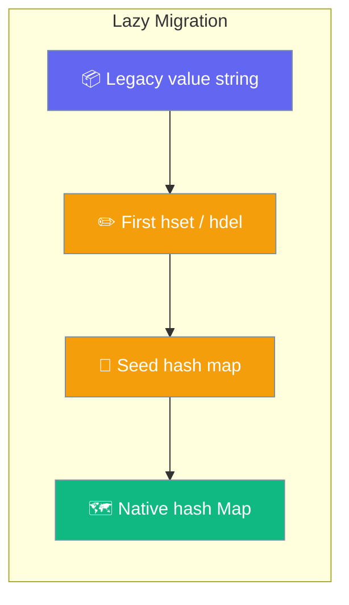

# DynamoDB

AWS DynamoDB for state storage.

## Setup

```bash
pip install boto3
export AWS_ACCESS_KEY_ID=your_key
export AWS_SECRET_ACCESS_KEY=your_secret
export AWS_DEFAULT_REGION=us-east-1
```

## Quick Start

```python
from praisonaiagents import Agent

agent = Agent(
    name="Assistant",
    instructions="You are a helpful assistant.",
    memory={
        "backend": "dynamodb",
        "db": "dynamodb://us-east-1/table-name",
        "session_id": "my-session"
    }
)

response = agent.start("Hello!")
print(response)
```

## Storage Schema & Migration

Hash fields live in a native DynamoDB `Map` attribute called `hash`, with automatic lazy migration from the legacy JSON-string format.



Hash fields are stored in a native `Map` attribute (`hash`) on each item. Earlier versions kept them inside a JSON-encoded string under `value`.

Migration is automatic and lazy. On the first `hset` or `hdel` against a legacy key, the store reads the JSON-string `value`, seeds the native `hash` map via `SET #h = if_not_exists(#h, :seed)`, then applies the field write. `hget` and `hgetall` transparently read either representation.

No manual migration script is required and no downtime is needed. Reads keep working against un-migrated items.

### Item shape after migration

```json
{
  "pk": "session:abc",
  "hash": { "step": "planning", "count": 3 },
  "ttl": 1770000000,
  "updated_at": 1769000000
}
```

### Legacy shape (still readable)

```json
{ "pk": "session:abc", "value": "{\"step\":\"planning\",\"count\":3}" }
```

Legacy items remain readable and are migrated in place on the next mutation.

## Behavior & Guarantees

Hash writes are atomic and TTL is honoured on every read path.

### Atomic hash writes

`hset` uses `UpdateExpression: SET #h.#f = :val, updated_at = :now`, and `hdel` uses `REMOVE #h.#f1, #h.#f2, ...` with `ConditionExpression: attribute_exists(pk)`. Concurrent writers on different fields of the same key no longer clobber each other.

### TTL on hget/hgetall

`hget` and `hgetall` now return `None`/`{}` for keys whose stored `ttl` is in the past, matching the behaviour of `get`.

```python
from praisonai.persistence.state.dynamodb import DynamoDBStateStore

store = DynamoDBStateStore(table_name="praisonai_state", region="us-east-1")

# Two workers writing different fields of the same key — no lost writes.
store.hset("session:abc", "step", "planning")
store.hset("session:abc", "count", 3)

# TTL now respected by hget/hgetall as well as get.
store.set("temp", {"x": 1}, ttl=1)
```

<Note>
Native `hash` map storage, atomic writes, and TTL on `hget`/`hgetall` apply as of PraisonAI #4215.
</Note>

## Best Practices

<AccordionGroup>
  <Accordion title="Write distinct fields concurrently">
    Use `hset(key, field, value)` per field. The atomic `UpdateExpression` on the native map means concurrent writers on different fields never lose writes.
  </Accordion>
  <Accordion title="No manual migration needed">
    Legacy JSON-string items migrate in place on their next `hset`/`hdel`. Reads keep working throughout — no script, no downtime.
  </Accordion>
  <Accordion title="Rely on TTL across all reads">
    Expired keys return `None`/`{}` from `get`, `hget`, and `hgetall` alike, so stale reads are consistent regardless of access method.
  </Accordion>
</AccordionGroup>

## Related

<CardGroup cols={2}>
  <Card title="Firestore" icon="fire" href="/databases/firestore">
    Google Cloud Firestore state store with scoped credentials
  </Card>
  <Card title="Recipe Serve" icon="server" href="/features/recipe-serve-code">
    Serve recipes over HTTP backed by a state store
  </Card>
</CardGroup>
