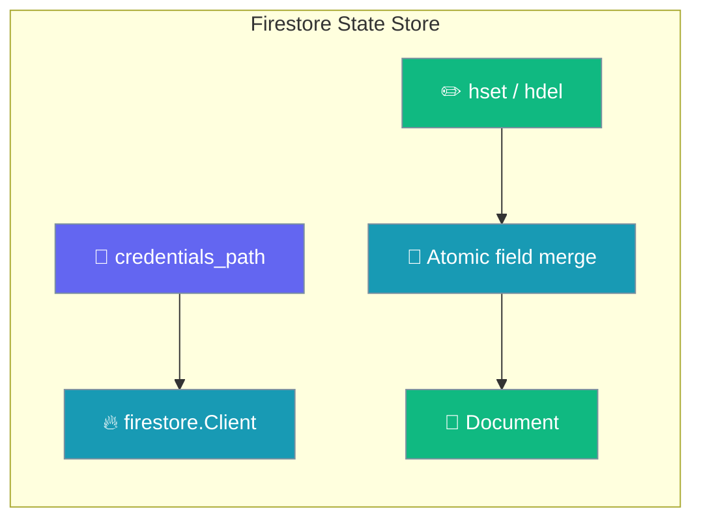

# Firestore

Google Cloud Firestore for state storage.

## Setup

```bash
pip install google-cloud-firestore
export GOOGLE_APPLICATION_CREDENTIALS=path/to/service-account.json
```

## Quick Start

```python
from praisonaiagents import Agent

agent = Agent(
    name="Assistant",
    instructions="You are a helpful assistant.",
    memory={
        "backend": "firestore",
        "db": "firestore://project-id",
        "session_id": "my-session"
    }
)

response = agent.start("Hello!")
print(response)
```

## Behavior & Guarantees

The Firestore state store scopes credentials per client and writes hash fields atomically.



### Credential isolation

Passing `credentials_path=` (or `google_credentials` in `serve.yaml`) scopes the service account to the `firestore.Client` instance only. Earlier versions mutated `os.environ["GOOGLE_APPLICATION_CREDENTIALS"]`, which leaked one tenant's credentials into every other Google Cloud client in the same process (Vertex AI, GCS, and others). Multi-tenant hosts and any process that mixes GCP credentials no longer need a workaround.

```python
from praisonai.persistence.state.firestore import FirestoreStateStore

# Credentials are scoped to this client only — os.environ is untouched.
store = FirestoreStateStore(
    project="my-gcp-project",
    collection="agent_state",
    credentials_path="/etc/secrets/tenant-a.json",
)

# Concurrent hset on different fields no longer clobbers.
store.hset("session:abc", "step", "planning")
store.hset("session:abc", "count", 3)  # safe alongside the line above
```

### Atomic hash writes

`hset(key, field, value)` uses Firestore's field-level merge (`set(..., merge=True)`) and `hdel(key, *fields)` uses `DELETE_FIELD`. Two writers updating **different fields** of the same key no longer clobber each other. Earlier versions did a read-modify-write of the whole `value` document.

### TTL preservation

Because `hset`/`hdel` no longer rewrite the whole document, an existing `expires_at` (TTL) on the key is preserved across field updates. Earlier versions could reset the TTL when `hset` ran after `expire(...)`.

### Scoped credentials in serve.yaml

```yaml
# serve.yaml
memory:
  backend: firestore
  project: my-gcp-project
  collection: agent_state
  # Scoped to the Firestore client only — does not leak to os.environ.
  google_credentials: /etc/secrets/tenant-a.json
```

<Note>
Credential isolation and atomic hash writes apply as of PraisonAI #4215. Field-level merge means concurrent writes to distinct fields are safe without external locking.
</Note>

## Best Practices

<AccordionGroup>
  <Accordion title="Use credentials_path for multi-tenant hosts">
    Pass `credentials_path=` per tenant so each `firestore.Client` carries its own service account. `os.environ` stays untouched, so other GCP clients in the process are unaffected.
  </Accordion>
  <Accordion title="Write distinct fields concurrently">
    Use `hset(key, field, value)` for per-field updates. Concurrent writers on different fields merge safely — no read-modify-write race.
  </Accordion>
  <Accordion title="Set TTL once, then update fields freely">
    Call `expire(key, ttl)` once. Subsequent `hset`/`hdel` calls preserve the existing `expires_at`, so the key still expires on schedule.
  </Accordion>
</AccordionGroup>

## Related

<CardGroup cols={2}>
  <Card title="DynamoDB" icon="cloud" href="/databases/dynamodb">
    AWS DynamoDB state store with atomic hash writes
  </Card>
  <Card title="Recipe Serve" icon="server" href="/features/recipe-serve-code">
    Serve recipes over HTTP with scoped credentials
  </Card>
</CardGroup>
