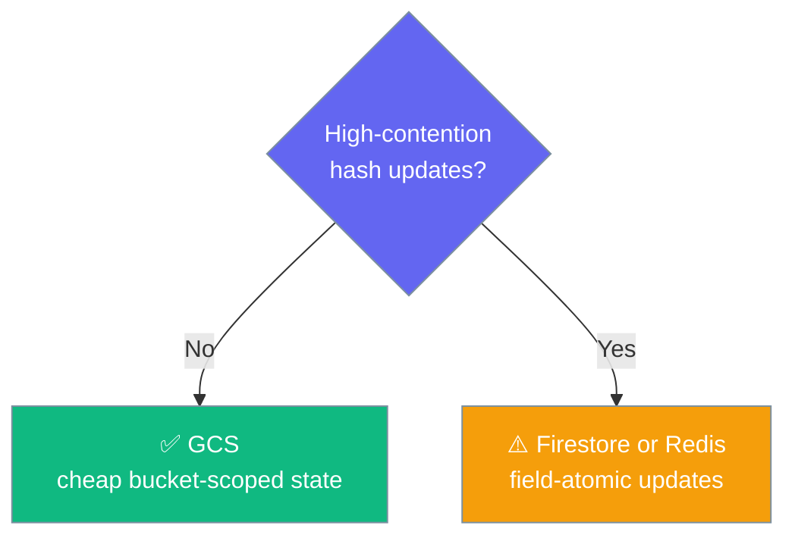

Store agent state in a Google Cloud Storage bucket — cheap, durable, and fully wired to the `StateStore` contract.


<Note>
**GCS state store is fully functional as of PraisonAI PR [#5332](https://github.com/MervinPraison/PraisonAI/pull/5332).** Earlier releases raised `TypeError: Can't instantiate abstract class GCSStateStore with abstract methods expire, hdel, hget, hgetall, hset, keys, ttl` before any GCS call. `GCSStateStore` now implements the complete `StateStore` protocol.
</Note>

## Setup

```bash
pip install google-cloud-storage
export GOOGLE_APPLICATION_CREDENTIALS=path/to/service-account.json
```

## Quick Start

<Steps>
<Step title="Enable via memory config">

Point an agent at a bucket path — persistence is automatic.

```python
from praisonaiagents import Agent

agent = Agent(
    name="Assistant",
    instructions="You are a helpful assistant.",
    memory={
        "backend": "gcs",
        "db": "gs://your-bucket/state",
        "session_id": "my-session"
    }
)

response = agent.start("Hello!")
print(response)
```

</Step>
<Step title="Use the store directly">

`GCSStateStore` now instantiates and covers the full `StateStore` protocol.

```python
from praisonai.persistence.state.gcs import GCSStateStore

store = GCSStateStore(
    bucket_name="your-bucket",
    prefix="state/",
    credentials_path="path/to/service-account.json",
)

store.set("user:42", {"name": "Ada", "plan": "pro"})
print(store.get("user:42"))      # {'name': 'Ada', 'plan': 'pro'}
print(store.keys("user:*"))      # ['user:42']
store.close()
```

</Step>
</Steps>

---

## Supported Operations

`GCSStateStore` covers every method on the `StateStore` ABC end-to-end.

| Op | Supported | Notes |
|----|-----------|-------|
| `get` / `set` / `delete` / `exists` | ✅ | Any JSON-native value (str/int/list/dict); scalars are wrapped internally so they round-trip. |
| `keys(pattern="*")` | ✅ | Glob patterns via `fnmatch`. |
| TTL: `set(..., ttl=seconds)`, `ttl(key)`, `expire(key, ttl)` | ✅ | Expired keys are lazily deleted on read. |
| Hash ops: `hget` / `hset` / `hgetall` / `hdel` | ✅ | Read-modify-write of one JSON blob per key; not field-atomic. |
| `close()` | ✅ | Closes the underlying `google-cloud-storage` client. |

Scalars round-trip because non-dict values are wrapped internally as `{"__value__": ...}` and unwrapped on `get()`, so `set()` matches the ABC (`Any -> None`) and `get()` returns `Optional[Any]`. TTL expiry survives hash rewrites — `hset` / `hdel` / `expire` carry the existing expiry through the read-modify-write. `hdel` returns the count of fields actually removed; a failed rewrite reports `0` rather than falsely claiming success.

<Warning>
GCS hash ops are a read-modify-write of one JSON blob per key, **not field-atomic**. For high-contention field-level concurrency, prefer [Firestore](/databases/firestore) or Redis.
</Warning>

---

## When to Choose GCS

Pick GCS for cheap, bucket-scoped state on a Cloud Run or GKE deployment where you already have a bucket and want durable state without running a separate database.



Not the right tool for high-concurrency hash updates — reach for [Firestore](/databases/firestore) or Redis there.

---

## Best Practices

<AccordionGroup>
<Accordion title="Authenticate via GOOGLE_APPLICATION_CREDENTIALS">
Set `GOOGLE_APPLICATION_CREDENTIALS` to your service-account JSON, or pass `credentials_path=` explicitly. On Cloud Run / GKE, the attached service account is picked up automatically.
</Accordion>
<Accordion title="Use a prefix per environment">
Give each environment its own `prefix` (`prod/state/`, `staging/state/`) so keys never collide inside one bucket.
</Accordion>
<Accordion title="Don't hammer hash fields concurrently">
Each `hset` / `hdel` rewrites the whole JSON blob for a key. Concurrent writers to different fields of the same key can lose updates — use Firestore or Redis for field-level concurrency.
</Accordion>
</AccordionGroup>

---

## Related

<CardGroup cols={2}>
<Card title="Firestore" icon="fire" href="/databases/firestore">
  Field-atomic state store for high-concurrency updates.
</Card>
<Card title="Persistence Overview" icon="database" href="/persistence/overview">
  How state, conversation, and knowledge stores fit together.
</Card>
</CardGroup>
