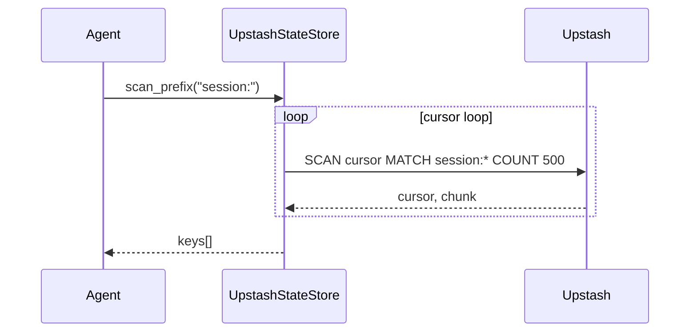

# Upstash

Serverless Redis for state storage.

## Setup

```bash
export UPSTASH_REDIS_REST_URL=your_url
export UPSTASH_REDIS_REST_TOKEN=your_token
```

## Quick Start

```python
from praisonaiagents import Agent
import os

agent = Agent(
    name="Assistant",
    instructions="You are a helpful assistant.",
    memory={
        "backend": "upstash",
        "db": os.getenv("UPSTASH_REDIS_REST_URL"),
        "session_id": "my-session"
    }
)

response = agent.start("Hello!")
print(response)
```

## Configuration Options

| Option | Type | Default | Description |
|--------|------|---------|-------------|
| `url` | `str` | `None` | Upstash Redis REST URL (falls back to `UPSTASH_REDIS_URL`) |
| `token` | `str` | `None` | Upstash Redis REST token (falls back to `UPSTASH_REDIS_TOKEN`) |
| `prefix` | `str` | `"praison:"` | Key prefix for namespacing |

## Production notes

To list many keys, call `scan_prefix()` instead of `keys()` — it uses a server-side cursor `SCAN` (batches of `500`) instead of the blocking `KEYS` command, so a single read never blocks the serverless Redis instance.

```python
from praisonai.persistence import create_state_store

store = create_state_store(
    "upstash",
    url="https://xxx.upstash.io",
    token="your-token",
)
recent = store.scan_prefix("session:")
```


