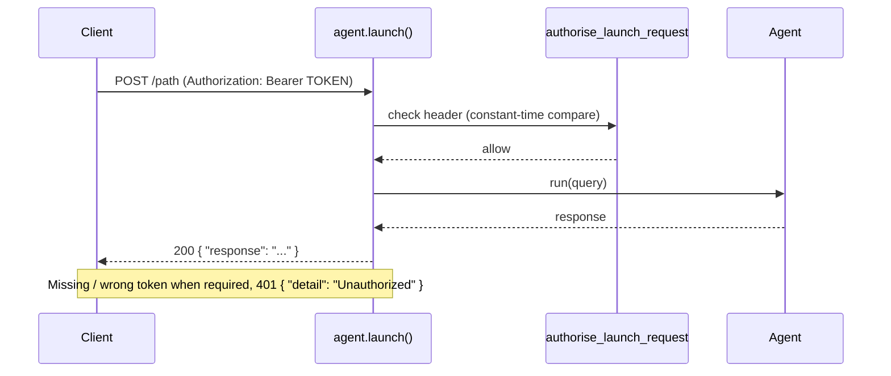

<Note>
**Two Different API Servers**: This page documents the `Agent.launch()` HTTP server, which uses `PRAISONAI_LAUNCH_AUTH_TOKEN`. For the auto-generated API server created by `praisonai deploy run --type api` (which uses `PRAISONAI_API_TOKEN`), see [API Server Authentication](/features/api-server-auth).
</Note>

HTTP REST API endpoints for agents deployed via `Agent.launch()` or `Agents.launch()`.

## Base URL

```
http://localhost:{port}
```

Default port is `8000`. The server binds to `127.0.0.1` by default.

<Note>
If `PRAISONAI_LAUNCH_AUTH_TOKEN` is set (or your process printed a one-time token because it bound to a non-loopback host), add `-H "Authorization: Bearer $PRAISONAI_LAUNCH_AUTH_TOKEN"` to every request below. See [Authentication](#authentication).
</Note>

## Endpoints

### POST /{path}

Send a query to the agent(s).

**Request:**
```bash
curl -X POST http://localhost:8000/ask \
  -H "Content-Type: application/json" \
  -d '{"query": "What is AI?"}'
```

**Request Body:**

| Field | Type | Required | Description |
|-------|------|----------|-------------|
| `query` | string | Yes | The message to send |

**Response:**
```json
{
  "response": "Artificial intelligence (AI) refers to..."
}
```

**Response Fields:**

| Field | Type | Description |
|-------|------|-------------|
| `response` | string | Agent's response |

### POST /{path}/{agent_id}

Call a specific agent in multi-agent setup.

**Request:**
```bash
curl -X POST http://localhost:8000/content/researcher \
  -H "Content-Type: application/json" \
  -d '{"query": "Research AI trends"}'
```

**Response:**
```json
{
  "agent": "Researcher",
  "query": "Research AI trends",
  "response": "Current AI trends include..."
}
```

### GET /{path}/list

List available agents.

**Request:**
```bash
curl http://localhost:8000/content/list
```

**Response:**
```json
{
  "agents": [
    {"name": "Researcher", "id": "researcher"},
    {"name": "Writer", "id": "writer"}
  ]
}
```

### GET /health

Health check endpoint.

**Request:**
```bash
curl http://localhost:8000/health
```

**Response:**
```json
{
  "status": "ok",
  "endpoints": ["/ask", "/content"]
}
```

### GET /

Root endpoint with welcome message.

**Request:**
```bash
curl http://localhost:8000/
```

**Response:**
```json
{
  "message": "Welcome to PraisonAI Agents API on port 8000. See /docs for usage.",
  "endpoints": ["/ask", "/content"]
}
```

### GET /docs

Swagger UI documentation.

**Request:**
Open in browser: `http://localhost:8000/docs`

## Error Responses

| Status | Description |
|--------|-------------|
| `400` | Bad request - invalid JSON or missing query |
| `401` | Unauthorized - invalid or missing API key |
| `500` | Internal server error |

**Error Format:**
```json
{
  "detail": "Missing 'query' field in request"
}
```

## Authentication

The `Agent.launch()` / `Agents.launch()` server binds to `127.0.0.1` by default and requires a bearer token whenever `PRAISONAI_LAUNCH_AUTH_TOKEN` is set. On loopback with no token, requests are keyless. Binding to a non-loopback host (`0.0.0.0`, a LAN IP) with no token auto-generates a one-time token and prints it to stdout.



Send the token with **either** header:

```bash
# Preferred
curl -X POST http://localhost:8000/ask \
  -H "Content-Type: application/json" \
  -H "Authorization: Bearer $PRAISONAI_LAUNCH_AUTH_TOKEN" \
  -d '{"query": "Hello"}'

# Alternate (clients that cannot set Authorization)
curl -X POST http://localhost:8000/ask \
  -H "Content-Type: application/json" \
  -H "X-Auth-Token: $PRAISONAI_LAUNCH_AUTH_TOKEN" \
  -d '{"query": "Hello"}'
```

A missing or wrong token when one is required returns:

```json
{ "detail": "Unauthorized" }
```

with HTTP status `401`. See [Agent API Launch → Authentication](/features/agent-api-launch#authentication) for the full three-state model.

## Python Client

```python
import requests

response = requests.post(
    "http://localhost:8000/ask",
    json={"query": "What is machine learning?"},
    headers={"Content-Type": "application/json"}
)

print(response.json()["response"])
```

## Related

- [Agents Server](../agents-server) - Deploy agents as HTTP server
- [MCP API](./mcp-api) - MCP server endpoints
- [A2A API](./a2a-api) - A2A protocol endpoints
