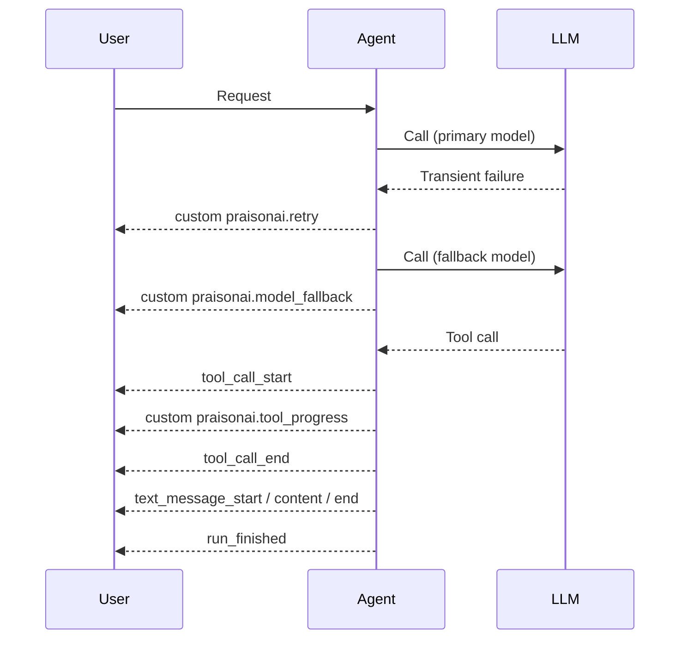

# AGUI API

AG-UI protocol endpoints for agents deployed via `AGUI(agent).get_router()`. Compatible with CopilotKit.

## Base URL + Playground

```bash
# Start AGUI server
from praisonaiagents import Agent
from praisonaiagents.agui import AGUI
import uvicorn

agent = Agent(instructions="You are a helpful assistant")
app = AGUI(agent).get_router()
uvicorn.run(app, host="0.0.0.0", port=8000)
```

**Base URL:** `http://localhost:8000`

## Endpoints

### POST /agui

Run agent with Server-Sent Events streaming.

<ParamField body="threadId" type="string" required>
  Thread identifier
</ParamField>

<ParamField body="runId" type="string" required>
  Run identifier
</ParamField>

<ParamField body="state.messages" type="array" required>
  Conversation messages array
</ParamField>

<CodeGroup>
```bash curl
curl -X POST http://localhost:8000/agui \
  -H "Content-Type: application/json" \
  -d '{
    "threadId": "thread-123",
    "runId": "run-456",
    "state": {
      "messages": [
        {"id": "msg-1", "role": "user", "content": "Hello!"}
      ]
    }
  }'
```

```python Python
import requests
import json

response = requests.post(
    "http://localhost:8000/agui",
    json={
        "threadId": "thread-123",
        "runId": "run-456",
        "state": {
            "messages": [{"id": "msg-1", "role": "user", "content": "Hello!"}]
        }
    },
    stream=True
)

for line in response.iter_lines():
    if line:
        line = line.decode('utf-8')
        if line.startswith('data: '):
            event = json.loads(line[6:])
            print(f"Event: {event['type']}")
            if event['type'] == 'text_message_content':
                print(f"  Delta: {event['delta']}")
```

```javascript JavaScript
const response = await fetch("http://localhost:8000/agui", {
  method: "POST",
  headers: { "Content-Type": "application/json" },
  body: JSON.stringify({
    threadId: "thread-123",
    runId: "run-456",
    state: {
      messages: [{ id: "msg-1", role: "user", content: "Hello!" }]
    }
  })
});

const reader = response.body.getReader();
const decoder = new TextDecoder();

while (true) {
  const { done, value } = await reader.read();
  if (done) break;
  
  const text = decoder.decode(value);
  for (const line of text.split('\n')) {
    if (line.startsWith('data: ')) {
      const event = JSON.parse(line.slice(6));
      console.log('Event:', event.type);
    }
  }
}
```
</CodeGroup>

**Response (SSE Stream):**
```
event: run_started
data: {"type": "run_started", "threadId": "thread-123", "runId": "run-456"}

event: tool_call_start
data: {"type": "tool_call_start", "toolCallId": "call-1", "toolCallName": "search"}

event: custom
data: {"type": "custom", "name": "praisonai.tool_progress", "value": {"content": "Fetched 12 results", "tool_call": {"id": "call-1"}, "metadata": {"progress": 0.5}}}

event: tool_call_end
data: {"type": "tool_call_end", "toolCallId": "call-1"}

event: text_message_start
data: {"type": "text_message_start", "messageId": "msg-2"}

event: text_message_content
data: {"type": "text_message_content", "messageId": "msg-2", "delta": "Hello"}

event: text_message_content
data: {"type": "text_message_content", "messageId": "msg-2", "delta": "! How can I help?"}

event: text_message_end
data: {"type": "text_message_end", "messageId": "msg-2"}

event: run_finished
data: {"type": "run_finished", "threadId": "thread-123", "runId": "run-456"}
```

The `custom` event carries a `praisonai.*` name. Clients that do not recognise a custom name must ignore it — see [PraisonAI custom events](#praisonai-custom-events).

### GET /status

Check agent availability.

<ParamField query="none" type="none">
  No parameters required.
</ParamField>

<CodeGroup>
```bash curl
curl http://localhost:8000/status
```

```python Python
import requests

response = requests.get("http://localhost:8000/status")
print(response.json())
```
</CodeGroup>

**Response:**
```json
{
  "status": "available"
}
```

## Event Types

| Event | Description |
|-------|-------------|
| `run_started` | Agent run has started |
| `run_finished` | Agent run completed |
| `run_error` | Terminal error — includes mid-stream provider failures |
| `text_message_start` | New text message started |
| `text_message_content` | Text content delta |
| `text_message_end` | Text message completed |
| `tool_call_start` | Tool call started |
| `tool_call_args` | Tool call arguments |
| `tool_call_end` | Tool call completed |
| `custom` (`praisonai.*`) | PraisonAI-specific events for recoverable failures and progress — see below |

## PraisonAI custom events

AG-UI has no first-class frames for recoverable failures or user-visible progress. PraisonAI carries these as `custom` events with a `praisonai.*` name. AG-UI clients are expected to ignore custom event names they do not recognise, so adding these is backwards-compatible.

| Custom event name | When it fires | `value` shape |
|-------------------|---------------|---------------|
| `praisonai.retry` | LLM call is being retried after a transient failure | `{ message, metadata }` |
| `praisonai.model_fallback` | Provider swapped to a fallback model | `{ message, metadata }` |
| `praisonai.stream_unavailable` | Streaming path failed; falling back to non-streaming | `{ message, metadata }` |
| `praisonai.tool_progress` | A running tool emitted progress | `{ content, tool_call, metadata }` |
| `praisonai.todo_updated` | The agent's todo list changed | `{ content, tool_call, metadata }` |

Recoverable events (`retry`, `model_fallback`, `stream_unavailable`) are deliberately **not** `run_error` — the run continues. `run_error` is terminal in AG-UI.



Branch on `event.type === 'custom'` and inspect `event.name` for the `praisonai.` prefix:

```javascript
function handleEvent(event) {
  if (event.type === 'custom' && event.name.startsWith('praisonai.')) {
    switch (event.name) {
      case 'praisonai.retry':
      case 'praisonai.model_fallback':
      case 'praisonai.stream_unavailable':
        console.warn(`${event.name}: ${event.value.message}`);
        break;
      case 'praisonai.tool_progress':
      case 'praisonai.todo_updated':
        console.log(`${event.name}:`, event.value.content);
        break;
      default:
        break;  // ignore unknown praisonai.* events
    }
    return;
  }
  // ...handle standard AG-UI events (text_message_*, tool_call_*, run_*)
}
```

## Message Format

**Input Message:**
```json
{
  "id": "msg-1",
  "role": "user",
  "content": "Hello!"
}
```

| Field | Type | Description |
|-------|------|-------------|
| `id` | string | Message ID |
| `role` | string | "user" or "assistant" |
| `content` | string | Message content |

## Error Events

A terminal error reaches the client as `run_error`. This now includes **mid-stream provider failures** — a provider-side error part-way through a response is surfaced as `run_error` instead of being silently swallowed.

```
event: run_error
data: {"type": "run_error", "threadId": "thread-123", "runId": "run-456", "error": "Error message"}
```

For **recoverable** conditions where the run continues (retry, model fallback, streaming fallback), the client receives a `custom` `praisonai.*` event instead — see [PraisonAI custom events](#praisonai-custom-events).

## CopilotKit Integration

```jsx
import { CopilotKit } from "@copilotkit/react-core";

function App() {
  return (
    <CopilotKit runtimeUrl="http://localhost:8000/agui">
      <YourApp />
    </CopilotKit>
  );
}
```

## Related

- [AGUI Server](../agui-server) - Deploy agents as AGUI server
- [A2A API](./a2a-api) - A2A protocol endpoints
- [Agents API](./agents-api) - HTTP REST endpoints
