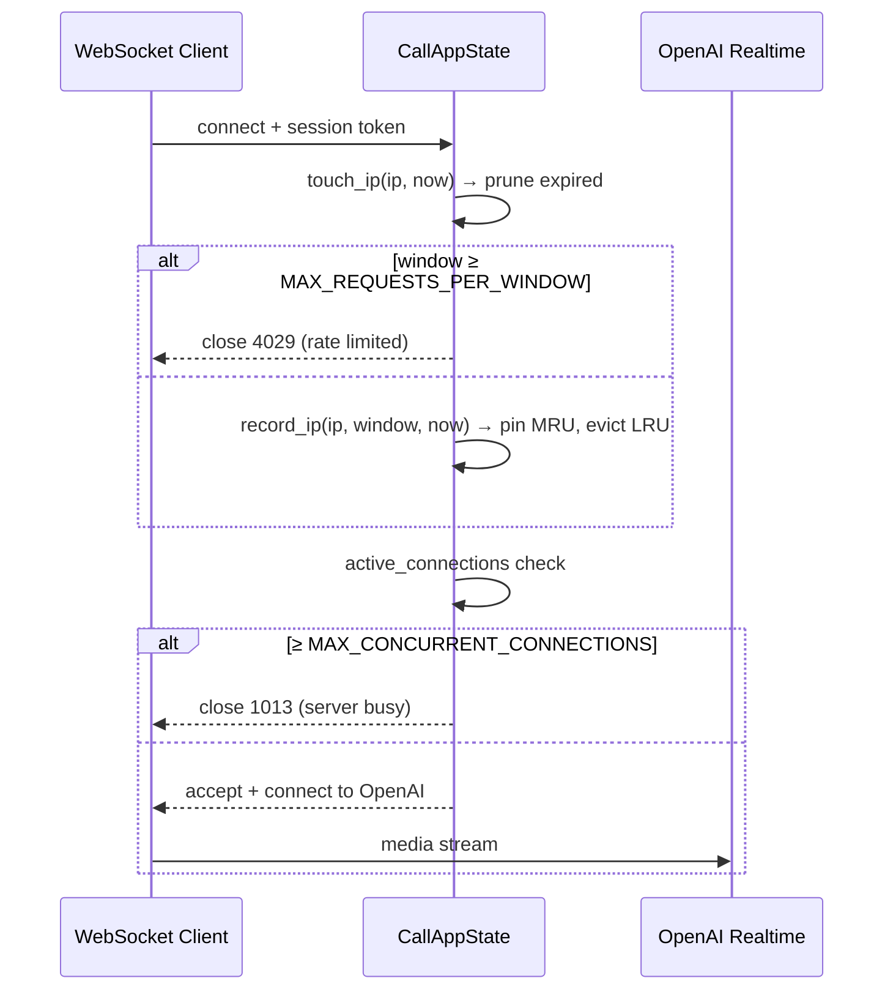

# Voice Call API

The Voice Call API provides Twilio voice integration with OpenAI's Realtime API for voice-based AI interactions.

## Binding

`praisonai call` binds to `127.0.0.1:8090` by default. Inside a container or VM, use `--host 0.0.0.0` so the server is reachable from outside the container boundary — see [Binding & Network Access](/docs/call#binding-network-access) for details. Always pair an exposed port with `CALL_SERVER_TOKEN`.

```bash
# Inside a container / pod (the container IS the isolation boundary)
praisonai call --host 0.0.0.0 --port 8090
```

## Base URL

```
http://localhost:8090
```

## Endpoints

### Status Page

Check if the server is running.

<ParamField path="GET" type="/status">
  Returns HTML status page
</ParamField>

**Response**

```html
<html>
  <head><title>Praison AI Call Server</title></head>
  <body>
    <h1>Praison AI Call Server is running!</h1>
  </body>
</html>
```

---

### Incoming Call Handler

Handle incoming Twilio calls and return TwiML response.

<ParamField path="GET/POST" type="/">
  Twilio webhook for incoming calls
</ParamField>

**Response (TwiML)**

```xml
<?xml version="1.0" encoding="UTF-8"?>
<Response>
  <Say></Say>
  <Pause length="1"/>
  <Connect>
    <Stream url="wss://your-host/media-stream"/>
  </Connect>
</Response>
```

---

### Media Stream WebSocket

WebSocket endpoint for real-time audio streaming between Twilio and OpenAI.

<ParamField path="WebSocket" type="/media-stream">
  WebSocket for audio streaming
</ParamField>

**Connection Flow**

1. Twilio connects to WebSocket
2. Server connects to OpenAI Realtime API
3. Audio streams bidirectionally:
   - Twilio → Server → OpenAI (user speech)
   - OpenAI → Server → Twilio (AI response)

**Twilio Events**

| Event | Description |
|-------|-------------|
| `start` | Stream started |
| `media` | Audio data chunk |
| `stop` | Stream ended |

**OpenAI Events**

| Event | Description |
|-------|-------------|
| `session.created` | Session initialized |
| `session.updated` | Session config updated |
| `input_audio_buffer.speech_started` | User started speaking |
| `input_audio_buffer.speech_stopped` | User stopped speaking |
| `response.audio.delta` | AI audio response chunk |
| `response.done` | AI response complete |

## Configuration

### Environment Variables

| Variable | Required | Default | Description |
|----------|----------|---------|-------------|
| `OPENAI_API_KEY` | Yes* | - | OpenAI API key with Realtime access (*required unless `PRAISONAI_REALTIME_API_KEY` is set) |
| `PORT` | No | `8090` | Server port |
| `NGROK_AUTH_TOKEN` | No | - | ngrok token for public URL |
| `PUBLIC` | No | `false` | Enable public URL via ngrok |
| `PRAISONAI_REALTIME_URL` | No | (OpenAI) | Full `wss://…` URL — takes precedence over the OpenAI default |
| `PRAISONAI_REALTIME_MODEL` | No | `gpt-4o-realtime-preview-2024-10-01` | Model for the default OpenAI URL |
| `PRAISONAI_REALTIME_API_KEY` | No | falls back to `OPENAI_API_KEY` | Bearer key for the realtime connection |

### Realtime Timeouts

The realtime WebSocket runs with bounded connect / heartbeat / close so a dead upstream cannot hold a Twilio media leg indefinitely: `open_timeout=10`, `ping_interval=20`, `ping_timeout=20`, `close_timeout=5`, `max_size=1 MiB`. These are hardcoded, not env-tunable. See [Point the realtime endpoint elsewhere](/docs/call#point-the-realtime-endpoint-elsewhere-azure-self-hosted) for the override flow.

### Rate Limiting & Multi-Tenant Isolation

Each `build_call_app()` tenant enforces per-IP request rate limiting and a total concurrent-connection cap. As of [PR #5348](https://github.com/MervinPraison/PraisonAI/pull/5348), both counters live on that app's `CallAppState` — co-hosted tenants in a single process no longer cross-consume each other's connection budget.

**Rate Limiting**

| Env Var | Default | Description |
|---|---|---|
| `MAX_REQUESTS_PER_WINDOW` | `100` | Requests allowed per IP per hour. Exceeding it closes the WebSocket with code `4029` ("Rate limit exceeded"). |
| `MAX_CONCURRENT_CONNECTIONS` | `5` | Total concurrent media-stream connections per app. Exceeding it closes the WebSocket with code `1013` ("Server busy"). |

**Bounded IP tracking**

The per-IP request-timestamp map is an **LRU-bounded `OrderedDict`** (default cap `10_000` IPs, configurable via the `max_tracked_ips` argument to `CallAppState(...)`):

- Expired timestamps are pruned eagerly on read (`touch_ip`), and an IP whose window has emptied is dropped from the map immediately — a rejected caller leaves no residue.
- On admit (`record_ip`), the IP is pinned MRU and the oldest entries are evicted so the map never exceeds `max_tracked_ips`. Provision above your realistic distinct-IP working set (the 10k default is generous) so eviction only bites under a rotating-IP flood — exactly the unbounded-growth case the bound exists to contain.

Prior to PR #5348, `client_ips` was a plain module-global `defaultdict(list)` — a caller rotating source IPs could grow it without bound.

**Custom `max_tracked_ips`:**

```python
from praisonai.api.call import build_call_app, CallAppState

app = build_call_app()
# CallAppState is built inside build_call_app(); override by replacing
# app.state.call_state with a state that carries a different IP cap.
app.state.call_state = CallAppState(max_tracked_ips=50_000)
```



### Custom Tools

Create a `tools.py` file in the working directory:

```python
# tools.py
async def get_weather(location: str) -> dict:
    """Get weather for a location."""
    return {"location": location, "temp": "72°F", "condition": "sunny"}

get_weather.definition = {
    "name": "get_weather",
    "description": "Get current weather for a location",
    "parameters": {
        "type": "object",
        "properties": {
            "location": {"type": "string", "description": "City name"}
        },
        "required": ["location"]
    }
}

tools = [(get_weather.definition, get_weather)]
```

## Usage Example

### Start Server

```bash
# Basic start
python -m praisonai.api.call

# With public URL
python -m praisonai.api.call --public

# Custom port
python -m praisonai.api.call --port 9000
```

### Twilio Configuration

1. Get your public URL (ngrok or deployed)
2. In Twilio Console:
   - Go to Phone Numbers → Your Number
   - Set Voice webhook to: `https://your-url.ngrok.io/`
   - Method: POST

### Python Usage

```python
from praisonai.api.call import run_server

# Start the server (local only, default)
run_server(port=8090)

# Start with public ngrok tunnel
run_server(port=8090, use_public=True)

# Start bound to all interfaces (e.g. inside a container)
run_server(port=8090, host="0.0.0.0")
```

## Session Configuration

The server sends this session configuration to OpenAI:

```json
{
  "type": "session.update",
  "session": {
    "turn_detection": {
      "type": "server_vad",
      "threshold": 0.5,
      "prefix_padding_ms": 300,
      "silence_duration_ms": 200
    },
    "input_audio_format": "g711_ulaw",
    "output_audio_format": "g711_ulaw",
    "voice": "alloy",
    "tools": [],
    "tool_choice": "auto",
    "modalities": ["text", "audio"],
    "temperature": 0.8
  }
}
```

## Related

- [Point the realtime endpoint elsewhere](/docs/call#point-the-realtime-endpoint-elsewhere-azure-self-hosted) - Azure / self-hosted realtime overrides
- [CLI](/cli/cli) - Command-line interface
- [Agent](/sdk/praisonaiagents/agent/agent) - Agent configuration
