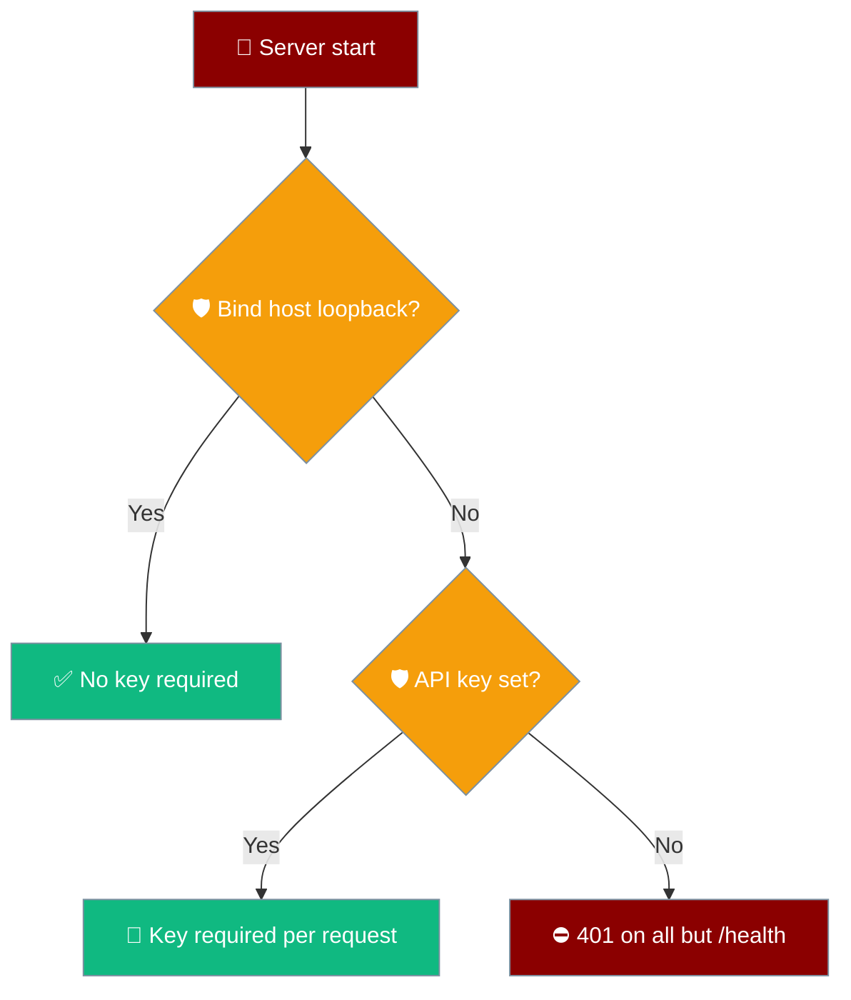

# Async Jobs Deployment

Deploy the async jobs server for production-grade agent and recipe execution with persistence, webhooks, and streaming.

## Overview

The async jobs server provides:
- HTTP API for job submission and management
- Persistent job storage
- Webhook notifications
- SSE streaming for real-time progress
- Idempotency support

## Quick Start

### Start the Server

```bash
# Development
python -m uvicorn praisonai.jobs.server:create_app --port 8005 --factory

# Production with multiple workers
python -m uvicorn praisonai.jobs.server:create_app \
    --host 0.0.0.0 \
    --port 8005 \
    --workers 4 \
    --factory
```

### Submit a Job

```bash
# Submit with CLI
praisonai run submit "Analyze data" --recipe analyzer --api-url http://localhost:8005

# Submit with Python
from praisonai import recipe

job = recipe.submit_job(
    "my-recipe",
    input={"query": "What is AI?"},
    api_url="http://localhost:8005",
)
```

## Docker Deployment

### Dockerfile

```dockerfile
FROM python:3.11-slim

WORKDIR /app

# Install dependencies
COPY requirements.txt .
RUN pip install -r requirements.txt

# Copy application
COPY . .

# Expose port
EXPOSE 8005

# Set environment variables
ENV OPENAI_API_KEY=${OPENAI_API_KEY}
ENV PRAISONAI_JOBS_PORT=8005
ENV PRAISONAI_JOBS_HOST=0.0.0.0
ENV PRAISONAI_JOBS_BIND_HOST=0.0.0.0
ENV PRAISONAI_JOBS_API_KEY=${PRAISONAI_JOBS_API_KEY}

# Run server
CMD ["python", "-m", "uvicorn", "praisonai.jobs.server:create_app", "--host", "0.0.0.0", "--port", "8005", "--factory"]
```

### Docker Compose

```yaml
version: '3.8'

services:
  jobs-server:
    build: .
    ports:
      - "8005:8005"
    environment:
      - OPENAI_API_KEY=${OPENAI_API_KEY}
      - PRAISONAI_JOBS_MAX_CONCURRENT=10
      - PRAISONAI_JOBS_DEFAULT_TIMEOUT=3600
      - PRAISONAI_JOBS_BIND_HOST=0.0.0.0
      - PRAISONAI_JOBS_API_KEY=${PRAISONAI_JOBS_API_KEY}
    healthcheck:
      test: ["CMD", "curl", "-f", "http://localhost:8005/health"]
      interval: 30s
      timeout: 10s
      retries: 3
    restart: unless-stopped
```

## Configuration

### Environment Variables

| Variable | Default | Description |
|----------|---------|-------------|
| `PRAISONAI_JOBS_PORT` | 8005 | Server port |
| `PRAISONAI_JOBS_HOST` | 127.0.0.1 | Server host |
| `PRAISONAI_JOBS_MAX_CONCURRENT` | 10 | Max concurrent jobs |
| `PRAISONAI_JOBS_DEFAULT_TIMEOUT` | 3600 | Default timeout (seconds) |
| `PRAISONAI_JOBS_API_KEY` | *(unset)* | When set, all requests except `/health` must send the key via `Authorization: Bearer <key>` or `X-API-Key: <key>`. Wrong or missing key returns `401`. |
| `PRAISONAI_JOBS_BIND_HOST` | 127.0.0.1 | Bind host used for the auth guard. Any value outside `{127.0.0.1, localhost, ::1}` requires `PRAISONAI_JOBS_API_KEY`. |

### Authentication

The jobs server has two auth modes based on where it binds.

<Steps>

<Step title="Localhost-only (default)">
No key required, reachable only from the loopback interface.

```bash
python -m uvicorn praisonai.jobs.server:create_app --port 8005 --factory
```
</Step>

<Step title="Public bind">
Set `PRAISONAI_JOBS_BIND_HOST` to a real interface and `PRAISONAI_JOBS_API_KEY` together.

```bash
export PRAISONAI_JOBS_BIND_HOST=0.0.0.0
export PRAISONAI_JOBS_API_KEY=$JOBS_KEY
python -m uvicorn praisonai.jobs.server:create_app --host 0.0.0.0 --port 8005 --factory
```

```bash
curl -H "Authorization: Bearer $JOBS_KEY" http://your-host:8005/api/v1/runs
```
</Step>

</Steps>

A public bind without a key refuses every request except `/health` with `401 {"error": "PRAISONAI_JOBS_API_KEY required for non-localhost binding"}`.



### TEMPLATE.yaml Runtime Block

Configure job defaults in your recipe:

```yaml
runtime:
  job:
    enabled: true
    timeout_sec: 3600
    webhook_url: "${WEBHOOK_URL}"
    idempotency_scope: "session"
    events:
      - completed
      - failed
```

## API Endpoints

| Endpoint | Method | Description |
|----------|--------|-------------|
| `/api/v1/runs` | POST | Submit a new job |
| `/api/v1/runs` | GET | List all jobs |
| `/api/v1/runs/{id}` | GET | Get job status |
| `/api/v1/runs/{id}/result` | GET | Get job result |
| `/api/v1/runs/{id}/stream` | GET | Stream job progress (SSE) |
| `/api/v1/runs/{id}/cancel` | POST | Cancel a job |
| `/api/v1/runs/{id}` | DELETE | Delete a job |
| `/health` | GET | Health check |
| `/stats` | GET | Server statistics |

## Production Considerations

### Load Balancing

For high availability, deploy multiple instances behind a load balancer:

```nginx
upstream jobs_servers {
    server jobs1:8005;
    server jobs2:8005;
    server jobs3:8005;
}

server {
    listen 80;
    
    location / {
        proxy_pass http://jobs_servers;
        proxy_http_version 1.1;
        proxy_set_header Upgrade $http_upgrade;
        proxy_set_header Connection "upgrade";
    }
}
```

### Webhooks

Configure webhooks for job completion notifications:

```python
job = recipe.submit_job(
    "my-recipe",
    webhook_url="https://your-server.com/webhook",
)
```

Webhook payload:

```json
{
  "job_id": "run_abc123",
  "status": "succeeded",
  "result": {"output": "..."},
  "completed_at": "2024-01-15T10:30:00Z",
  "duration_seconds": 45.2
}
```

### Idempotency

Prevent duplicate job submissions:

```bash
praisonai run submit "Task" --idempotency-key order-123 --idempotency-scope global
```

### Monitoring

```bash
# Check server health
curl http://localhost:8005/health

# Get server stats
curl http://localhost:8005/stats

# List running jobs
praisonai run list --status running --json
```

## Kubernetes Deployment

```yaml
apiVersion: apps/v1
kind: Deployment
metadata:
  name: praisonai-jobs
spec:
  replicas: 3
  selector:
    matchLabels:
      app: praisonai-jobs
  template:
    metadata:
      labels:
        app: praisonai-jobs
    spec:
      containers:
      - name: jobs-server
        image: praisonai/jobs-server:latest
        ports:
        - containerPort: 8005
        env:
        - name: OPENAI_API_KEY
          valueFrom:
            secretKeyRef:
              name: praisonai-secrets
              key: openai-api-key
        - name: PRAISONAI_JOBS_BIND_HOST
          value: "0.0.0.0"
        - name: PRAISONAI_JOBS_API_KEY
          valueFrom:
            secretKeyRef:
              name: praisonai-secrets
              key: jobs-api-key
        - name: PRAISONAI_JOBS_MAX_CONCURRENT
          value: "10"
        livenessProbe:
          httpGet:
            path: /health
            port: 8005
          initialDelaySeconds: 10
          periodSeconds: 30
        resources:
          requests:
            memory: "512Mi"
            cpu: "500m"
          limits:
            memory: "2Gi"
            cpu: "2000m"
---
apiVersion: v1
kind: Service
metadata:
  name: praisonai-jobs
spec:
  selector:
    app: praisonai-jobs
  ports:
  - port: 8005
    targetPort: 8005
  type: LoadBalancer
```

## See Also

- [Async Jobs Feature](/docs/features/async-jobs)
- [Async Jobs CLI](/docs/cli/async-jobs)
- [Jobs API Reference](/docs/deploy/api/async-jobs/index)
- [Background Tasks Deployment](/docs/deploy/background-tasks)
- [Scheduler Deployment](/docs/deploy/scheduler-deploy)
