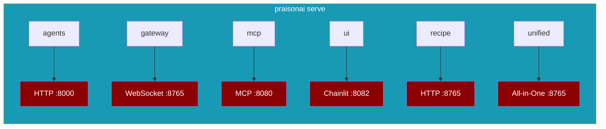

PraisonAI offers two deployment approaches: **Deploy to Cloud/Docker** using `praisonai deploy` CLI, or **Run as a Server** locally using Python SDK.

## Choose Your Path

<CardGroup cols={2}>
  <Card title="Deploy to Cloud" icon="cloud" href="#deploy-to-cloud">
    Deploy agents to AWS, Azure, GCP, or Docker
  </Card>
  <Card title="Run as Server" icon="server" href="#run-as-server">
    Start HTTP, MCP, A2A, or AGUI servers locally
  </Card>
</CardGroup>

---

## Deploy to Cloud

Use `praisonai deploy` to deploy agents to cloud providers or Docker containers.

<Tabs>
  <Tab title="Local API">
```bash
pip install praisonai
praisonai deploy run --type api
```
  </Tab>
  <Tab title="Docker">
```bash
praisonai deploy run --type docker
```
  </Tab>
  <Tab title="AWS">
```bash
praisonai deploy run --type cloud --provider aws
```
  </Tab>
  <Tab title="GCP">
```bash
praisonai deploy run --type cloud --provider gcp
```
  </Tab>
  <Tab title="Azure">
```bash
praisonai deploy run --type cloud --provider azure
```
  </Tab>
</Tabs>

### Cloud Deployment Pages

| Target | Description | Guide |
|--------|-------------|-------|
| **API Server** | Local FastAPI server for development | [API Guide](./cli/api) |
| **Docker** | Containerized deployment | [Docker Guide](./cli/docker) |
| **AWS** | Deploy to AWS ECS/Fargate | [AWS Guide](./cli/aws) |
| **Azure** | Deploy to Azure Container Apps | [Azure Guide](./cli/azure) |
| **GCP** | Deploy to Google Cloud Run | [GCP Guide](./cli/gcp) |

### Deploy CLI Commands

| Command | Description |
|---------|-------------|
| `praisonai deploy run` | Execute deployment |
| `praisonai deploy init` | Generate agents.yaml with deploy config |
| `praisonai deploy doctor` | Check deployment readiness |
| `praisonai deploy status` | View deployment status |
| `praisonai deploy destroy` | Remove deployment |

<Card title="Deploy CLI Reference" icon="terminal" href="./cli/index">
  Complete guide to all `praisonai deploy` commands and options
</Card>

---

## Run as Server

Start agents as servers locally using Python SDK or CLI.



<Tabs>
  <Tab title="HTTP Server">
```python
from praisonaiagents import Agent

agent = Agent(instructions="You are helpful")
agent.launch(port=8000)
```
  </Tab>
  <Tab title="MCP Server">
```python
from praisonaiagents import ToolsMCPServer

server = ToolsMCPServer(name="my-tools")
server.run(transport="sse", port=8080)
```
  </Tab>
  <Tab title="CLI">
```bash
praisonai serve agents --port 8000
```
  </Tab>
</Tabs>

### All Serve Commands

<Note>
All server commands are now unified under `praisonai serve <type>`. 
Run `praisonai serve` to see all available options.
</Note>

Use `praisonai serve <type>` to start any server. All options in one place:

| Command | Protocol | Default Port | Description |
|---------|----------|--------------|-------------|
| `praisonai serve agents` | HTTP | 8000 | Agents as HTTP REST API |
| `praisonai serve gateway` | WebSocket | 8765 | Multi-agent real-time coordination |
| `praisonai serve mcp` | STDIO/SSE | 8080 | MCP server for Claude/Cursor |
| `praisonai serve acp` | STDIO | - | Agent Client Protocol for IDEs |
| `praisonai serve lsp` | STDIO | - | Language Server Protocol |
| `praisonai serve ui` | HTTP | 8082 | Chainlit web interface |
| `praisonai serve rag` | HTTP | 9000 | RAG query server |
| `praisonai serve registry` | HTTP | 7777 | Package registry server |
| `praisonai serve docs` | HTTP | 3000 | Documentation preview |
| `praisonai serve scheduler` | Background | - | Job scheduler daemon |
| `praisonai serve recipe` | HTTP | 8765 | Recipe runner server |
| `praisonai serve a2a` | JSON-RPC | 8001 | Agent-to-Agent protocol |
| `praisonai serve a2u` | SSE | 8002 | Agent-to-User event stream |
| `praisonai serve unified` | HTTP/SSE | 8765 | All providers combined |

<Card title="Unified Serve Reference" icon="server" href="./servers/serve">
  Complete guide to all `praisonai serve` commands and options
</Card>

### Server Type Guides

| Server | Use Case | Guide |
|--------|----------|-------|
| **Unified Serve** | All serve commands in one place | [Serve Commands](./servers/serve) |
| **Agents** | HTTP REST API for single/multi-agent systems | [Agents Server](./servers/agents) |
| **Gateway** | WebSocket multi-agent real-time coordination | [Gateway Server](./servers/gateway) |
| **MCP** | Expose tools to Claude Desktop, Cursor | [MCP Server](./servers/tools-mcp) |
| **A2A** | Agent-to-Agent protocol communication | [A2A Server](./servers/a2a) |
| **AGUI** | CopilotKit frontend integration | [AGUI Server](./servers/agui) |

---

## API Reference

Documentation for all server endpoints.

| API | Protocol | Reference |
|-----|----------|-----------|
| **Agents API** | HTTP REST | [Endpoints](./api/agents-api) |
| **MCP API** | MCP Protocol | [Endpoints](./api/mcp-api) |
| **A2A API** | JSON-RPC | [Endpoints](./api/a2a-api) |
| **AGUI API** | SSE Streaming | [Endpoints](./api/agui-api) |

---

## Quick Decision Guide

| I want to... | Use |
|--------------|-----|
| Test locally | `praisonai deploy run --type api` or `agent.launch()` |
| Deploy to production | `praisonai deploy run --type cloud --provider <aws/gcp/azure>` |
| Containerize my agent | `praisonai deploy run --type docker` |
| Integrate with Claude Desktop | [Tools MCP Server](./servers/tools-mcp) |
| Build a chat UI | [AGUI Server](./servers/agui) with CopilotKit |
| Connect agents together | [A2A Server](./servers/a2a) |
