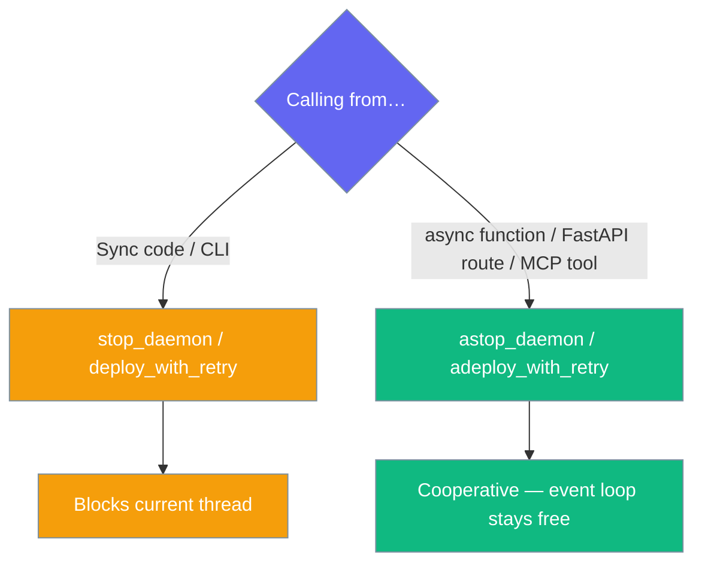
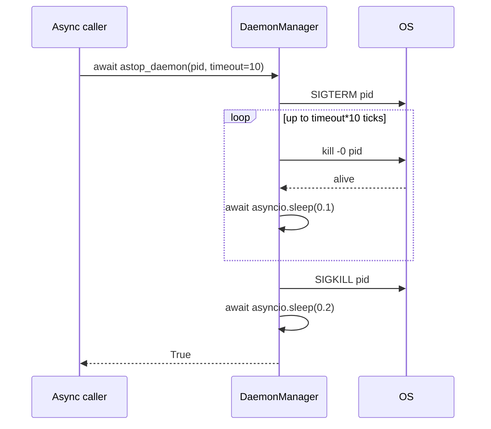
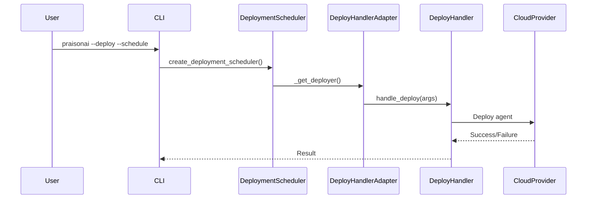

# Scheduler Deployment

Deploy scheduled agent and recipe execution for 24/7 autonomous operations in production environments.

## Overview

The scheduler provides:
- Interval-based agent/recipe execution
- PM2-style daemon management
- Cost budgeting and monitoring
- Automatic retry with exponential backoff
- Centralized logging

## CLI: `praisonai --deploy --schedule`

Deploy and schedule with real cloud deployment (no longer a stub):

```bash
praisonai agents.yaml --deploy --provider gcp --schedule daily --max-retries 3
```

This command now runs the actual `DeployHandler` on the chosen interval, replacing the previous stub implementation.

## Quick Start

### Start a Scheduler

```bash
# With a task prompt
praisonai schedule start news-bot "Check AI news" --interval hourly

# With a recipe
praisonai schedule start news-monitor --recipe news-analyzer --interval hourly

# With all options
praisonai schedule start my-scheduler \
    --recipe my-recipe \
    --interval "*/6h" \
    --timeout 600 \
    --max-cost 2.00 \
    --max-retries 3
```

### Manage Schedulers

```bash
# List all schedulers
praisonai schedule list

# View logs
praisonai schedule logs news-bot --follow

# Stop scheduler
praisonai schedule stop news-bot

# Restart scheduler
praisonai schedule restart news-bot
```

## Python API

Create deployment schedulers with the real cloud deployer:

```python
from praisonai.scheduler import create_deployment_scheduler

# Create a deployment scheduler
scheduler = create_deployment_scheduler(provider="gcp", config={
    "project": "my-project",
    "region": "us-central1"
})

# Start scheduling deployments
scheduler.start("daily")  # or "60", "*/30m", "cron:0 9 * * *"

# Check status
if scheduler.is_running:
    print("Scheduler is running")

# Custom deployer support
class MyCustomDeployer:
    def deploy(self) -> bool:
        # Custom deployment logic
        return True

scheduler.set_deployer(MyCustomDeployer())

# Stop when done
scheduler.stop()
```

---

## Async API

Use async methods for non-blocking daemon shutdown and retry-with-backoff deployment from async contexts like FastAPI routes or MCP tools.



### DaemonManager.astop_daemon()

**Signature:** `async def astop_daemon(pid, timeout=10) -> bool`

Async variant of `stop_daemon`. Uses `asyncio.sleep` (cooperative) instead of `time.sleep` (blocking). Same SIGTERM → wait → SIGKILL escalation, with `timeout` seconds between SIGTERM and SIGKILL.

### DeploymentScheduler.adeploy_with_retry()

**Signature:** `async def adeploy_with_retry(max_retries=3) -> bool`

Async variant of the retry-with-backoff path. Runs each blocking `deployer.deploy()` call via `asyncio.to_thread(...)` so it never blocks the event loop, and sleeps 30s between retries via `asyncio.sleep`.

### Quick Start Example

```python
import asyncio
from praisonai.scheduler.daemon_manager import DaemonManager
from praisonai.scheduler.deployment import DeploymentScheduler

async def main():
    # Stop a daemon without blocking the event loop
    manager = DaemonManager()
    stopped = await manager.astop_daemon(pid=12345, timeout=10)

    # Deploy with cooperative retries
    scheduler = DeploymentScheduler()
    deployed = await scheduler.adeploy_with_retry(max_retries=3)

asyncio.run(main())
```

### Sequence Diagram



### Best Practices

<AccordionGroup>
<Accordion title="In any async def context, prefer a* variants">
Sync versions will block the event loop for up to `timeout` seconds. Use async variants to keep the event loop responsive.
</Accordion>

<Accordion title="Don't mix">
Calling `stop_daemon` from inside `asyncio.run(...)` freezes the loop; calling `astop_daemon` from sync code requires `asyncio.run(...)` wrapper.
</Accordion>

<Accordion title="CLI path stays sync">
`praisonai schedule stop` continues to use the sync method, unchanged for backward compatibility.
</Accordion>
</AccordionGroup>

---

**Sequence Diagram:**



## Python Deployment (Legacy Recipe API)

```python
from praisonai import recipe

# Schedule a recipe
scheduler = recipe.schedule(
    "my-recipe",
    interval="hourly",
    max_retries=3,
    timeout_sec=300,
    max_cost_usd=1.00,
    run_immediately=True,
)

# Start the scheduler
scheduler.start()

# Get statistics
stats = scheduler.get_stats()
print(f"Executions: {stats['total_executions']}")
print(f"Success rate: {stats['success_rate']}%")

# Stop when done
scheduler.stop()
```

## Docker Deployment

### Dockerfile

```dockerfile
FROM python:3.11-slim

WORKDIR /app

# Install dependencies
COPY requirements.txt .
RUN pip install -r requirements.txt

# Copy application
COPY . .

# Set environment variables
ENV OPENAI_API_KEY=${OPENAI_API_KEY}

# Run scheduler
CMD ["praisonai", "schedule", "start", "my-scheduler", "--recipe", "my-recipe", "--interval", "hourly"]
```

### Docker Compose

```yaml
version: '3.8'

services:
  scheduler:
    build: .
    environment:
      - OPENAI_API_KEY=${OPENAI_API_KEY}
    volumes:
      - scheduler-data:/root/.praisonai
    restart: unless-stopped

volumes:
  scheduler-data:
```

## Configuration

### Schedule Intervals

| Format | Interval | Description |
|--------|----------|-------------|
| `hourly` | 3600s | Every hour |
| `daily` | 86400s | Every 24 hours |
| `*/30m` | 1800s | Every 30 minutes |
| `*/6h` | 21600s | Every 6 hours |
| `*/5s` | 5s | Every 5 seconds (testing) |
| `3600` | 3600s | Custom seconds |

### TEMPLATE.yaml Runtime Block

Configure scheduler defaults in your recipe:

```yaml
runtime:
  schedule:
    enabled: true
    interval: "hourly"
    max_retries: 3
    run_immediately: false
    timeout_sec: 300
    max_cost_usd: 1.00
```

### Safe Defaults

| Setting | Default | Description |
|---------|---------|-------------|
| `interval` | hourly | Execution interval |
| `max_retries` | 3 | Retry attempts on failure |
| `timeout_sec` | 300 | Timeout per execution |
| `max_cost_usd` | 1.00 | Budget limit |

## Production Considerations

### Cost Monitoring

Set budget limits to prevent runaway costs:

```bash
praisonai schedule start my-scheduler \
    --recipe my-recipe \
    --interval hourly \
    --max-cost 10.00
```

The scheduler automatically stops when the budget is reached:

```
Budget limit reached: $10.01 >= $10.00
Stopping scheduler to prevent additional costs
```

### Logging

Logs are stored in `~/.praisonai/logs/`:

```bash
# View logs
praisonai schedule logs my-scheduler

# Follow logs in real-time
praisonai schedule logs my-scheduler --follow

# Logs location
ls ~/.praisonai/logs/
```

### State Persistence

Scheduler state is persisted in `~/.praisonai/schedulers/`:

```bash
# View state files
ls ~/.praisonai/schedulers/

# Export scheduler config
praisonai schedule save my-scheduler --output config.yaml
```

### Error Handling

The scheduler automatically retries failed executions with exponential backoff:

- **Attempt 1:** Execute immediately
- **Attempt 2:** Wait 30s, retry
- **Attempt 3:** Wait 60s, retry
- **Attempt 4:** Wait 90s, retry
- **Attempt 5:** Wait 120s, retry

### Monitoring

```bash
# Show scheduler statistics
praisonai schedule stats my-scheduler

# Describe scheduler details
praisonai schedule describe my-scheduler
```

Output:

```
Scheduler: my-scheduler
========================
Status: running
PID: 12345
Recipe: my-recipe
Interval: hourly
Timeout: 300s
Budget: $10.00

Statistics:
  Total Executions: 24
  Successful: 23
  Failed: 1
  Success Rate: 95.8%
  Total Cost: $0.0024
```

## Kubernetes Deployment

```yaml
apiVersion: apps/v1
kind: Deployment
metadata:
  name: praisonai-scheduler
spec:
  replicas: 1  # Only one replica for scheduler
  selector:
    matchLabels:
      app: praisonai-scheduler
  template:
    metadata:
      labels:
        app: praisonai-scheduler
    spec:
      containers:
      - name: scheduler
        image: praisonai/scheduler:latest
        command: ["praisonai", "schedule", "start", "my-scheduler", "--recipe", "my-recipe", "--interval", "hourly"]
        env:
        - name: OPENAI_API_KEY
          valueFrom:
            secretKeyRef:
              name: praisonai-secrets
              key: openai-api-key
        volumeMounts:
        - name: scheduler-data
          mountPath: /root/.praisonai
        resources:
          requests:
            memory: "256Mi"
            cpu: "100m"
          limits:
            memory: "1Gi"
            cpu: "500m"
      volumes:
      - name: scheduler-data
        persistentVolumeClaim:
          claimName: scheduler-pvc
---
apiVersion: v1
kind: PersistentVolumeClaim
metadata:
  name: scheduler-pvc
spec:
  accessModes:
    - ReadWriteOnce
  resources:
    requests:
      storage: 1Gi
```

## Systemd Service

For Linux deployments, create a systemd service:

```ini
# /etc/systemd/system/praisonai-scheduler.service
[Unit]
Description=PraisonAI Scheduler
After=network.target

[Service]
Type=simple
User=praisonai
Environment=OPENAI_API_KEY=your-key-here
ExecStart=/usr/local/bin/praisonai schedule start my-scheduler --recipe my-recipe --interval hourly
Restart=always
RestartSec=10

[Install]
WantedBy=multi-user.target
```

Enable and start:

```bash
sudo systemctl enable praisonai-scheduler
sudo systemctl start praisonai-scheduler
sudo systemctl status praisonai-scheduler
```

## Security & Hardening

For production deployments, use `RunPolicy` to add run-scoped guardrails to every scheduled execution:

- **Tool scoping** — restrict which tools the agent can use per run
- **Prompt scanning** — detect injection attempts before they reach the model
- **Durable audit** — persist full output to a reliable path even when delivery fails
- **Fail-closed delivery** — send failure summaries to operators when a run is blocked

```python
from praisonai.scheduler import ScheduledAgentExecutor, RunPolicy
from praisonai.scheduler.run_policy import DEFAULT_DENIED_TOOLSETS

executor = ScheduledAgentExecutor(
    runner=runner,
    agent_resolver=lambda _id: agent,
    run_policy=RunPolicy(
        audit_dir="/var/log/praisonai/runs",
        denied_toolsets=DEFAULT_DENIED_TOOLSETS | {"shell", "filesystem"},
        deliver_on_failure=True,
    ),
)
```

See [Scheduled Run Policy](/docs/features/scheduled-run-policy) for the full configuration reference.

## See Also

- [Scheduler CLI](/docs/cli/scheduler)
- [Scheduled Run Policy](/docs/features/scheduled-run-policy)
- [Background Tasks Deployment](/docs/deploy/background-tasks)
- [Async Jobs Deployment](/docs/deploy/async-jobs-deploy)
