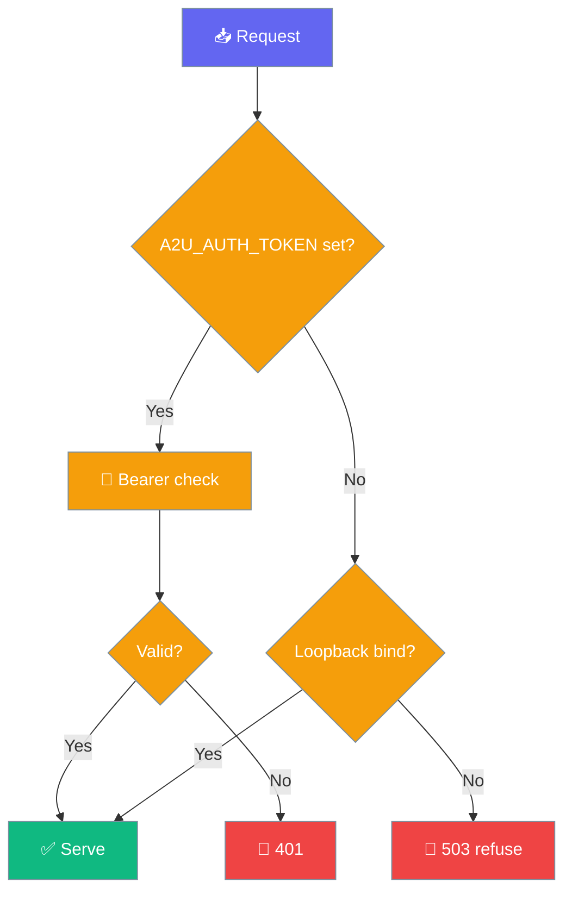

Deploy agents with A2U (Agent-to-User) event streaming for real-time agent-to-user communication.

## CLI

```bash
pip install "praisonai[serve]"
export OPENAI_API_KEY="your-key"

# Start A2U server
praisonai serve a2u --port 8083
```

**Expected Output:**
```
🚀 Starting A2U Event Stream Server...
   Host: 127.0.0.1
   Port: 8083
📡 Event stream: http://127.0.0.1:8083/a2u/events/events
ℹ️  Info: http://127.0.0.1:8083/a2u/info
✅ Server started at http://127.0.0.1:8083
```

## Python

```python
from fastapi import FastAPI
import uvicorn
from praisonai.endpoints.a2u_server import (
    create_a2u_routes,
    emit_agent_started,
    emit_agent_response,
    emit_agent_completed,
)

app = FastAPI(title="PraisonAI A2U Server")

# Add A2U routes
create_a2u_routes(app)

# Add discovery endpoint
@app.get("/__praisonai__/discovery")
async def discovery():
    return {
        "schema_version": "1.0.0",
        "server_name": "praisonai-a2u",
        "providers": [{"type": "a2u", "name": "A2U Event Stream"}],
        "endpoints": [{"name": "events", "provider_type": "a2u"}]
    }

uvicorn.run(app, host="0.0.0.0", port=8083)
```

**Expected Output:**
```
INFO:     Started server process
INFO:     Waiting for application startup.
INFO:     Application startup complete.
INFO:     Uvicorn running on http://0.0.0.0:8083
```

## A2U Endpoints

| Endpoint | Method | Description |
|----------|--------|-------------|
| `/a2u/info` | GET | Server info and capabilities |
| `/a2u/events/<stream>` | GET | SSE event stream |
| `/a2u/subscribe` | POST | Subscribe to events |
| `/a2u/unsubscribe` | POST | Unsubscribe from events |

## Event Types

| Event Type | Description |
|------------|-------------|
| `agent.started` | Agent started processing |
| `agent.thinking` | Agent is thinking/processing |
| `agent.response` | Agent generated response |
| `agent.completed` | Agent completed task |
| `agent.error` | Agent encountered error |
| `tool.called` | Tool was invoked |
| `tool.result` | Tool returned result |

## Subscribe to Events

```bash
# Get server info
curl http://localhost:8083/a2u/info

# Subscribe to events
curl -X POST http://localhost:8083/a2u/subscribe \
  -H "Content-Type: application/json" \
  -d '{"stream": "events", "filters": ["agent.response"]}'

# Stream events (SSE)
curl -N http://localhost:8083/a2u/events/events
```

**Subscribe Response:**
```json
{
  "subscription_id": "sub_abc123",
  "stream": "events",
  "stream_url": "/a2u/events/events"
}
```

## Emit Events from Agent

```python
from praisonai.endpoints.a2u_server import (
    emit_agent_started,
    emit_agent_thinking,
    emit_agent_response,
    emit_agent_completed,
)

# In your agent code
agent_id = "agent-123"

emit_agent_started(agent_id, "MyAgent")
emit_agent_thinking(agent_id, "Processing your request...")
emit_agent_response(agent_id, "Here is my response")
emit_agent_completed(agent_id, {"status": "success"})
```

### `publish_sync` and tracked delivery

<Note>
Behavior changed in **v4.6.162**.
</Note>

`A2UEventBus.publish_sync(event)` returns immediately with a **tracked** `asyncio.Task`. The module keeps a `WeakSet` of live tasks so the event loop can't garbage-collect one mid-flight, and each task's done-callback surfaces exceptions that were previously swallowed silently.

Use `A2UEventBus.last_publish_task()` to await the most recent scheduled publish — for example in tests, or when you need the real delivered subscriber count. The task's result is the delivered count.

`publish_sync` checks `asyncio.get_running_loop()`. Inside a running loop it schedules the tracked task and returns the number of targeted subscribers; `last_publish_task()` then exposes the delivered count. Outside a running loop it blocks and returns the actual delivered count via the async bridge — but `last_publish_task()` stays `None`, so only await it from an async context. The related `push/client.py` future creation and `acp/server.py` `asyncio.to_thread` calls likewise use `get_running_loop()` instead of the deprecated `asyncio.get_event_loop()`.

```python
from praisonai.endpoints.a2u_server import A2UEventBus, A2UEvent

bus = A2UEventBus()

async def emit():
    bus.publish_sync(A2UEvent(event_type="job.completed", data={"job_id": "abc"}))
    delivered = await bus.last_publish_task()  # real subscriber count
    return delivered
```

## SSE Event Format

```
event: agent.started
data: {"agent_id": "agent-123", "agent_name": "MyAgent"}
id: evt_abc123

event: agent.response
data: {"agent_id": "agent-123", "content": "Hello!"}
id: evt_def456
```

## Python Client

```python
import requests
import sseclient

# Subscribe to events
url = "http://localhost:8083/a2u/events/events"
response = requests.get(url, stream=True)
client = sseclient.SSEClient(response)

for event in client.events():
    print(f"Event: {event.event}")
    print(f"Data: {event.data}")
```

## CLI Options

| Option | Default | Description |
|--------|---------|-------------|
| `--port` | 8083 | Server port |
| `--host` | 127.0.0.1 | Server host |
| `--api-key` | - | API key for authentication |

## Security & Limits

The A2U server fails closed on non-loopback binds without a token and caps subscriptions and per-subscription queues.



### Fail-closed authentication

Loopback binds (`127.0.0.1`, `::1`, `localhost`, empty) still allow unauthenticated traffic for local development. **Every other bind** without `A2U_AUTH_TOKEN` set returns `503`:

```json
{"error": "A2U_AUTH_TOKEN not configured; refusing non-loopback traffic"}
```

This matches the call-server security contract in [Gateway Bind-Aware Auth](/features/gateway-bind-aware-auth).

### Environment variables

| Env var | Default | Description |
|---------|---------|-------------|
| `A2U_AUTH_TOKEN` | unset | Bearer token required for all A2U routes. When unset **and** the bind is non-loopback, the server refuses to serve (503). |
| `PRAISONAI_A2U_BIND_HOST` | inherits `PRAISONAI_CALL_BIND_HOST` | Bind host the auth guard uses to decide fail-closed vs. loopback dev mode. |
| `PRAISONAI_CALL_BIND_HOST` | set by launcher | Launcher-set bind host; the auth guard reads this when `PRAISONAI_A2U_BIND_HOST` is unset. |
| `PRAISONAI_A2U_MAX_SUBS` | `1024` | Max concurrent subscriptions across the bus. Exceeding returns HTTP 429. Non-positive or unparseable values fall back to the default. |
| `PRAISONAI_A2U_QUEUE_MAX` | `1000` | Max queued events per subscription. On overflow, `publish_sync` **drops** the event and logs a warning. Non-positive or unparseable values fall back to the default. |

Both `_MAX_SUBS` and `_QUEUE_MAX` fall back to their defaults on non-positive or unparseable env values, which prevents `asyncio.Queue(maxsize<=0)` from becoming silently unbounded.

### Subscription and queue caps

When the subscription cap is reached, subscribe routes return `429`:

```json
{"error": "A2U subscription limit reached"}
```

When a subscription's queue is full, `publish_sync` drops the event (`put_nowait` → `asyncio.QueueFull`) and logs:

```
A2U queue full for {sub_id} — dropping event {event_type}
```

### HTTP responses

| Endpoint | Condition | Status | Body |
|----------|-----------|--------|------|
| `/a2u/subscribe` | subscription cap reached | `429` | `{"error": "A2U subscription limit reached"}` |
| `/a2u/events/<stream>` | subscription cap reached | `429` | `{"error": "A2U subscription limit reached"}` |
| any `/a2u/*` | non-loopback bind + no `A2U_AUTH_TOKEN` | `503` | `{"error": "A2U_AUTH_TOKEN not configured; refusing non-loopback traffic"}` |

## Troubleshooting

| Issue | Fix |
|-------|-----|
| Port in use | `lsof -i :8083` |
| Missing deps | `pip install "praisonai[serve]"` |
| No events | Check agent is emitting events |
| SSE not connecting | Check firewall, use `host="0.0.0.0"` |
| `503` on a public bind | Set `A2U_AUTH_TOKEN` — non-loopback binds refuse unauthenticated traffic |
| `429` on subscribe | Subscription cap hit; raise `PRAISONAI_A2U_MAX_SUBS` or free subscriptions |

## Related

- [A2A Server](./a2a) - Agent-to-agent protocol
- [Agents Server](./agents) - Deploy as HTTP server
- [Endpoints CLI](/cli/endpoints) - Client for all server types
