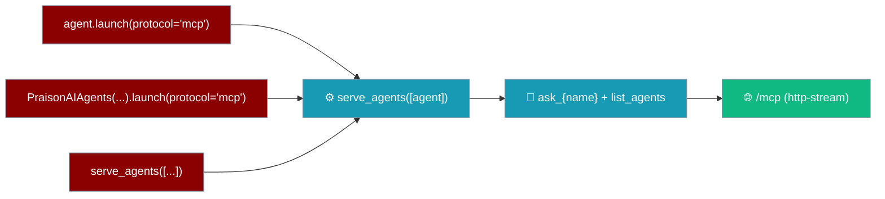
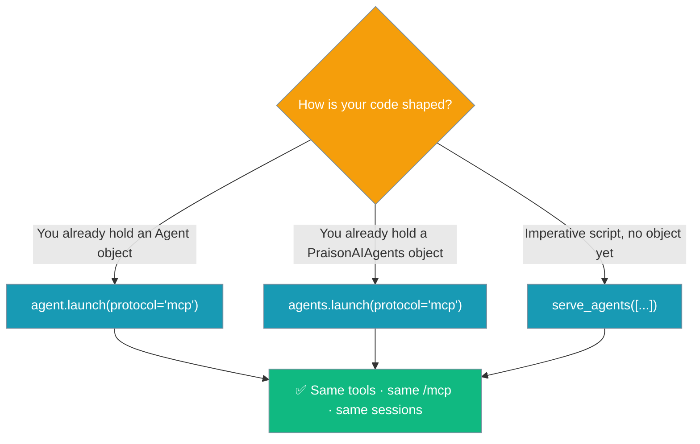

Publish single or multi-agent systems over MCP with `launch(protocol="mcp")` — the built-in idiom that delegates to `serve_agents(...)` under the hood.

<Note>
**Same code path as [`serve_agents([...])`](/features/serve-agents).** `launch(protocol="mcp")` calls `serve_agents(...)` for you, so the published tools (`ask_{name}` + `list_agents`), the `/mcp` endpoint, and per-session continuity are **identical**. Pick whichever idiom fits your code — a method on the `Agent`/`Agents` object, or the standalone function.
</Note>



## Quick Start

<Steps>
  <Step title="Install Dependencies">
    ```bash
    pip install praisonai-mcp
    ```
    `praisonai-mcp` is an optional package imported lazily. Without it, `launch(protocol="mcp")` prints: *"MCP serving requires the 'praisonai-mcp' package."*
  </Step>
  <Step title="Set API Key">
    ```bash
    export OPENAI_API_KEY="your-key"
    ```
  </Step>
  <Step title="Create Agent MCP Server">
    ```python
    from praisonaiagents import Agent

    agent = Agent(
        name="TweetAgent",
        instructions="Create engaging tweets",
        llm="gpt-4o-mini"
    )
    agent.launch(port=8080, protocol="mcp")
    ```
  </Step>
  <Step title="Verify">
    ```bash
    curl http://localhost:8080/mcp
    ```
  </Step>
</Steps>

## Which idiom fits your code?



## Single Agent as MCP

```python
from praisonaiagents import Agent

agent = Agent(
    name="TweetAgent",
    instructions="Create engaging tweets",
    llm="gpt-4o-mini"
)
agent.launch(port=8080, protocol="mcp")
# Equivalent to: serve_agents([agent], port=8080)
```

Published tools: `ask_tweetagent` + `list_agents`. The output comes from `praisonai-mcp` and the endpoint is `/mcp`.

## Multi-Agent as MCP

```python
from praisonaiagents import Agent
from praisonaiagents.agents import PraisonAIAgents

researcher = Agent(name="Researcher", instructions="Research topics", llm="gpt-4o-mini")
writer = Agent(name="Writer", instructions="Write content", llm="gpt-4o-mini")

agents = PraisonAIAgents(agents=[researcher, writer])
agents.launch(port=8080, protocol="mcp")
# Equivalent to: serve_agents([researcher, writer], port=8080)
```

Each agent gets its own `ask_{name}` tool — here `ask_researcher` and `ask_writer` — plus one shared `list_agents`.

<Note>
`path` is ignored in MCP mode. `protocol="http"` behaviour is unchanged.
</Note>

## MCP Endpoints

| Endpoint | Method | Description |
|----------|--------|-------------|
| `/mcp` | POST | JSON-RPC over spec-compliant streamable HTTP |

See [Serve Agents](/features/serve-agents) for the canonical tool schema and session model.

## launch() Parameters

| Parameter | Type | Default | Description |
|-----------|------|---------|-------------|
| `port` | int | `8000` | Server port |
| `host` | str | `0.0.0.0` | Server host |
| `protocol` | str | `mcp` | Must be `mcp` |
| `debug` | bool | `False` | Debug mode |

## Connect MCP Client

**Claude Desktop** (`claude_desktop_config.json`):
```json
{
  "mcpServers": {
    "praisonai-agent": {
      "url": "http://localhost:8080/mcp",
      "transport": "http-stream"
    }
  }
}
```

**Cursor** (`.cursor/mcp.json`):
```json
{
  "mcpServers": {
    "praisonai-agent": {
      "url": "http://localhost:8080/mcp",
      "transport": "http-stream"
    }
  }
}
```

## Test MCP Tools

```bash
# List tools
curl -X POST http://localhost:8080/mcp \
  -H "Content-Type: application/json" \
  -d '{"jsonrpc": "2.0", "method": "tools/list", "id": 1}'

# Call tool
curl -X POST http://localhost:8080/mcp \
  -H "Content-Type: application/json" \
  -d '{
    "jsonrpc": "2.0",
    "method": "tools/call",
    "params": {"name": "ask_tweetagent", "arguments": {"message": "Create a tweet about AI"}},
    "id": 2
  }'
```

## Docker Deployment

**app.py:**
```python
from praisonaiagents import Agent

agent = Agent(instructions="Create tweets", llm="gpt-4o-mini")
agent.launch(port=8080, protocol="mcp")
```

**Dockerfile:**
```dockerfile
FROM python:3.11-slim
WORKDIR /app
COPY requirements.txt .
RUN pip install --no-cache-dir -r requirements.txt
COPY app.py .
EXPOSE 8080
CMD ["python", "app.py"]
```

**requirements.txt:**
```
praisonaiagents
praisonai-mcp
```

**Build and run:**
```bash
docker build -t agent-mcp-server .
docker run -p 8080:8080 -e OPENAI_API_KEY=$OPENAI_API_KEY agent-mcp-server
```

## Troubleshooting

| Issue | Fix |
|-------|-----|
| Port in use | `lsof -i :8080` |
| `MCP serving requires the 'praisonai-mcp' package.` | `pip install praisonai-mcp` |
| No API key | `export OPENAI_API_KEY="your-key"` |
| Client can't connect | Check firewall, use `host="0.0.0.0"` |

## Related

- [Serve Agents](/features/serve-agents) - The `serve_agents([...])` function `launch()` delegates to
- [API Vocabulary](/features/api-vocabulary) - One page for `approval=` and `launch(protocol=...)`
- [Tools MCP](./tools-mcp) - Deploy tools as MCP server
- [Recipes MCP](./recipes-mcp) - Deploy recipes as MCP server
- [PraisonAI MCP](./praisonai-mcp) - Full PraisonAI MCP server
- [Agents HTTP](./agents) - Deploy as HTTP server
