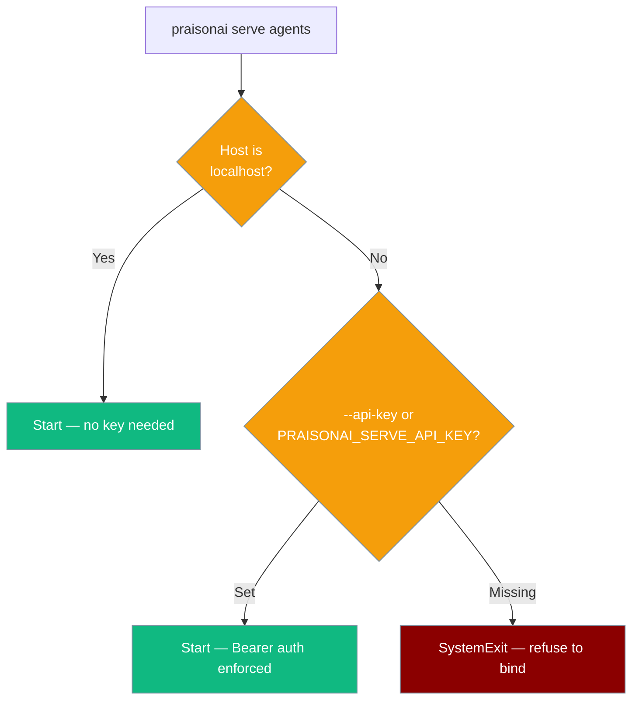

Deploy single or multi-agent systems as HTTP REST API servers.

## Quick Start

<Steps>
  <Step title="Install Dependencies">
    ```bash
    pip install "praisonaiagents[os]"
    ```
  </Step>
  <Step title="Set API Key">
    ```bash
    export OPENAI_API_KEY="your-key"
    ```
  </Step>
  <Step title="Initialize Agents">
    ```bash
    praisonai --init "helpful assistant"
    ```
  </Step>
  <Step title="Start Server (localhost)">
    ```bash
    praisonai serve agents --port 8000
    ```

    **Expected Output:**
    ```
    📄 Loading workflow from: agents.yaml
    🚀 Starting PraisonAI API server...
       Host: 127.0.0.1
       Port: 8000
    🚀 Multi-Agent HTTP API available at http://127.0.0.1:8000/agents
    ✅ FastAPI server started at http://127.0.0.1:8000
    📚 API documentation available at http://127.0.0.1:8000/docs
    ```
  </Step>
  <Step title="Start Server (public bind)">
    A non-localhost host requires an API key:

    ```bash
    export PRAISONAI_SERVE_API_KEY="$(openssl rand -hex 32)"
    praisonai serve agents --port 8000 --host 0.0.0.0
    ```
  </Step>
  <Step title="Verify">
    ```bash
    curl http://localhost:8000/health
    ```
  </Step>
</Steps>

## Security

`praisonai serve agents` drives YAML-defined tools (including `execute_command`), so binding it to a non-localhost interface without authentication is refused.

<Warning>
Binding to any host other than `127.0.0.1` / `localhost` **requires** an API key. The server exits immediately (`SystemExit`) if neither `--api-key` nor `PRAISONAI_SERVE_API_KEY` is set.
</Warning>

```bash
# Localhost — no key required
praisonai serve agents --port 8000

# Remote — key required (via env var)
export PRAISONAI_SERVE_API_KEY="your-secret"
praisonai serve agents --port 8000 --host 0.0.0.0

# Or via flag
praisonai serve agents --port 8000 --host 0.0.0.0 --api-key "your-secret"
```

Clients then send the key in the `Authorization: Bearer …` header (mirrors `jobs/server.py`).

```bash
curl -X POST http://SERVER_IP:8000/agents \
  -H "Authorization: Bearer your-secret" \
  -H "Content-Type: application/json" \
  -d '{"query": "What is AI?"}'
```



## Python - Single Agent

```python
from praisonaiagents import Agent

agent = Agent(
    name="Assistant",
    instructions="You are a helpful assistant.",
    llm="gpt-4o-mini"
)
agent.launch(path="/ask", port=8000, host="0.0.0.0")
```

**Expected Output:**
```
🚀 Agent 'Assistant' available at http://0.0.0.0:8000
✅ FastAPI server started at http://0.0.0.0:8000
📚 API documentation available at http://0.0.0.0:8000/docs
🔌 Available endpoints: /ask
```

## Python - Multi-Agent

```python
from praisonaiagents import Agent, AgentTeam

researcher = Agent(name="Researcher", instructions="Research topics", llm="gpt-4o-mini")
writer = Agent(name="Writer", instructions="Write content", llm="gpt-4o-mini")

agents = AgentTeam(agents=[researcher, writer])
agents.launch(path="/content", port=8000, host="0.0.0.0")
```

**Expected Output:**
```
🚀 Multi-Agent HTTP API available at http://0.0.0.0:8000/content
📊 Available agents for this endpoint (2): Researcher, Writer
🔗 Per-agent endpoints: /content/researcher, /content/writer
✅ FastAPI server started at http://0.0.0.0:8000
📚 API documentation available at http://0.0.0.0:8000/docs
```

<Note>
Multiple `Agent` / `Agents` instances may call `.launch(port=N)` concurrently from different threads — registration is atomic. If two launch calls use the same path on the same port, the second gets an auto-suffixed path (`/path_abc123`) and a warning is logged. Server readiness is signalled deterministically (no fixed sleep); `.launch()` returns only after the port is accepting connections. The wait defaults to **5 seconds** and is configurable via the `PRAISONAI_SERVER_READY_TIMEOUT` environment variable. If the server doesn't become ready in time, `.launch()` still returns and a warning is logged — check server logs for startup errors.
</Note>

## agents.yaml

```yaml
framework: praisonai
topic: research and write content
roles:
  researcher:
    role: Researcher
    goal: Research topics thoroughly
    backstory: Expert researcher
    tasks:
      research_task:
        description: Research the topic
        expected_output: Research findings
  writer:
    role: Writer
    goal: Write engaging content
    backstory: Expert writer
    tasks:
      write_task:
        description: Write based on research
        expected_output: Written content
```

```bash
export PRAISONAI_SERVE_API_KEY="$(openssl rand -hex 32)"
praisonai serve agents --port 8000 --host 0.0.0.0
```

## CLI Commands

```bash
# Start agents server (localhost default — no key needed)
praisonai serve agents --port 8000

# With custom host for remote access (key required — see Security)
export PRAISONAI_SERVE_API_KEY="your-secret"
praisonai serve agents --port 8000 --host 0.0.0.0

# With agents file
praisonai serve agents --file agents.yaml --port 8000

# Give the server more time on slow machines
export PRAISONAI_SERVER_READY_TIMEOUT=15
praisonai serve agents --port 8000
```

| Option | Default | Description |
|--------|---------|-------------|
| `--port` | `8000` | Server port |
| `--host` | `127.0.0.1` | Server host (use `0.0.0.0` for remote) |
| `--file` | `agents.yaml` | Agents YAML file |
| `--reload` | `false` | Enable hot reload |
| `--api-key` | - | API key. **Required when `--host` is not `127.0.0.1` / `localhost` / `::1`.** Can also be set via `PRAISONAI_SERVE_API_KEY`. |

## launch() Parameters

| Parameter | Type | Default | Description |
|-----------|------|---------|-------------|
| `path` | str | `/` | API endpoint path |
| `port` | int | `8000` | Server port |
| `host` | str | `0.0.0.0` | Server host |
| `debug` | bool | `False` | Debug mode |
| `protocol` | str | `http` | `http` or `mcp` |

## Endpoints

| Endpoint | Method | Description |
|----------|--------|-------------|
| `/agents` | POST | Send query to all agents — runs through the cached generator (ToolResolver, tool_timeout, approval, guardrails, retry) |
| `/agents/{agent_name}` | POST | Call a specific agent through the **same** pipeline as `/agents`. Returns `404` for an unknown name |
| `/{path}` | POST | Send query to agent(s) |
| `/{path}/list` | GET | List available agents |
| `/{path}/{agent_id}` | POST | Call specific agent |
| `/health` | GET | Health check |
| `/docs` | GET | Swagger UI |

<Note>
`/agents` and `/agents/{agent_name}` share one pipeline. The named-agent route previously used a hand-rolled agent that dropped every safety/reliability field; both routes now apply identical YAML lowering.
</Note>

## Example Request/Response

**Request:**
```bash
curl -X POST http://localhost:8000/ask \
  -H "Content-Type: application/json" \
  -d '{"query": "What is AI?"}'
```

**Response:**
```json
{
  "response": "Artificial intelligence (AI) refers to..."
}
```

## Remote Access

Use `host="0.0.0.0"` to allow remote connections. For `praisonai serve agents`, a non-localhost bind **requires** an API key (see [Security](#security)):

<Warning>
`praisonai serve agents --host 0.0.0.0` without `--api-key` / `PRAISONAI_SERVE_API_KEY` exits immediately with `SystemExit`. Set a key before binding remotely.
</Warning>

```bash
# CLI — key required for non-localhost
export PRAISONAI_SERVE_API_KEY="your-secret"
praisonai serve agents --port 8000 --host 0.0.0.0

# Python launch() — no key gate (mount your own auth if exposing publicly)
agent.launch(path="/ask", port=8000, host="0.0.0.0")
```

Connect from remote (include the Bearer key when serving `agents`):
```bash
curl -X POST http://SERVER_IP:8000/ask \
  -H "Authorization: Bearer your-secret" \
  -H "Content-Type: application/json" \
  -d '{"query": "Hello"}'
```

## How It Works

The `agents` server builds one shared generator per app and routes every request through the same YAML pipeline.

```mermaid
sequenceDiagram
    participant Client
    participant App as FastAPI (lifespan)
    participant Gen as AgentsGenerator
    participant Lock as asyncio.Lock

    App->>Gen: build once at startup
    Client->>App: POST /agents or /agents/{name}
    App->>Lock: acquire (serialise cli_config)
    Lock->>Gen: run through ToolResolver, tool_timeout, approval, guardrails, retry
    Gen-->>Client: response
    App->>Gen: close() at shutdown

    classDef app fill:#189AB4,stroke:#7C90A0,color:#fff
    classDef gen fill:#10B981,stroke:#7C90A0,color:#fff
    classDef lock fill:#F59E0B,stroke:#7C90A0,color:#fff

    class App app
    class Gen gen
    class Lock lock
```

- **Generator cached per app.** A FastAPI `lifespan` builds a single `AgentsGenerator` at startup and `close()`s it at shutdown — no per-request YAML re-parse, framework re-resolution, or fresh 32-worker tool-timeout pool on every call.
- **Concurrency-safe.** Concurrent requests are serialised on the shared `cli_config` via a per-app `asyncio.Lock`.
- **Graceful fallback.** If the cached generator can't be built, the server falls back to the per-request `praisonai.arun` path.
- **Route convergence.** Both `/agents` and `/agents/{agent_name}` run through the cached generator, so both apply identical YAML lowering (`ToolResolver`, `tool_timeout`, `approval`, `guardrails`, retry policy). `POST /agents/{agent_name}` returns `404` for an unknown name.

## Environment Variables

| Variable | Default | Description |
|----------|---------|-------------|
| `PRAISONAI_SERVE_API_KEY` | - | API key required to bind `praisonai serve agents` on a non-localhost host. The server exits with `SystemExit` if this is unset and no `--api-key` is passed when `--host` is not localhost. Clients authenticate with `Authorization: Bearer <key>`. |
| `PRAISONAI_SERVER_READY_TIMEOUT` | `5.0` | Seconds to wait for the FastAPI server to become ready after `.launch()` / `praisonai serve agents`. A warning is logged if exceeded; startup continues. |

## Troubleshooting

| Issue | Fix |
|-------|-----|
| `--api-key ... is required when binding to a non-localhost host` at startup | You bound to a non-localhost host without a key. Set `PRAISONAI_SERVE_API_KEY=...` (or `--api-key ...`), or bind to `127.0.0.1` / `localhost` for a private-only server. |
| Port in use | `lsof -i :8000` then kill process |
| No agents.yaml | `praisonai --init "topic"` |
| Missing API key | `export OPENAI_API_KEY="your-key"` |
| Server exits immediately on `--host 0.0.0.0` | Non-localhost bind needs auth: `export PRAISONAI_SERVE_API_KEY="your-secret"` (or pass `--api-key`) |
| Missing deps | `pip install "praisonaiagents[os]"` |
| Connection refused | Use `host="0.0.0.0"` for remote |
| Firewall blocking | Open port in firewall |
| Agent server slow to start / "did not become ready" warning | Set `PRAISONAI_SERVER_READY_TIMEOUT=10` (seconds) before launching, or check server logs for the underlying startup error. |

## Related

- [Agents API Reference](../api/agents-api) - Full API documentation
- [Agents MCP](./agents-mcp) - Deploy agents as MCP server
- [Tools MCP](./tools-mcp) - Deploy tools as MCP server
- [Deploy CLI](../cli/index) - Deploy using praisonai deploy
