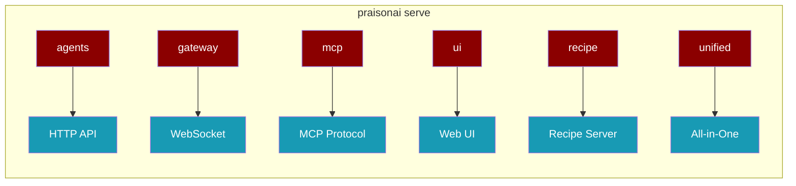
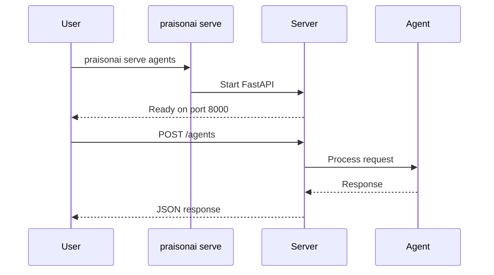

All PraisonAI servers are accessible through `praisonai serve <type>` - one command to start any server.



## Quick Start

<Steps>

<Step title="Start Agents Server">
```bash
praisonai serve agents --port 8000
```
</Step>

<Step title="Start Gateway Server">
```bash
praisonai serve gateway --port 8765
```
</Step>

<Step title="Start All-in-One Server">
```bash
praisonai serve unified --port 8765
```
</Step>

</Steps>

---

## All Serve Commands

<Note>
Run `praisonai serve` to see all available options with descriptions.
</Note>

| Command | Protocol | Port | Description |
|---------|----------|------|-------------|
| `praisonai serve agents` | HTTP | 8000 | Agents as HTTP REST API |
| `praisonai serve gateway` | WebSocket | 8765 | Multi-agent real-time coordination |
| `praisonai serve mcp` | STDIO/SSE | 8080 | MCP server for Claude/Cursor |
| `praisonai serve acp` | STDIO | - | Agent Client Protocol for IDEs |
| `praisonai serve lsp` | STDIO | - | Language Server Protocol |
| `praisonai serve ui` | HTTP | 8082 | Chainlit web interface |
| `praisonai serve rag` | HTTP | 9000 | RAG query server |
| `praisonai serve registry` | HTTP | 7777 | Package registry server |
| `praisonai serve docs` | HTTP | 3000 | Documentation preview |
| `praisonai serve scheduler` | Background | - | Job scheduler daemon |
| `praisonai serve recipe` | HTTP | 8765 | Recipe runner server |
| `praisonai serve a2a` | JSON-RPC | 8001 | Agent-to-Agent protocol |
| `praisonai serve a2u` | SSE | 8002 | Agent-to-User event stream |
| `praisonai serve unified` | HTTP/SSE | 8765 | All providers combined |

---

## Server Details

<Tabs>

<Tab title="Agents">
HTTP REST API for agents.

```bash
praisonai serve agents --file agents.yaml --port 8000
```

**Options:**
| Option | Default | Description |
|--------|---------|-------------|
| `--host` | `127.0.0.1` | Host to bind to |
| `--port` | `8000` | Port to bind to |
| `--file` | `agents.yaml` | Agents YAML file |
| `--reload` | `false` | Enable hot reload |
| `--api-key` | - | API key for auth |

**Test with curl:**
```bash
curl http://localhost:8000/
```
</Tab>

<Tab title="Gateway">
WebSocket server for multi-agent coordination.

```bash
praisonai serve gateway --port 8765 --agents agents.yaml
```

**Options:**
| Option | Default | Description |
|--------|---------|-------------|
| `--host` | `127.0.0.1` | Host to bind to |
| `--port` | `8765` | Port to bind to |
| `--agents` | - | Agents YAML file |

**Connect with WebSocket:**
```javascript
const ws = new WebSocket('ws://localhost:8765');
```
</Tab>

<Tab title="MCP">
MCP server for Claude Desktop and Cursor.

```bash
praisonai serve mcp --transport sse --port 8080
```

**Options:**
| Option | Default | Description |
|--------|---------|-------------|
| `--host` | `127.0.0.1` | Host to bind to |
| `--port` | `8080` | Port to bind to |
| `--transport` | `stdio` | Transport: stdio, sse |
| `--name` | - | Server name from config |
</Tab>

<Tab title="Recipe">
Recipe runner server.

```bash
praisonai serve recipe --port 8765 --reload
```

**Options:**
| Option | Default | Description |
|--------|---------|-------------|
| `--host` | `127.0.0.1` | Host to bind to |
| `--port` | `8765` | Port to bind to |
| `--config` | - | Config file path |
| `--reload` | `false` | Enable hot reload |
</Tab>

<Tab title="Unified">
All providers in one server.

```bash
praisonai serve unified --port 8765
```

**Options:**
| Option | Default | Description |
|--------|---------|-------------|
| `--host` | `127.0.0.1` | Host to bind to |
| `--port` | `8765` | Port to bind to |
| `--file` | `agents.yaml` | Agents YAML file |
| `--reload` | `false` | Enable hot reload |

**Includes:** agents-api, recipe, mcp, a2a, a2u
</Tab>

</Tabs>

---

## How It Works



---

## Common Patterns

<AccordionGroup>

<Accordion title="Development with Hot Reload">
```bash
praisonai serve agents --reload --port 8000
```
Changes to agents.yaml auto-reload the server.
</Accordion>

<Accordion title="Production with Auth">
```bash
praisonai serve agents --api-key $API_KEY --host 0.0.0.0
```
Bind to all interfaces with API key authentication.
</Accordion>

<Accordion title="Multiple Servers">
```bash
# Terminal 1: Agents API
praisonai serve agents --port 8000

# Terminal 2: Gateway
praisonai serve gateway --port 8765

# Terminal 3: MCP
praisonai serve mcp --transport sse --port 8080
```
Run different server types simultaneously.
</Accordion>

<Accordion title="All-in-One Development">
```bash
praisonai serve unified --port 8765 --reload
```
Single server with all providers for development.
</Accordion>

</AccordionGroup>

---

## Discovery Endpoint

All HTTP servers expose `/__praisonai__/discovery` for endpoint discovery.

```bash
curl http://localhost:8000/__praisonai__/discovery
```

```json
{
  "server_name": "praisonai-agents",
  "version": "1.0.0",
  "providers": [...],
  "endpoints": [...]
}
```

---

## Best Practices

<AccordionGroup>

<Accordion title="Use Unified for Development">
Start with `praisonai serve unified` during development to access all providers. Split into separate servers for production.
</Accordion>

<Accordion title="Always Set Host in Production">
Use `--host 0.0.0.0` to accept external connections. Default `127.0.0.1` only accepts local connections.
</Accordion>

<Accordion title="Enable Auth for Public Servers">
Always use `--api-key` when exposing servers publicly. Never run unauthenticated servers on public networks.
</Accordion>

</AccordionGroup>

---

## Related

<CardGroup cols={2}>
  <Card title="Agents Server" icon="users" href="./agents">
    HTTP REST API details
  </Card>
  <Card title="Gateway Server" icon="network-wired" href="./gateway">
    WebSocket coordination
  </Card>
  <Card title="MCP Server" icon="plug" href="./tools-mcp">
    Claude Desktop integration
  </Card>
  <Card title="A2A Server" icon="arrows-left-right" href="./a2a">
    Agent-to-Agent protocol
  </Card>
</CardGroup>
