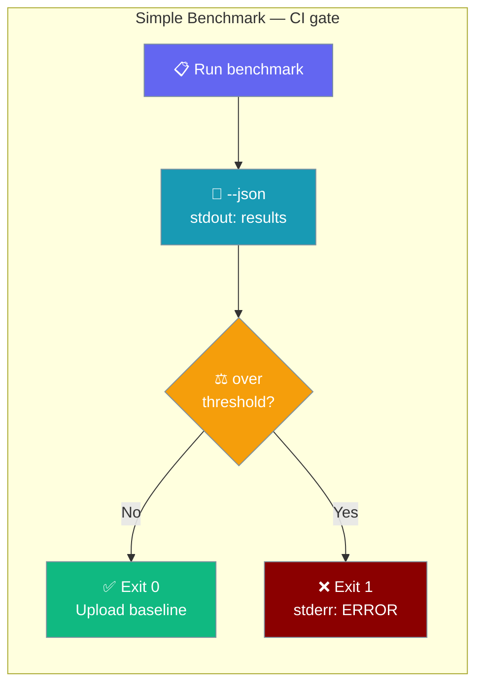

# Performance Benchmarks

PraisonAI Agents includes comprehensive benchmarks to measure and compare performance against other popular AI agent frameworks.

## Benchmark Types

| Benchmark | Description | File |
|-----------|-------------|------|
| **Simple** | Agent instantiation time (no API calls) | `simple_benchmark.py` |
| **Tools** | Agent instantiation with tools | `tools_benchmark.py` |
| **Execution** | Real agent execution with LLM API calls | `execution_benchmark.py` |

## Quick Start

```bash
cd praisonai-agents

# Run instantiation benchmark
python benchmarks/simple_benchmark.py

# Run tools benchmark
python benchmarks/tools_benchmark.py

# Run real execution benchmark (requires API key)
export OPENAI_API_KEY=your_key
python benchmarks/execution_benchmark.py
```

## Simple Benchmark

Measures PraisonAI agent instantiation time (no API calls, no tools) and compares against installed frameworks.



### CLI Options

```bash
python benchmarks/simple_benchmark.py [OPTIONS]
```

| Option | Default | Description |
|--------|---------|-------------|
| `--save` | `False` | Save `BENCHMARK_RESULTS.md` and update project `README.md`. |
| `--skip-crewai` | `False` | Skip the optional CrewAI benchmark (its import can hang 4+ min on some platforms). |
| `--json` | `False` | Emit `{"results": {...}, "iterations": N, "warmup": M}` to stdout. Human progress output is suppressed; save-status goes to stderr so stdout stays machine-readable. |
| `--fail-over-threshold` | `False` | Exit non-zero when PraisonAI instantiation exceeds `praisonai_instantiation_us_max` in `thresholds.json`. Prints `ERROR: PraisonAI instantiation X us > threshold Y us` on stderr. |

### Thresholds file

The script reads `benchmarks/thresholds.json` for CI budgets:

```json
{
  "praisonai_instantiation_us_max": 450,
  "iterations": 100,
  "warmup": 10
}
```

- `praisonai_instantiation_us_max` — hard cap (µs) for `--fail-over-threshold`.
- `iterations` / `warmup` — override the script's defaults.

### Examples

```bash
# Default run (same output as before)
python benchmarks/simple_benchmark.py

# CI baseline: skip the hang-prone framework, emit machine-readable JSON
python benchmarks/simple_benchmark.py --skip-crewai --json

# CI gate: fail the job on a regression
python benchmarks/simple_benchmark.py --skip-crewai --json --fail-over-threshold \
  | tee agent-perf-baseline.json
```

## Execution Benchmark

The execution benchmark tests **real agent execution** with actual LLM API calls.

### CLI Options

```bash
python benchmarks/execution_benchmark.py [OPTIONS]
```

| Option | Short | Default | Description |
|--------|-------|---------|-------------|
| `--model` | `-m` | `gpt-4o-mini` | Model to use |
| `--iterations` | `-i` | `3` | Number of iterations |
| `--prompt` | `-p` | `"What is 2+2?..."` | Prompt to use |
| `--no-save` | - | `False` | Don't save results to file |

### Examples

```bash
# Default (3 iterations, gpt-4o-mini)
python benchmarks/execution_benchmark.py

# Custom iterations
python benchmarks/execution_benchmark.py --iterations 5
python benchmarks/execution_benchmark.py -i 10

# Custom model
python benchmarks/execution_benchmark.py --model gpt-4o
python benchmarks/execution_benchmark.py -m gpt-4o

# Custom prompt
python benchmarks/execution_benchmark.py --prompt "What is the capital of France?"

# Don't save results
python benchmarks/execution_benchmark.py --no-save

# Combine options
python benchmarks/execution_benchmark.py -m gpt-4o -i 5 --no-save
```

## Results

### Agent Instantiation (Without Tools)

| Framework | Avg Time (μs) | Relative |
|-----------|---------------|----------|
| **PraisonAI** | **3.77** | **1.00x (fastest)** |
| OpenAI Agents SDK | 5.26 | 1.39x |
| Agno | 5.64 | 1.49x |
| PraisonAI (LiteLLM) | 7.56 | 2.00x |
| PydanticAI | 226.94 | 60x |
| LangGraph | 4,558.71 | 1,209x |
| CrewAI | 15,607.92 | 4,138x |

### Agent Instantiation (With Tools)

| Framework | Avg Time (μs) | Relative |
|-----------|---------------|----------|
| **PraisonAI** | **3.24** | **1.00x (fastest)** |
| Agno | 5.12 | 1.58x |
| PraisonAI (LiteLLM) | 8.59 | 2.65x |
| OpenAI Agents SDK | 279.95 | 86x |
| LangGraph | 2,310.82 | 713x |
| CrewAI | 15,773.44 | 4,870x |

### Real Execution (With API Calls)

| Framework | Method | Avg Time | Relative |
|-----------|--------|----------|----------|
| **PraisonAI** | `agent.start()` | **0.45s** | **1.00x (fastest)** |
| PraisonAI (LiteLLM) | `agent.start()` | 0.55s | 1.22x |
| CrewAI | `crew.kickoff()` | 0.58s | 1.28x |
| Agno | `agent.run()` | 0.92s | 2.05x |

## Frameworks Compared

| Framework | Execution Method |
|-----------|------------------|
| PraisonAI | `agent.start()` |
| PraisonAI (LiteLLM) | `agent.start()` |
| Agno | `agent.run()` |
| CrewAI | `crew.kickoff()` |
| OpenAI Agents SDK | `Runner.run()` |
| LangGraph | `create_react_agent()` |
| PydanticAI | `Agent()` |

## Output Files

Benchmarks save results to markdown files in the `benchmarks/` directory:

| File | Description |
|------|-------------|
| `BENCHMARK_RESULTS.md` | Instantiation benchmark results |
| `TOOLS_BENCHMARK_RESULTS.md` | Tools benchmark results |
| `EXECUTION_BENCHMARK_RESULTS.md` | Execution benchmark results |

## Key Findings

<CardGroup cols={2}>
  <Card title="Fastest Instantiation" icon="bolt">
    PraisonAI is **1.49x faster than Agno** and **4,138x faster than CrewAI** for agent instantiation.
  </Card>
  <Card title="Fastest Execution" icon="rocket">
    PraisonAI is **2x faster than Agno** and **1.28x faster than CrewAI** for real agent execution.
  </Card>
</CardGroup>

## Running Your Own Benchmarks

1. Clone the repository:
```bash
git clone https://github.com/MervinPraison/PraisonAI.git
cd PraisonAI/src/praisonai-agents
```

2. Install dependencies:
```bash
pip install praisonaiagents agno crewai pydantic-ai openai-agents langgraph
```

3. Set your API key:
```bash
export OPENAI_API_KEY=your_key
```

4. Run benchmarks:
```bash
python benchmarks/simple_benchmark.py
python benchmarks/tools_benchmark.py
python benchmarks/execution_benchmark.py
```
