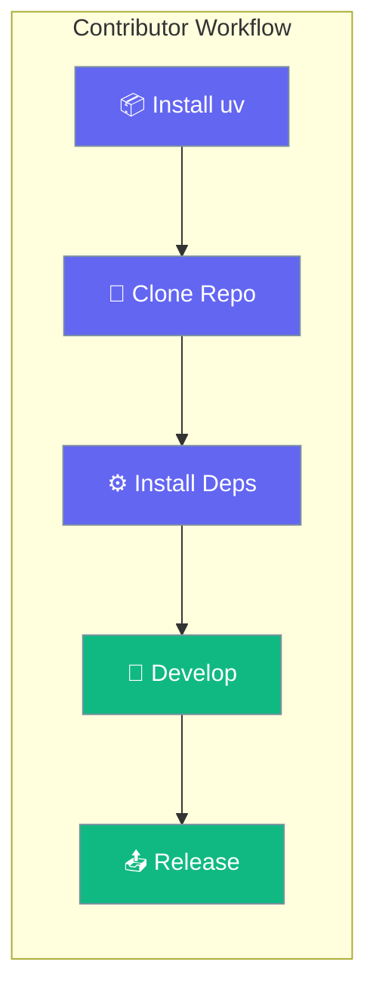

Set up a local PraisonAI development environment using `uv` — the fast Python package manager.



## Quick Start

<Steps>
<Step title="Install uv">

```bash
pip install uv
```

</Step>

<Step title="Clone and Install">

```bash
git clone https://github.com/MervinPraison/PraisonAI.git
cd PraisonAI

# Install base dependencies
uv pip install -r pyproject.toml
```

</Step>

<Step title="Install with Extras">

```bash
# Single extra
uv pip install -r pyproject.toml --extra code

# Multiple extras
uv pip install -r pyproject.toml --extra "crewai,autogen"
```

</Step>
</Steps>

---

## Available Extras

| Extra | What It Includes |
|-------|------------------|
| `code` | Code generation and analysis tools |
| `chat` | Chainlit-based chat interface |
| `crewai` | CrewAI framework integration |
| `autogen` | AG2 (AutoGen) framework integration |
| `tools` | All built-in tool packages |
| `bot` | Discord/Telegram/Slack bot support |
| `os` | Production-ready OS-level dependencies |

---

## Bump and Release

<Warning>
Release commands modify package versions and publish to PyPI. Only maintainers with publish credentials should run these.
</Warning>

```bash
# Bump version and prepare release
python src/praisonai/scripts/bump_and_release.py 2.2.99

# With praisonaiagents dependency update
python src/praisonai/scripts/bump_and_release.py 2.2.99 --agents 0.0.169

# Publish to PyPI
cd src/praisonai && uv publish
```

---

## Project Structure

```
praisonai-package/
├── src/
│   ├── praisonai/           # Main CLI package
│   ├── praisonai-agents/    # Agent SDK (praisonaiagents)
│   ├── praisonai-ts/        # TypeScript SDK
│   └── praisonai-rust/      # Rust SDK
├── examples/                # Example scripts
└── tests/                   # Test suites
```

---

## Related

<CardGroup cols={2}>
  <Card icon="terminal" href="/developers/local-development">
    Local development and testing
  </Card>
  <Card icon="book" href="/developers/reference-home">
    SDK reference documentation
  </Card>
</CardGroup>
