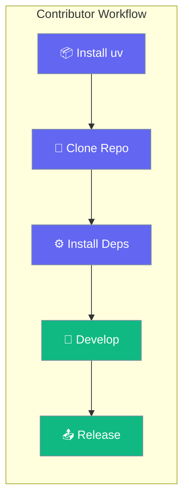
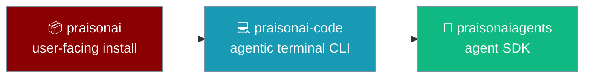

Set up a local PraisonAI development environment using `uv` — the fast Python package manager.



## Quick Start

<Steps>
<Step title="Install uv">

```bash
pip install uv
```

</Step>

<Step title="Clone and Install">

```bash
git clone https://github.com/MervinPraison/PraisonAI.git
cd PraisonAI

# Install base dependencies
uv pip install -r pyproject.toml
```

<Note>
The `src/` directory now contains three sibling packages: `praisonai-agents/` (SDK), `praisonai-code/` (agentic terminal CLI — introduced in scaffold form at [PR #2539](https://github.com/MervinPraison/PraisonAI/pull/2539) as step C0 of the migration in [issue #2512](https://github.com/MervinPraison/PraisonAI/issues/2512)), and `praisonai/` (main user-facing wrapper). Install with `pip install -e src/praisonai` — this pulls in `praisonai-code` and `praisonai-agents` automatically via the workspace path deps. See [praisonai-code Migration](/docs/guides/praisonai-code-migration) for the full picture.
</Note>

</Step>

<Step title="Install with Extras">

```bash
# Single extra
uv pip install -r pyproject.toml --extra code

# Multiple extras
uv pip install -r pyproject.toml --extra "crewai,autogen"
```

</Step>
</Steps>

---

## Available Extras

| Extra | What It Includes |
|-------|------------------|
| `code` | Code generation and analysis tools |
| `chat` | Chainlit-based chat interface |
| `crewai` | CrewAI framework integration |
| `autogen` | AG2 (AutoGen) framework integration |
| `langgraph` | LangGraph framework integration (probe + doctor recognition; also install `praisonai-frameworks[langgraph]` for the adapter) |
| `tools` | All built-in tool packages |
| `bot` | Discord/Telegram/Slack bot support |
| `os` | Production-ready OS-level dependencies |

---

## Bump and Release

<Warning>
Release commands modify package versions and publish to PyPI. Only maintainers with publish credentials should run these.
</Warning>

```bash
# Bump version and prepare release
python src/praisonai/scripts/bump_and_release.py 2.2.99

# With praisonaiagents dependency update
python src/praisonai/scripts/bump_and_release.py 2.2.99 --agents 0.0.169

# Publish to PyPI
cd src/praisonai && uv publish
```

---

## Project Structure

```
praisonai-package/
├── src/
│   ├── praisonai/           # Main user-facing CLI package (pip install praisonai)
│   ├── praisonai-code/      # Agentic terminal CLI — extracted from praisonai (incremental C0–C6)
│   ├── praisonai-agents/    # Agent SDK (praisonaiagents)
│   ├── praisonai-ts/        # TypeScript SDK
│   └── praisonai-rust/      # Rust SDK
├── examples/                # Example scripts
└── tests/                   # Test suites
```

---

## praisonai-code Sibling Package

`praisonai-code` hosts the **agentic terminal CLI** (`run`, `chat`, `code`, warm runtime, CLI backends) as an internal sibling package. `praisonai` remains the user-facing install; `praisonai-code` is not published standalone to PyPI during migration.

**Status:** C0 scaffold merged in [PraisonAI#2520](https://github.com/MervinPraison/PraisonAI/pull/2520). C1 moved `runtime/` and `cli_backends/` into `praisonai_code` in [PraisonAI#2523](https://github.com/MervinPraison/PraisonAI/pull/2523); PEP 562 shims keep the old import paths working. See the [praisonai-code migration guide](/docs/guides/praisonai-code-migration) for the full C0–C6 roadmap and shim behaviour.

### Dependency Rules

```
praisonai (main)  →  depends on  praisonai-code
praisonai-code    →  depends on  praisonaiagents (core SDK)
```



### Dev Install

<Steps>
  <Step title="Install the sibling package in editable mode">

```bash
pip install -e src/praisonai-code
```

  </Step>
  <Step title="Verify the install">

```bash
python -c "import praisonai_code; print(praisonai_code.__version__)"
# → 0.0.1
```

  </Step>
</Steps>

### Migration Plan (C0–C6)

Track upstream progress in the [praisonai-code migration guide](/docs/guides/praisonai-code-migration) and [PraisonAI#2512](https://github.com/MervinPraison/PraisonAI/issues/2512).

| Step | Scope | Status |
|------|-------|--------|
| **C0** | Scaffold (this) | ✅ Merged in [#2520](https://github.com/MervinPraison/PraisonAI/pull/2520) |
| C1 | `runtime/` + `cli_backends/` | ✅ Merged in [#2523](https://github.com/MervinPraison/PraisonAI/pull/2523) |
| C2 | `interactive/`, `execution/`, `ui/`, `output/`, `state/` | Tracking |
| C3 | Agentic commands (80 files) | Tracking |
| C4 | Agentic features (158 files) | Tracking |
| C5 | `main.py`, `app.py`, config/session/utils + shims | Tracking |
| C6 | Integration gate | Tracking |

<Note>
Users continue to `pip install praisonai` and run `praisonai [TASK]`. From C1 onward, `from praisonai.runtime import …` and `from praisonai.cli_backends import …` forward to `praisonai_code` via PEP 562 shims; later C steps add shims for the rest of the agentic CLI. Details: [praisonai-code migration guide](/docs/guides/praisonai-code-migration).
</Note>

<Warning>
During C1–C5 migration, `praisonai-code` may still import selected symbols from the wrapper (for example `praisonai._registry` in `cli_backends/registry.py`). That deliberate trade-off is removed in later steps — see the migration note in `src/praisonai-code/README.md` on the monorepo.
</Warning>

---

## Related

<CardGroup cols={2}>
  <Card icon="terminal" href="/docs/developers/local-development">
    Local development and testing
  </Card>
  <Card icon="book" href="/docs/developers/reference-home">
    SDK reference documentation
  </Card>
  <Card icon="route" href="/docs/guides/praisonai-code-migration">
    praisonai-code migration (C0–C6)
  </Card>
  <Card icon="github" href="https://github.com/MervinPraison/PraisonAI/issues/2512">
    praisonai-code extraction (upstream tracking issue)
  </Card>
</CardGroup>
