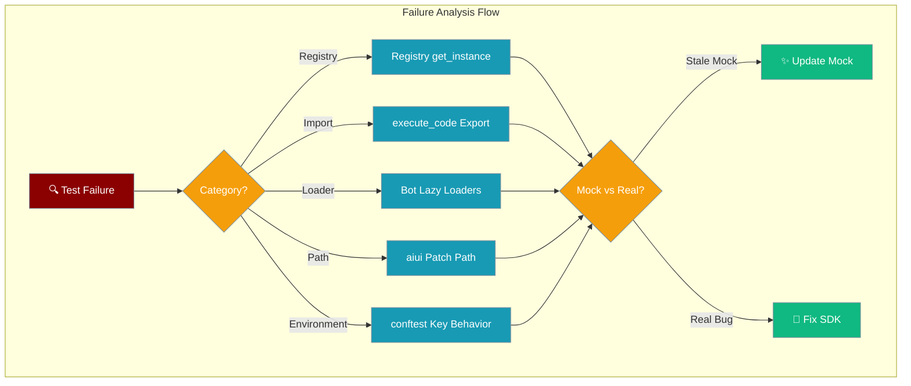

Pytest failures in PraisonAI fall into predictable categories that help distinguish real regressions from outdated test mocks.



## Quick Start

<Steps>
<Step title="Identify the Category">
Run the one-liner check to identify which category your test failure belongs to.
</Step>

<Step title="Determine Real vs Stale">
Use the verification commands to distinguish between real regressions and outdated mocks.
</Step>

<Step title="Apply the Fix">
Update mock targets or escalate to SDK maintainers based on the analysis.
</Step>
</Steps>

---

## Failure Categories

### Registry get_instance

**Symptom:** `AttributeError` where registry mock returns `None` instead of registry instance

**One-liner check:**
```bash
python -c "from praisonai.llm.registry import LLMProviderRegistry; print(LLMProviderRegistry.get_instance())"
```

**Likely root cause:** Stale mock — registry API changed in SDK, mock needs updating

**Common failure signature:**
```python
AttributeError: 'NoneType' object has no attribute 'resolve'
```

**Fix approach:**
- Update mock patch target to match current registry location
- Verify mock returns actual registry instance, not None
- Check for singleton pattern changes in LLMProviderRegistry.get_instance()

---

### execute_code Export

**Symptom:** `ImportError` on `from praisonaiagents.tools import execute_code`

**One-liner check:**
```bash
python -c "from praisonaiagents.tools import execute_code; print('✓ Import successful')"
```

**Likely root cause:** Export removed/renamed in SDK

**Common failure signature:**
```python
ImportError: cannot import name 'execute_code' from 'praisonaiagents.tools'
```

**Fix approach:**
- Check TOOL_MAPPINGS in `praisonaiagents/tools/__init__.py`
- Verify execute_code is mapped to `.python_tools` module
- Update import paths if module structure changed

---

### Bot Lazy Loaders

**Symptom:** First call returns `None` instead of bot instance due to lazy loading bypass

**One-liner check:**
```bash
pytest tests/unit/test_bot_loaders.py -x
```

**Likely root cause:** Mock targets the eager path; lazy loader bypasses it

**Common failure signature:**
```python
AssertionError: Expected bot instance, got None
```

**Fix approach:**
- Mock the lazy loading mechanism itself
- Ensure mocks cover both eager and lazy initialization paths
- Check for `__getattr__` method changes in tools modules

---

### aiui Patch Path

**Symptom:** Mock patch silently no-ops, test passes when it should fail

**One-liner check:**
```bash
python -c "import praisonai.ui; print(praisonai.ui.__file__)"
```

**Likely root cause:** Patch target moved; update `mock.patch` path

**Common failure signature:**
```python
# Test passes but shouldn't - mock not being applied
```

**Fix approach:**
- Verify praisonaiui module location has not changed
- Update patch paths from `praisonai.aiui` to `praisonaiui` if needed
- Check for import alias changes (`import praisonaiui as aiui`)

---

### conftest Key Behavior

**Symptom:** Tests pass locally but fail in CI, or vice versa

**One-liner check:**
```bash
env | grep -E '^(OPENAI|ANTHROPIC|GOOGLE|XAI|GROQ|COHERE)_API_KEY='
```

**Likely root cause:** Real key exported in one environment but not the other

**Context:** Since May 2026 (PR #1663), `setup_test_environment` only injects placeholder API keys when variables are **unset or empty**. Real keys from shell environment are preserved.

**Fix approach:**
- `unset` API keys before running unit tests to force placeholder injection
- Use clean shell environment for consistent test behavior
- Mark tests as `real`/`network`/`e2e` if they need real API keys

---

## Troubleshooting Workflow

<AccordionGroup>
<Accordion title="Before You Escalate Checklist">
- [ ] Re-pull latest from main branch
- [ ] Re-install editable package: `pip install -e .`
- [ ] Check installed version: `pip show praisonai-agents`
- [ ] Run with verbose output: `pytest -vv --tb=long`
- [ ] Verify environment isolation (no stale imports)
</Accordion>

<Accordion title="Real Regression vs Stale Mock">
**Real Regression Signs:**
- One-liner checks fail on fresh install
- Multiple unrelated tests failing simultaneously  
- Recent SDK changes in related modules
- Failures persist after mock updates

**Stale Mock Signs:**
- One-liner checks pass, only mocked tests fail
- Single test or module affected
- Mock targets non-existent paths/attributes
- Failures resolve with mock path updates
</Accordion>

<Accordion title="Mock Update Strategy">
1. **Identify current API:** Run one-liner to see actual behavior
2. **Update patch target:** Match current module location
3. **Verify mock return:** Ensure mock returns expected type
4. **Test both paths:** Cover eager and lazy loading scenarios
</Accordion>

<Accordion title="When to Escalate">
Escalate to SDK maintainers when:
- One-liner checks confirm real API breakage
- Breaking changes affect multiple test categories
- Public API contracts have changed unexpectedly
- Fixes require SDK-level changes, not just test updates
</Accordion>
</AccordionGroup>

---

## Related

<CardGroup cols={2}>
<Card title="Testing Guide" icon="flask-vial" href="testing">
  Complete testing documentation and environment setup
</Card>
<Card title="Development Setup" icon="code" href="development-setup">
  Local development environment configuration
</Card>
</CardGroup>