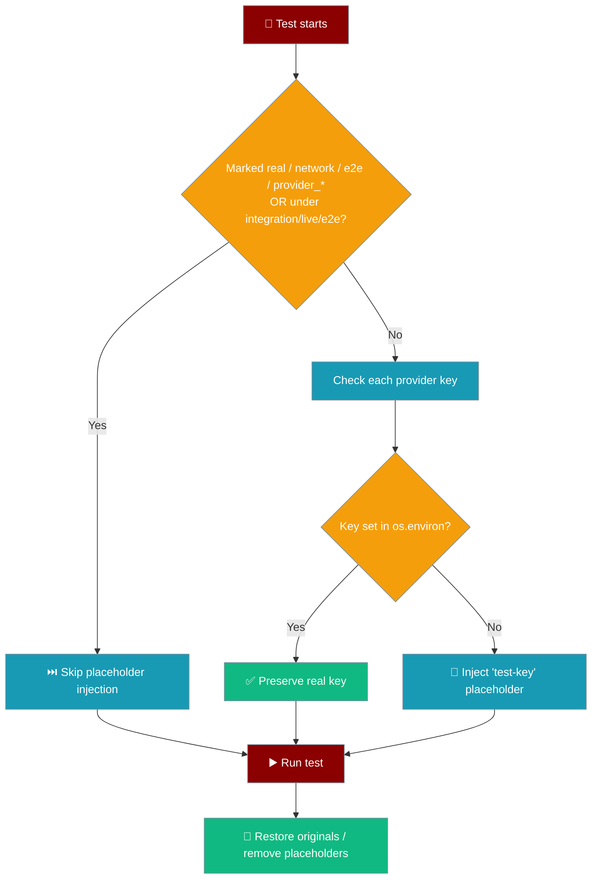

# PraisonAI Testing Guide

This guide explains how to run tests, understand test tiers, and work with provider-specific tests in PraisonAI.

## Quick Start

```bash
# Run smoke tests (fastest, ~2 min)
praisonai test --tier smoke

# Run main tests (default, ~5 min)
praisonai test

# Run with parallelization
praisonai test --parallel auto

# Run OpenAI live tests (requires API key)
praisonai test --provider openai --live
```

## Test Tiers

PraisonAI uses a tiered testing approach to balance speed and coverage:

| Tier | Target Runtime | Description |
|------|---------------|-------------|
| `smoke` | ≤ 2 min | Fast unit tests, no network, no slow tests |
| `main` | ≤ 5 min | Unit + integration, OpenAI gated only |
| `extended` | ≤ 15 min | All providers, gated by API keys |
| `nightly` | ≤ 30 min | Full matrix + stress tests |

### Running Specific Tiers

```bash
# Smoke tier - fastest, for quick validation
praisonai test --tier smoke

# Main tier - default for development
praisonai test --tier main

# Extended tier - all providers
praisonai test --tier extended --live

# Nightly tier - comprehensive
praisonai test --tier nightly --live
```

## Provider Tests

Tests that require specific LLM providers are automatically detected and gated:

| Provider | Environment Variable | Marker |
|----------|---------------------|--------|
| OpenAI | `OPENAI_API_KEY` | `provider_openai` |
| Anthropic | `ANTHROPIC_API_KEY` | `provider_anthropic` |
| Google/Gemini | `GOOGLE_API_KEY` | `provider_google` |
| Ollama | (local service) | `provider_ollama` |
| Grok/xAI | `XAI_API_KEY` | `provider_grok_xai` |
| Groq | `GROQ_API_KEY` | `provider_groq` |
| Cohere | `COHERE_API_KEY` | `provider_cohere` |

### Running Provider-Specific Tests

```bash
# Run only OpenAI tests
praisonai test --provider openai --live

# Run only Anthropic tests
praisonai test --provider anthropic --live

# Run all provider tests
praisonai test --provider all --live
```

## Environment Variables

| Variable | Default | Description |
|----------|---------|-------------|
| `PRAISONAI_TEST_TIER` | `main` | Test tier to run |
| `PRAISONAI_ALLOW_NETWORK` | `0` | Allow network calls in tests |
| `PRAISONAI_LIVE_TESTS` | `0` | Enable live API tests |
| `PRAISONAI_TEST_PROVIDERS` | `openai` | Comma-separated provider list |
| `PRAISONAI_LOCAL_SERVICES` | `0` | Enable local service tests |
| `OPENAI_API_KEY` | `'test-key'` | Placeholder injected only if unset/empty for non-real tests |
| `ANTHROPIC_API_KEY` | `'test-key'` | Placeholder injected only if unset/empty for non-real tests |
| `GOOGLE_API_KEY` | `'test-key'` | Placeholder injected only if unset/empty for non-real tests |
| `XAI_API_KEY` | `'test-key'` | Placeholder injected only if unset/empty for non-real tests |
| `GROQ_API_KEY` | `'test-key'` | Placeholder injected only if unset/empty for non-real tests |
| `COHERE_API_KEY` | `'test-key'` | Placeholder injected only if unset/empty for non-real tests |

### Placeholder API Keys in Mock Tests

The autouse `setup_test_environment` fixture in `src/praisonai/tests/conftest.py` injects a `'test-key'` placeholder for `OPENAI_API_KEY`, `ANTHROPIC_API_KEY`, `GOOGLE_API_KEY`, `XAI_API_KEY`, `GROQ_API_KEY`, and `COHERE_API_KEY` so unit tests can construct LLM clients without real credentials.

Since May 2026 (PR #1663), the placeholder is only injected when the variable is **unset or empty**. If you already exported a real key, it is left untouched.

**Implication:** if you export a real key and run mock unit tests, any test that isn't fully mocked will make real, billable API calls. To force the placeholder path, `unset` the keys first (or run in a clean shell). The fixture skips placeholder injection entirely for tests marked `real`, `network`, `e2e`, or `provider_*`, and for tests under `tests/integration/`, `tests/live/`, or `tests/e2e/`.

### Provider API keys in unit/mock tests

The `setup_test_environment` autouse fixture preserves any provider API key already present in the shell environment.



Placeholder `"test-key"` values are injected **only** for keys that are unset, so SDK imports and guardrails never crash on missing keys. On teardown, originally-set keys keep their values; keys that were missing and got placeholders are removed (not left behind as `"test-key"`).

Tests marked `@pytest.mark.real`, `@pytest.mark.network`, `@pytest.mark.e2e`, or any `@pytest.mark.provider_*` skip the placeholder injection entirely, so they always see the real environment. Tests located under `tests/integration/`, `tests/live/`, or `tests/e2e/` are also treated as real and skip placeholder injection.

| Scenario | Behavior |
|----------|----------|
| Key set in shell, running unit/mock test | Real key is preserved (used as-is) |
| Key unset, running unit/mock test | Placeholder `"test-key"` injected, removed on teardown |
| Test marked `provider_openai` / `real` / `network` / `e2e` | Placeholder injection skipped entirely |
| Test located under `integration/`, `live/`, or `e2e/` | Placeholder injection skipped entirely |

Provider keys covered by the fixture: `OPENAI_API_KEY`, `ANTHROPIC_API_KEY`, `GOOGLE_API_KEY`, `XAI_API_KEY`, `GROQ_API_KEY`, `COHERE_API_KEY`.

<Tip>
Export your real keys in `~/.bashrc` / `~/.zshrc` if you want local unit tests to call real provider APIs without using the `--live` flag — the autouse fixture will not overwrite them.
</Tip>

<Note>
An explicit empty string (`export OPENAI_API_KEY=""`) is also preserved — the fixture only injects placeholders when the variable is fully absent from `os.environ`.
</Note>

## CLI Options

```bash
praisonai test [OPTIONS]

Options:
  --tier, -t TEXT        Test tier: smoke, main, extended, nightly
  --provider, -p TEXT    Provider: openai, anthropic, google, ollama, etc.
  --live, -l             Enable live API tests
  --allow-network        Allow network access in tests
  --parallel, -n TEXT    Parallel workers: auto or number
  --verbose, -v          Verbose output
  --coverage, -c         Generate coverage report
  --fail-fast, -x        Stop on first failure
```

## Test Markers

Tests are automatically marked based on their location and content:

### Type Markers
- `unit` - Pure unit tests, no network
- `integration` - Local integration tests
- `e2e` - End-to-end tests with external calls

### Provider Markers
- `provider_openai` - Requires OpenAI API
- `provider_anthropic` - Requires Anthropic API
- `provider_google` - Requires Google/Gemini API
- `provider_ollama` - Requires Ollama running locally
- `provider_grok_xai` - Requires xAI/Grok API
- `provider_groq` - Requires Groq API
- `provider_cohere` - Requires Cohere API

### Infrastructure Markers
- `network` - Makes outbound network calls
- `local_service` - Requires Docker or local service
- `slow` - Takes more than 5 seconds
- `flaky` - Known intermittent failures
- `allow_sleep` - Opt out of fast_sleep fixture

### Timing-sensitive tests (`fast_sleep` / `allow_sleep`)

By default, unit tests replace `time.sleep` with a near-instant stub so suites finish quickly. That breaks tests which assert real delays, backoff, or scheduler timing.

```python
import pytest
import time

@pytest.mark.allow_sleep
def test_retry_backoff_waits():
    start = time.monotonic()
    time.sleep(0.05)  # real sleep — not patched when allow_sleep is set
    assert time.monotonic() - start >= 0.04
```

Run only tests that need real sleeps:

```bash
pytest tests/unit/test_scheduler.py -m allow_sleep
```

Or disable the fast_sleep fixture for one file by marking every test `@pytest.mark.allow_sleep`.

## Direct pytest Usage

You can also use pytest directly:

```bash
# Smoke tests
cd src/praisonai
pytest tests/unit/ -m "not slow and not network" -q --timeout=30

# Main tests with parallelization
pytest tests/unit/ tests/integration/ \
  -m "not provider_anthropic and not provider_google" \
  -n 2 --timeout=60

# OpenAI live tests
PRAISONAI_LIVE_TESTS=1 pytest tests/ -m "provider_openai" --timeout=120
```

## Network Guard

By default, unit tests block outbound network calls. This prevents:
- Accidental API calls during development
- Flaky tests due to network issues
- Unexpected costs from live API calls

To allow network access:
```bash
# Via CLI
praisonai test --live

# Via environment
PRAISONAI_ALLOW_NETWORK=1 pytest tests/
```

## CI/CD Integration

The test suite is designed for CI with separate jobs:

1. **smoke** - Runs on every push, fast validation
2. **main** - Runs on PR/main, comprehensive unit + integration
3. **openai-live** - Runs when `OPENAI_API_KEY` secret is set
4. **extended-*** - Provider-specific jobs, nightly schedule

See `.github/workflows/test-optimized.yml` for the full CI configuration.

## Writing Tests

### Test Location
- `tests/unit/` - Unit tests (no network)
- `tests/integration/` - Integration tests
- `tests/e2e/` - End-to-end tests
- `tests/live/` - Live API tests

### Marking Provider Tests

Tests are auto-detected, but you can explicitly mark:

```python
import pytest

@pytest.mark.provider_anthropic
def test_anthropic_feature():
    """This test requires Anthropic API."""
    pass

@pytest.mark.network
def test_external_api():
    """This test makes network calls."""
    pass

@pytest.mark.slow
def test_long_running():
    """This test takes a while."""
    pass
```

### Using Fixtures

Common fixtures are available in `conftest.py`:

- `setup_test_environment` - autouse fixture that fills missing provider API keys with placeholders; preserves real keys from your shell
- `mock_llm_response` - provides mock LLM responses for testing
- `temp_directory` - provides temporary directory for file operations

```python
def test_with_mock_llm(mock_llm_response):
    """Use mock LLM response."""
    assert mock_llm_response['choices'][0]['message']['content']

def test_with_temp_dir(temp_directory):
    """Use temporary directory."""
    file_path = temp_directory / "test.txt"
    file_path.write_text("test")
```

## Troubleshooting

### Tests Skipped Unexpectedly

Check if the test is being auto-marked as a provider test:
```bash
pytest tests/path/to/test.py --collect-only -q
```

### Network Blocked Error

If you see `NetworkBlockedError`, the test needs network access:
```bash
PRAISONAI_ALLOW_NETWORK=1 pytest tests/path/to/test.py
```

### Timeout Errors

Increase the timeout for slow tests:
```bash
pytest tests/ --timeout=120
```

Or mark the test as slow:
```python
@pytest.mark.slow
def test_slow_operation():
    pass
```

### Pytest Failure Categories

For common test failures and how to distinguish real regressions from stale mocks, see the [Pytest Failure Categories Guide](pytest-failure-categories).
