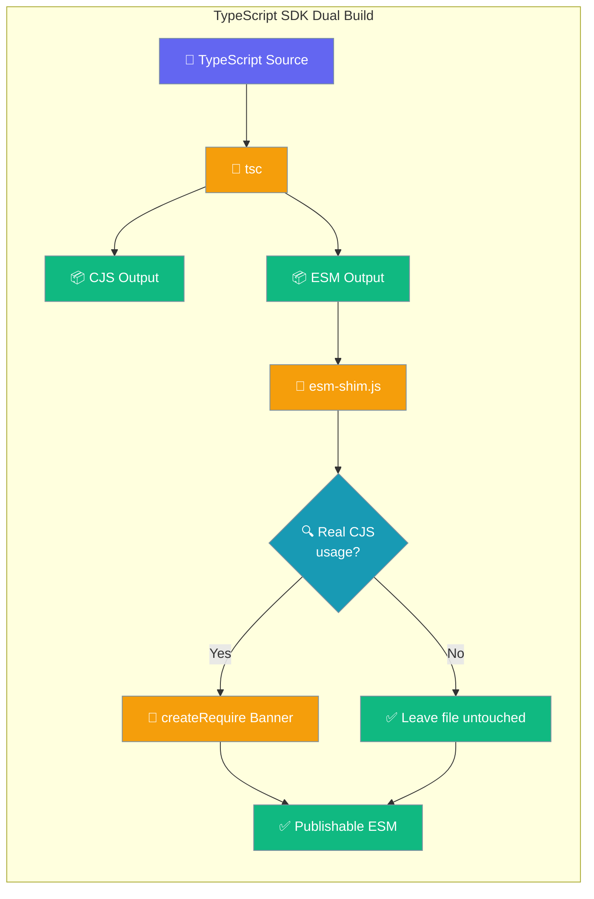
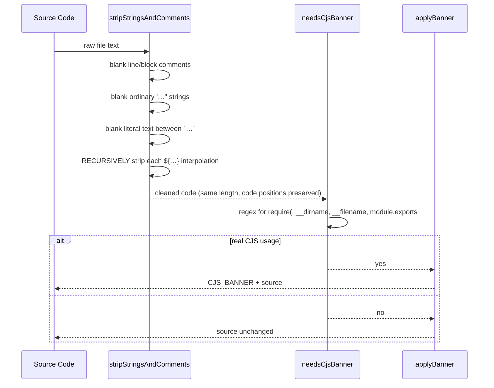

`praisonai-ts` publishes both CJS and ESM outputs from a single TypeScript source, and a build shim called `esm-shim.js` post-processes the emitted ESM files so anything that still relies on `require(...)`, `__dirname`, `__filename`, or `module.exports` keeps working at runtime under Node ESM.



## How The Build Runs

The dual build is driven by two `tsc` passes wired through npm scripts in `src/praisonai-ts/package.json`.

```bash
# from src/praisonai-ts/
npm run build       # runs build:cjs then build:esm
npm run build:cjs   # tsc  -> dist/
npm run build:esm   # tsc -p tsconfig.esm.json -> dist/esm/, then node scripts/esm-shim.js
```

The `esm-shim.js` step runs **after** `tsc` emits the ESM build into `dist/esm/`. It walks every `.js` file, fixes relative import specifiers, repoints internal `require(...)` calls at the CJS twin, and prepends the `createRequire` banner only where genuinely needed. Source files are never touched, and the CJS build in `dist/` is unaffected.

---

## What The Shim Does

The shim lives at `src/praisonai-ts/scripts/esm-shim.js` and exports four helpers.

| Export | Role |
|--------|------|
| `needsCjsBanner(code)` | Returns `true` if the file genuinely uses CJS globals. |
| `applyBanner(code)` | Prepends `CJS_BANNER` when `needsCjsBanner` is `true`, else returns the code unchanged. |
| `stripStringsAndComments(code)` | Blanks strings and comments so detection only sees real code. |
| `CJS_BANNER` | The banner text prepended to files that need CJS compat. |

When a file needs the banner, `applyBanner` prepends `CJS_BANNER`, which imports `createRequire` from `module`, `fileURLToPath` from `url`, and `dirname` from `path`, then re-creates `require`, `__filename`, and `__dirname` at module scope (plus a `module` stub so `require.main === module` evaluates to `false`).

<Note>
A shebang line (`#!...`) is preserved: the banner is inserted **after** it so the file stays executable.
</Note>

---

## Why Detection Is Non-Trivial

Detection has to avoid two opposite failure modes.

<AccordionGroup>
<Accordion title="False positives — a plain string triggering the banner">
A plain string like `"Zod schemas require zod-to-json-schema"` used to trigger the banner and pull in unused Node built-in imports (`module`, `url`, `path`), making the bundled ESM strictly worse than the TypeScript source. The real-world case was `dist/esm/llm/providers/openai.js`, where an error message alone caused 24 of 288 files to gain a banner they never needed.
</Accordion>

<Accordion title="False negatives — a real require hidden inside an interpolation">
An earlier fix over-blanked template literals: a genuine `require(...)` or `__dirname` **inside** a `${...}` interpolation was blanked along with the surrounding literal text, so the file emitted **without** the banner and threw `ReferenceError: require is not defined` at runtime under Node ESM. This is what [PR #4436](https://github.com/MervinPraison/PraisonAI/pull/4436) fixed.
</Accordion>
</AccordionGroup>

---

## How stripStringsAndComments Works

`needsCjsBanner` first calls `stripStringsAndComments`, which blanks literal text and comments while keeping `${...}` interpolations intact, then runs regex detectors on the cleaned code.



Blanking preserves offsets and newlines — each token is replaced with same-length whitespace — so error messages and source-map-friendly positions still line up. Inside a `${...}` interpolation the shim honors nested braces, nested strings and templates, regex literals (with `}` inside a character class), and line/block comments, so a stray `}` cannot close the interpolation early.

The regex detectors then match real CJS usage:

| Pattern | Matches |
|---------|---------|
| `/(?:^\|[^.\w$])require\s*\(/` | a real `require(...)` call, not `obj.require` |
| `/(?:^\|[^.\w$])__dirname\b/` / `__filename\b` | identifier position, not property access |
| `\bmodule\.exports\b`, `===\s*module\b`, `\bmodule\s*===` | CJS module-detection idioms |

---

## What Does And Does Not Get Bannered

Use this table as the quick reference for expected behavior.

| Source snippet | Banner? | Why |
|----------------|:-------:|-----|
| `const msg = "this require is a string";` | ❌ | `require` is inside a string literal |
| `// note: require(x) here` / `/* … require … */` | ❌ | Inside a comment |
| `` const t = `run require("x") to load`; `` | ❌ | Template-literal *text*, no interpolation |
| `` const t = `${"please require nothing"}`; `` | ❌ | Interpolation body is a plain string |
| `const opts = { require: true }; foo.require = 1;` | ❌ | Property, not a call |
| `const fs = require("fs");` | ✅ | Real `require(...)` call |
| `const d = __dirname + "/x";` / `console.log(__filename);` | ✅ | Identifier position |
| `` const v = `value=${require("fs").readFileSync("x")}`; `` | ✅ | Real call inside interpolation |
| `` const p = `${__dirname}/data`; `` | ✅ | Real identifier inside interpolation |
| `` const v = `x=${/[}]/.test(s) ? require("fs")… : 0}`; `` | ✅ | Regex `}` in character class doesn't close interpolation early |
| `` const v = `x=${a / b + c}`; `` | ❌ | Division is not a regex literal |

---

## Regression Tests

The detector is guarded by `src/praisonai-ts/tests/unit/packaging/esm-shim-banner.test.ts`, split into two directions plus an end-to-end emit check.

| Describe block | Guards against |
|----------------|----------------|
| `esm-shim needsCjsBanner (false positives)` | Anything mentioned only in strings / comments must NOT banner. |
| `esm-shim needsCjsBanner (genuine CJS usage)` | Real calls, including inside interpolations, MUST banner. |
| `esm-shim applyBanner` | End-to-end emit — real `require()` gets the banner, string-only files stay byte-identical. |

Run them from the TypeScript SDK folder:

```bash
# from src/praisonai-ts/
npm test -- esm-shim-banner
```

---

## When To Update This Page

Whenever a contributor changes `needsCjsBanner`, `stripStringsAndComments`, or the `CJS_BANNER` string, they should:

<Steps>
<Step title="Add a matching test">
Add a case to `src/praisonai-ts/tests/unit/packaging/esm-shim-banner.test.ts` in the matching describe block.
</Step>

<Step title="Update the behavior table">
Update the "What Does And Does Not Get Bannered" table on this page if the observable behavior changes.
</Step>
</Steps>

---

## Related

<CardGroup cols={2}>
  <Card title="Scripts & Automation" icon="terminal" href="/developers/scripts">
    Includes a TypeScript SDK scripts section
  </Card>
  <Card title="Development Setup" icon="code" href="/developers/development-setup">
    Setting up the dev environment
  </Card>
</CardGroup>
