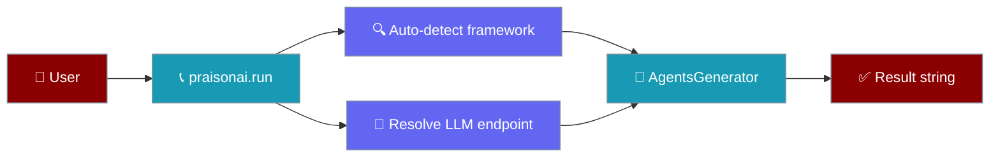
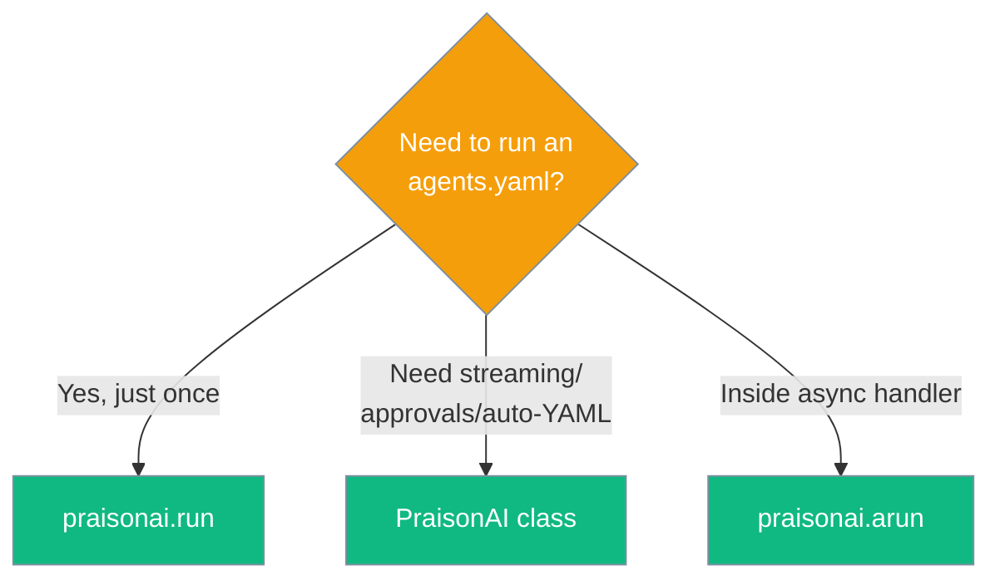
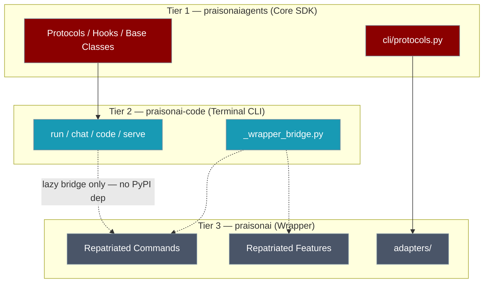

# Include praisonai package in your project

## Option 0: One-liner (simplest)

```python
import praisonai

result = praisonai.run("agents.yaml")
print(result)
```

That's it. `praisonai.run()` reuses the same framework auto-detection and LLM endpoint resolution the `praisonai` CLI uses, so anything that works on the command line works here.

### What it does

<Steps>
<Step>
  Auto-detects the first installed framework in this order: `crewai` → `praisonaiagents` → `autogen` → `ag2`. Pass `framework="..."` to override.
</Step>
<Step>
  Reads `OPENAI_API_KEY`, `OPENAI_BASE_URL`, `OPENAI_MODEL_NAME` (and the standard PraisonAI key/config files) — same as the CLI.
</Step>
<Step>
  Returns the final task output as a string.
</Step>
</Steps>



### Async variant for FastAPI / Jupyter

```python
import praisonai

async def handler():
    result = await praisonai.arun("agents.yaml")
    return result
```

`arun()` offloads the synchronous work to a thread so it never blocks the event loop.

### Optional parameters

| Parameter | Type | Default | Description |
|-----------|------|---------|-------------|
| `agent_file` | `str` | required | Path to your `agents.yaml`. |
| `framework` | `str \| None` | `None` (auto-detect) | One of `"crewai"`, `"praisonai"`, `"autogen"`, `"ag2"`, `"langgraph"`. LangGraph must be selected explicitly — it is not in the auto-detect chain. |
| `tools` | `list \| None` | `None` | Optional list of tool callables passed through to `AgentsGenerator`. |
| `agent_yaml` | `str \| None` | `None` | Inline YAML string; takes precedence over `agent_file` when both are given. |
| `cli_config` | `dict \| None` | `None` | Advanced: override the resolved CLI config (rarely needed). |

<Note>
If no framework is installed, `run()` raises `RuntimeError("No supported framework installed. Install one of: crewai, praisonaiagents, autogen, ag2.")`. Install one with `pip install praisonaiagents` (recommended for new projects). LangGraph is not in the auto-detect chain; pass `framework="langgraph"` explicitly.
</Note>

### When to use `PraisonAI(...)` instead

Reach for the full `PraisonAI` class (Option 1 below) when you need:
- Streaming / approval-system integration
- Custom backends or the gradio UI
- The `auto="..."` natural-language-to-YAML mode
- Repeated runs against the same generator without re-parsing YAML



## Option 1: Using RAW YAML

```python
from praisonai import PraisonAI

# Example agent_yaml content
agent_yaml = """
framework: "crewai"
topic: "Space Exploration"

agents:  # Canonical: use 'agents' instead of 'roles'
  astronomer:
    role: "Space Researcher"
    goal: "Discover new insights about {topic}"
    instructions:  # Canonical: use 'instructions' instead of 'backstory' "You are a curious and dedicated astronomer with a passion for unraveling the mysteries of the cosmos."
    tasks:
      investigate_exoplanets:
        description: "Research and compile information about exoplanets discovered in the last decade."
        expected_output: "A summarized report on exoplanet discoveries, including their size, potential habitability, and distance from Earth."
"""

# Create a PraisonAI instance with the agent_yaml content
praisonai = PraisonAI(agent_yaml=agent_yaml)

# Run PraisonAI
result = praisonai.run()

# Print the result
print(result)
```

## Option 2: Using separate agents.yaml file


Note: Please create agents.yaml file before hand. If you only need to run an `agents.yaml` once and want zero ceremony, see [Option 0: One-liner](#option-0-one-liner-simplest) above. 

```python
from praisonai import PraisonAI

def basic(): # Basic Mode
    praisonai = PraisonAI(agent_file="agents.yaml")
    praisonai.run()

if __name__ == "__main__":
    basic()
```

## Other options

```python
from praisonai import PraisonAI

def basic(): # Basic Mode
    praisonai = PraisonAI(agent_file="agents.yaml")
    praisonai.run()
    
def advanced(): # Advanced Mode with options
    praisonai = PraisonAI(
        agent_file="agents.yaml",
        framework="autogen", # use AG2 framework (Formerly AutoGen)
    )
    praisonai.run()
    
def auto(): # Full Automatic Mode
    praisonai = PraisonAI(
        auto="Create a movie script about car in mars",
        framework="autogen" # use AG2 framework
    )
    print(praisonai.framework)
    praisonai.run()

if __name__ == "__main__":
    basic()
    advanced()
    auto()
```

## Lifecycle / cleanup

Each `AgentsGenerator` lazily creates a bounded thread-pool to run synchronous tools under per-call timeouts. The pool is **owned by the instance**, not the process — concurrent sessions in a multi-tenant runtime never share workers.

When you're done with a generator, release the pool with `.close()` or use it as a context manager:

```python
from praisonai.agents_generator import AgentsGenerator

# Pattern A: context manager (recommended)
with AgentsGenerator(agent_file="agents.yaml", framework="crewai", config_list=[...]) as gen:
    gen.generate_crew_and_kickoff()
# pool is shut down on exit, even if generate_crew_and_kickoff raises

# Pattern B: explicit close()
gen = AgentsGenerator(agent_file="agents.yaml", framework="crewai", config_list=[...])
try:
    gen.generate_crew_and_kickoff()
finally:
    gen.close()
```

`close()` is idempotent — calling it twice is safe.

### Injecting a shared executor (multi-tenant)

If you already manage a thread-pool (e.g. one per tenant), inject it via `tool_timeout_executor=`. The generator will use the pool but **never shut it down** — ownership stays with you.

```python
import concurrent.futures
from praisonai.agents_generator import AgentsGenerator

tenant_pool = concurrent.futures.ThreadPoolExecutor(
    max_workers=8,
    thread_name_prefix=f"tenant-{tenant_id}",
)

with AgentsGenerator(
    agent_file="agents.yaml",
    framework="crewai",
    config_list=[...],
    tool_timeout_executor=tenant_pool,   # borrowed; close() will NOT shut it down
) as gen:
    gen.generate_crew_and_kickoff()

# you remain responsible for tenant_pool.shutdown()
```

Each owned pool is named `praisonai-tool-timeout-<hexid>` for easy enumeration in `top` / `py-spy` / thread dumps.

### `tool_timeout_executor` parameter

| Parameter | Type | Default | Description |
|-----------|------|---------|-------------|
| `tool_timeout_executor` | `concurrent.futures.Executor \| None` | `None` (lazy, instance-owned) | Optional executor for per-call tool timeouts. When `None`, the generator lazily creates and owns a bounded `ThreadPoolExecutor` (default 32 workers, override with `PRAISONAI_TOOL_TIMEOUT_WORKERS`). When supplied, it is **borrowed** — the generator never shuts it down. |

<AccordionGroup>

<Accordion title="Always close or use `with`">

Leaked tool-timeout pools accumulate threads named `praisonai-tool-timeout-<hexid>` across instances. Use `with AgentsGenerator(...) as gen:` or call `gen.close()` to release them. Check `top` / `py-spy` if you suspect thread accumulation.

</Accordion>

<Accordion title="Borrowed pools stay yours">

Passing `tool_timeout_executor=` means `close()` won't shut it down. You manage the lifecycle — call `your_pool.shutdown()` when you're done with it.

</Accordion>

<Accordion title="One generator per session in multi-tenant">

Don't share `AgentsGenerator` instances across tenants. Share the executor instead — inject the same pool via `tool_timeout_executor=` into each per-tenant generator.

</Accordion>

<Accordion title="Unique task names per workflow">

With the CrewAI framework, `context=[...]` lookup keys on the task name. Two roles defining the same task name now raise `ValueError` — pick names like `<role>_<verb>` for clarity.

</Accordion>

</AccordionGroup>

---

## Logging in scripts

If you want PraisonAI to configure your application's logging, call `configure_cli_logging()` once at startup:

```python
from praisonai import PraisonAI
from praisonai._logging import configure_cli_logging

configure_cli_logging("INFO")  # opt in to root-logger setup
PraisonAI(agent_file="agents.yaml").run()
```

If you want PraisonAI to leave your application's logging untouched, just don't call `configure_cli_logging` — only namespaced `praisonai.*` loggers will be used.

---

## C8 Architecture: Wrapper–Code Boundary (Developer Reference)

<Note>
This section covers the internal three-tier package architecture. It is relevant to contributors and maintainers, not end-users.
</Note>

### Three-Tier Model

PraisonAI uses a strict three-tier package model with a one-way dependency rule:



**Invariant:** `praisonai-code/pyproject.toml` declares **no** PyPI dependency on `praisonai`. All cross-tier access goes through `praisonai_code._wrapper_bridge` only.

### C8 Metrics (post-C8, merged 2026-07-02)

| Metric | Pre-C8 | Post-C8 |
|--------|--------|---------|
| Wrapper import lines in `praisonai-code` | 225 | **0** |
| Regression baseline in `check_c7_imports.sh` | 225 | **50** |
| Allowlisted files | 47 | **0** |

### `_wrapper_bridge` — The Only Cross-Tier Path

`praisonai_code._wrapper_bridge` is the **sole** permitted mechanism for `praisonai-code` to call into `praisonai`. It lazy-loads the wrapper at runtime and never causes an import-time error when the wrapper is absent.

```python
from praisonai_code._wrapper_bridge import get_wrapper_module

mod = get_wrapper_module("praisonai.cli.commands.train")
if mod:
    mod.train_command()
```

Direct `import praisonai` or `from praisonai import …` inside `praisonai-code` is forbidden and enforced by `scripts/check_c7_imports.sh`.

### `_WRAPPER_RESIDENT_COMMANDS`

Commands that live in the `praisonai` wrapper but are registered in the `praisonai-code` CLI router. The variable was renamed from `_WRAPPER_COMMANDS` in C8.1 (backward-compat alias retained).

`get_command()` lazy-loads these via the absolute `praisonai.cli.commands.*` path through the bridge.

**C8.2 Repatriated Commands** (moved from `praisonai-code` back to `praisonai`):

| Batch | Commands |
|-------|---------|
| A | `langfuse`, `langextract`, `flow`, `n8n`, `replay`, `langfuse_client` |
| B | `train`, `managed`, `examples`, `standardise` |
| C | `docs`, `schedule`, `batch` |
| D | `rag`, `knowledge`, `realtime`, `profile`, `audit`, `app` |
| E | `serve` wrapper paths (SDK subcommands remain in `praisonai-code`) |

### C8.3 Repatriated Features

The following `cli/features/*` modules moved from `praisonai-code` to `praisonai/cli/features/`:

`recipe`, `templates`, `deploy`, `recipe_optimizer`, `persistence`, `eval`, `agent_scheduler`, `acp`, `registry`, `sandbox_cli`, `ollama`, `workflow`, `tui/app`, `interactive/async_tui`, `interactive/core`

Also repatriated: `commands/recipe`, `context`, `mcp`, `validate`.

### Protocols & Adapters (C8.5)

New protocols in `praisonaiagents/cli/protocols.py` define the interface contracts between tiers:

```python
from praisonaiagents.cli.protocols import (
    TemplateStoreProtocol,
    SessionStoreProtocol,
    ServeHandlerProtocol,
)
```

| Protocol | Purpose |
|----------|---------|
| `TemplateStoreProtocol` | Template persistence accessed from repatriated CLI features (`list_templates`, `get_template`) |
| `SessionStoreProtocol` | Optional session backend for interactive TUI paths (`load`, `save`) |
| `ServeHandlerProtocol` | Dispatch serve subcommands without direct wrapper imports (`handle`) |

Concrete implementations live in `praisonai/adapters/`:

```python
from praisonai.adapters import ServeHandlerAdapter, get_template_store
```

| Adapter / helper | Purpose |
|-----------------|---------|
| `ServeHandlerAdapter` | Wraps `praisonai.cli.features.serve.handle_serve_command` |
| `get_template_store()` | Returns the template store module, or `None` if wrapper absent |

The `praisonai.adapters` module also lazily re-exports all existing adapter classes (`AutoReader`, `ChromaVectorStore`, `BasicRetriever`, `FusionRetriever`, `LLMReranker`, and registration helpers) to preserve backward compatibility.

### C8.4 Legacy Structure

- `praisonai/cli/legacy/inbuilt_tools.py`, `framework_run.py` — extraction targets for lazy loaders.
- `praisonai-code/cli/legacy/prompt_dispatch.py` — standalone-safe helpers.
- `main.py` still contains the `PraisonAI` class body; wrapper access is normalised via the bridge. The physical 7k-line split is **deferred** (out of scope of C8).

### Developer Tooling

| Script | Purpose |
|--------|---------|
| `scripts/check_c7_imports.sh` | Counts wrapper import lines in `praisonai-code`; enforces baseline ≤ 50 |
| `scripts/c8_bridge_convert.py` | Converts direct `from praisonai …` imports to `_wrapper_bridge` calls |
| `scripts/c8_repatriate.py` | Moves a command/feature implementation from `praisonai-code` → `praisonai` |

### Deferred Work

The physical extraction of the `PraisonAI` class (~7k lines in `main.py`) to `praisonai/cli/legacy/praison_class.py` was explicitly deferred from C8. The `docs/concepts/architecture.mdx` page (HUMAN-ONLY) also needs a maintainer update to reflect the C8 metrics.

