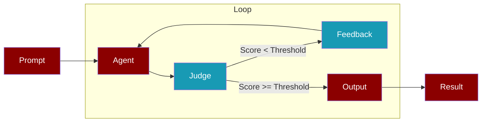
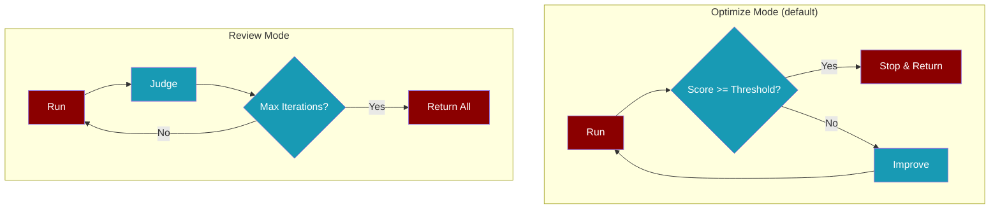

<Info>
**EvaluationLoop** implements the "Ralph Loop" pattern: run an agent, judge the output, provide feedback, and repeat until the quality threshold is met.
</Info>

## How It Works



## Quick Start

<Tabs>
  <Tab title="Agent.run_until()">
    ```python
    from praisonaiagents import Agent

    agent = Agent(name="analyzer", instructions="Analyze systems thoroughly")
    
    result = agent.run_until(
        "Analyze the authentication flow",
        criteria="Analysis is thorough and actionable",
        threshold=8.0,
    )
    
    print(f"Score: {result.final_score}/10")
    print(f"Success: {result.success}")
    ```
  </Tab>
  <Tab title="EvaluationLoop Class">
    ```python
    from praisonaiagents import Agent
    from praisonaiagents.eval import EvaluationLoop

    agent = Agent(name="writer", instructions="Write compelling content")
    
    loop = EvaluationLoop(
        agent=agent,
        criteria="Content is engaging and well-structured",
        threshold=8.0,
        max_iterations=5,
    )
    
    result = loop.run("Write a product description for an AI assistant")
    print(result.final_report)
    ```
  </Tab>
  <Tab title="With Callback">
    ```python
    from praisonaiagents import Agent
    from praisonaiagents.eval import EvaluationLoop

    def on_iteration(iteration_result):
        print(f"Iteration {iteration_result.iteration}: {iteration_result.score}/10")

    agent = Agent(name="coder", instructions="Write clean code")
    
    result = agent.run_until(
        "Write a function to validate email addresses",
        criteria="Code is correct, readable, and handles edge cases",
        on_iteration=on_iteration,
    )
    ```
  </Tab>
</Tabs>

## Modes



<CardGroup cols={2}>
  <Card title="Optimize Mode" icon="bullseye">
    Stops as soon as the threshold is met. Best for production use.
    ```python
    loop = EvaluationLoop(
        agent=agent,
        criteria="...",
        mode="optimize"  # default
    )
    ```
  </Card>
  <Card title="Review Mode" icon="magnifying-glass">
    Runs all iterations regardless of score. Best for analysis.
    ```python
    loop = EvaluationLoop(
        agent=agent,
        criteria="...",
        mode="review"
    )
    ```
  </Card>
</CardGroup>

## Configuration

<ParamField path="agent" type="Agent" required>
  The Agent instance to evaluate
</ParamField>

<ParamField path="criteria" type="string" required>
  Evaluation criteria for the Judge (e.g., "Response is thorough and accurate")
</ParamField>

<ParamField path="threshold" type="float" default="8.0">
  Score threshold for success (1-10 scale)
</ParamField>

<ParamField path="max_iterations" type="int" default="5">
  Maximum number of iterations before stopping
</ParamField>

<ParamField path="mode" type="string" default="optimize">
  `"optimize"` (stop on success) or `"review"` (run all iterations)
</ParamField>

<ParamField path="on_iteration" type="Callable">
  Optional callback called after each iteration with `IterationResult`
</ParamField>

<ParamField path="verbose" type="bool" default="false">
  Enable verbose logging
</ParamField>

## Results

### EvaluationLoopResult

<ResponseField name="success" type="bool">
  Whether the loop achieved the threshold
</ResponseField>

<ResponseField name="final_score" type="float">
  Score from the last iteration (1-10)
</ResponseField>

<ResponseField name="score_history" type="list[float]">
  All scores across iterations
</ResponseField>

<ResponseField name="final_output" type="string">
  Output from the last iteration
</ResponseField>

<ResponseField name="accumulated_findings" type="list[string]">
  All findings/suggestions collected
</ResponseField>

<ResponseField name="num_iterations" type="int">
  Number of iterations completed
</ResponseField>

<ResponseField name="total_duration_seconds" type="float">
  Total time taken
</ResponseField>

```python
result = agent.run_until("Analyze the codebase", criteria="...")

# Access results
print(result.success)              # True
print(result.final_score)          # 8.5
print(result.score_history)        # [6.0, 7.2, 8.5]
print(result.num_iterations)       # 3
print(result.accumulated_findings) # ["Consider edge cases", ...]

# Generate report
print(result.final_report)         # Markdown report

# Serialize
print(result.to_json())            # JSON string
print(result.to_dict())            # Dictionary
```

### IterationResult

Each iteration produces an `IterationResult`:

```python
for iteration in result.iterations:
    print(f"Iteration {iteration.iteration}")
    print(f"  Score: {iteration.score}/10")
    print(f"  Reasoning: {iteration.reasoning}")
    print(f"  Findings: {iteration.findings}")
    print(f"  Output: {iteration.output[:100]}...")
```

## Async Support

```python
import asyncio
from praisonaiagents import Agent
from praisonaiagents.eval import EvaluationLoop

async def main():
    agent = Agent(name="analyzer", instructions="Analyze systems")
    
    # Using EvaluationLoop directly
    loop = EvaluationLoop(agent=agent, criteria="Analysis is thorough")
    result = await loop.run_async("Analyze the auth flow")
    
    # Or using Agent method
    result = await agent.run_until_async(
        "Analyze the auth flow",
        criteria="Analysis is thorough",
    )
    
    print(result.final_score)

asyncio.run(main())
```

## Best Practices

<AccordionGroup>
  <Accordion title="Write Specific Criteria">
    Be specific in your criteria to get consistent results:
    
    ```python
    # ❌ Vague
    criteria="Response is good"
    
    # ✅ Specific
    criteria="Response includes: 1) Clear problem statement, 2) Step-by-step solution, 3) Code examples"
    ```
  </Accordion>
  
  <Accordion title="Set Appropriate Thresholds">
    - **8.0** (default): Good for most use cases
    - **9.0+**: High quality, may require more iterations
    - **7.0**: Acceptable quality, faster completion
  </Accordion>
  
  <Accordion title="Limit Iterations for Cost Control">
    Each iteration makes LLM calls. Set `max_iterations` based on your budget:
    
    ```python
    loop = EvaluationLoop(
        agent=agent,
        criteria="...",
        max_iterations=3,  # Limit for cost control
    )
    ```
  </Accordion>
  
  <Accordion title="Use Callbacks for Monitoring">
    Track progress in real-time:
    
    ```python
    def on_iteration(r):
        print(f"[{r.iteration}] Score: {r.score} - {r.reasoning[:50]}...")
        if r.score < 6:
            print("  ⚠️ Low score, may need more iterations")
    
    result = agent.run_until("...", criteria="...", on_iteration=on_iteration)
    ```
  </Accordion>
</AccordionGroup>

## Related

<CardGroup cols={2}>
  <Card title="Judge" icon="gavel" href="/docs/eval/judge">
    LLM-as-judge for evaluating outputs
  </Card>
  <Card title="Evaluator-Optimizer" icon="arrows-rotate" href="/docs/features/evaluator-optimiser">
    Multi-agent evaluator-optimizer pattern
  </Card>
</CardGroup>

<Note>
EvaluationLoop uses lazy loading - the Judge is only imported when you actually run an evaluation, ensuring zero performance impact when not in use.
</Note>
