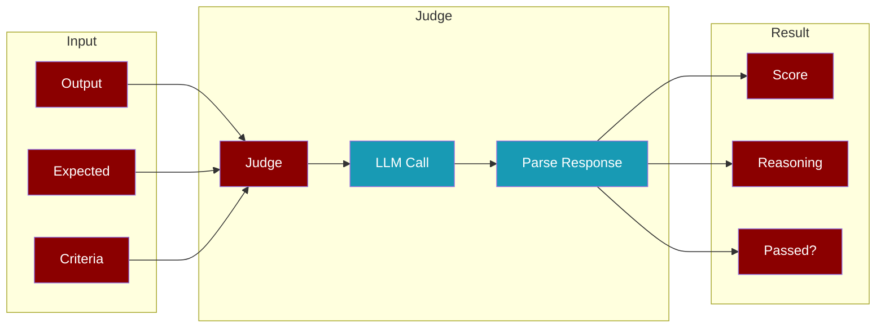
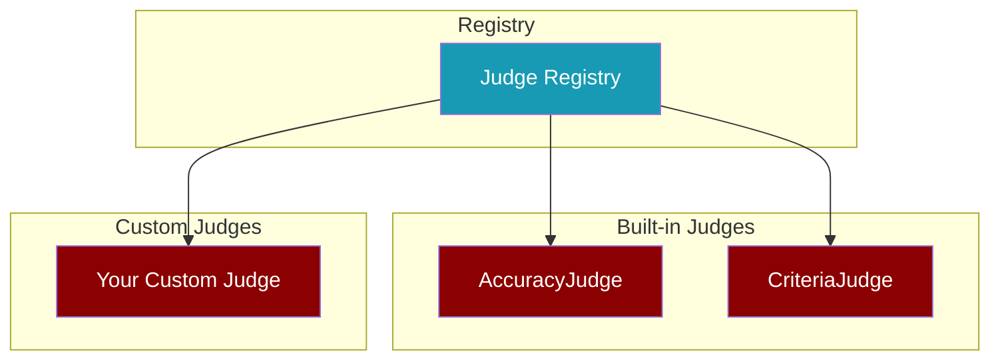

<Info>
**Judge** provides a simple, unified API for evaluating agent outputs using LLM-as-judge. It supports accuracy evaluation, criteria-based evaluation, and custom judges.
</Info>

## How It Works



## Quick Start

<Tabs>
  <Tab title="Accuracy Check">
    ```python
    from praisonaiagents.eval import Judge

    result = Judge().run(output="4", expected="4")
    print(f"Score: {result.score}/10")
    print(f"Passed: {result.passed}")
    ```
  </Tab>
  <Tab title="Criteria Check">
    ```python
    from praisonaiagents.eval import Judge

    judge = Judge(criteria="Response is helpful and accurate")
    result = judge.run(output="Hello! How can I help you today?")
    print(f"Score: {result.score}/10")
    ```
  </Tab>
  <Tab title="With Agent">
    ```python
    from praisonaiagents import Agent
    from praisonaiagents.eval import Judge

    agent = Agent(instructions="You are a math tutor")
    result = Judge().run(
        agent=agent,
        input_text="What is 2+2?",
        expected="4"
    )
    ```
  </Tab>
</Tabs>

## Judge Types



<CardGroup cols={2}>
  <Card title="AccuracyJudge" icon="bullseye">
    Compares output against expected output
  </Card>
  <Card title="CriteriaJudge" icon="list-check">
    Evaluates against custom criteria
  </Card>
</CardGroup>

## Configuration

<ParamField path="model" type="string" default="gpt-4o-mini">
  LLM model to use for judging
</ParamField>

<ParamField path="temperature" type="float" default="0.1">
  Temperature for LLM calls (lower = more consistent)
</ParamField>

<ParamField path="threshold" type="float" default="7.0">
  Score threshold for passing (1-10 scale)
</ParamField>

<ParamField path="criteria" type="string">
  Custom criteria for evaluation
</ParamField>

```python
from praisonaiagents.eval import Judge, JudgeConfig

config = JudgeConfig(
    model="gpt-4o",
    temperature=0.1,
    threshold=8.0,
    criteria="Response is accurate and well-formatted"
)

judge = Judge(config=config)
```

## Custom Judges

<Steps>
  <Step title="Create Custom Judge">
    ```python
    from praisonaiagents.eval import Judge

    class RecipeJudge(Judge):
        """Judge for evaluating recipe quality."""
        
        CRITERIA_PROMPT = """Evaluate this recipe:
    
    CRITERIA: Recipe is complete with ingredients and steps
    
    RECIPE:
    {output}
    
    Score 1-10 based on completeness and clarity.
    
    SCORE: [1-10]
    REASONING: [explanation]
    """
    ```
  </Step>
  <Step title="Register Judge">
    ```python
    from praisonaiagents.eval import add_judge

    add_judge("recipe", RecipeJudge)
    ```
  </Step>
  <Step title="Use Judge">
    ```python
    from praisonaiagents.eval import get_judge

    RecipeJudge = get_judge("recipe")
    judge = RecipeJudge()
    result = judge.run(output=recipe_text)
    ```
  </Step>
</Steps>

## Registry Functions

| Function | Description |
|----------|-------------|
| `add_judge(name, class)` | Register a custom judge |
| `get_judge(name)` | Get a judge class by name |
| `list_judges()` | List all registered judges |
| `remove_judge(name)` | Remove a registered judge |

```python
from praisonaiagents.eval import add_judge, get_judge, list_judges

# List available judges
print(list_judges())  # ['accuracy', 'criteria']

# Get a judge
AccuracyJudge = get_judge("accuracy")
```

## JudgeResult

<ResponseField name="score" type="float">
  Quality score from 1-10
</ResponseField>

<ResponseField name="passed" type="bool">
  Whether score >= threshold
</ResponseField>

<ResponseField name="reasoning" type="string">
  Explanation for the score
</ResponseField>

<ResponseField name="suggestions" type="list">
  Improvement suggestions
</ResponseField>

```python
result = judge.run(output="Hello!")

print(result.score)        # 8.5
print(result.passed)       # True
print(result.reasoning)    # "Good greeting..."
print(result.suggestions)  # ["Could add more context"]
print(result.to_dict())    # Full dictionary
```

## CLI Usage

<CodeGroup>
```bash Accuracy Mode
praisonai eval judge --output "4" --expected "4"
```

```bash Criteria Mode
praisonai eval judge --output "Hello!" --criteria "Response is friendly"
```

```bash From File
praisonai eval judge --file output.txt --criteria "Code is correct"
```

```bash List Judges
praisonai eval list-judges
```
</CodeGroup>

## Async Support

```python
import asyncio
from praisonaiagents.eval import Judge

async def evaluate():
    judge = Judge(criteria="Response is helpful")
    result = await judge.run_async(output="Hello!")
    return result

result = asyncio.run(evaluate())
```

## Best Practices

<AccordionGroup>
  <Accordion title="Choose the Right Mode">
    - Use **accuracy mode** when you have a known expected output
    - Use **criteria mode** for subjective quality evaluation
    - Create **custom judges** for domain-specific evaluation
  </Accordion>
  <Accordion title="Set Appropriate Thresholds">
    - Default threshold is 7.0 (70%)
    - Increase for critical evaluations
    - Decrease for exploratory testing
  </Accordion>
  <Accordion title="Use Specific Criteria">
    - Be specific in your criteria
    - Include measurable aspects
    - Avoid vague terms like "good" or "nice"
  </Accordion>
</AccordionGroup>

<Note>
Judge uses lazy loading - litellm is only imported when you actually run an evaluation, ensuring zero performance impact when not in use.
</Note>
